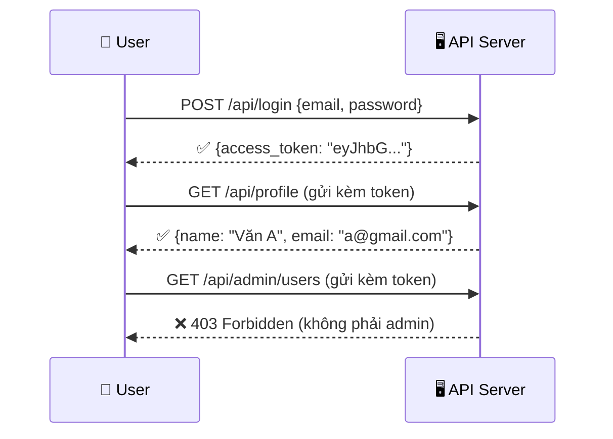
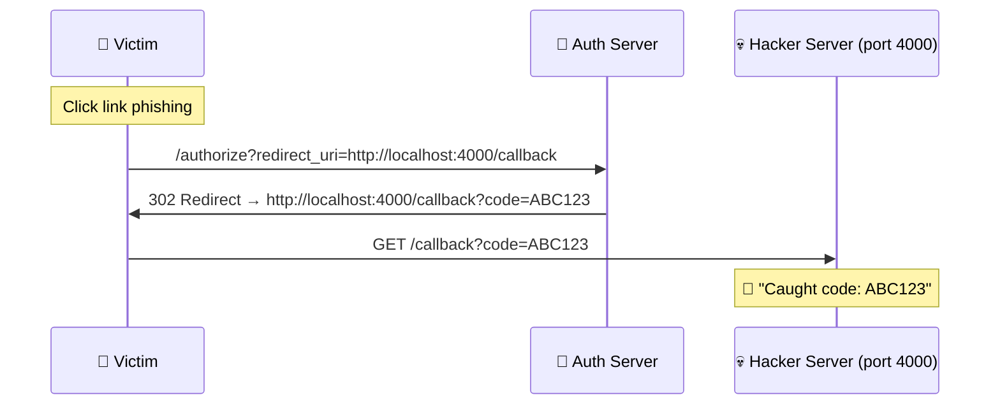
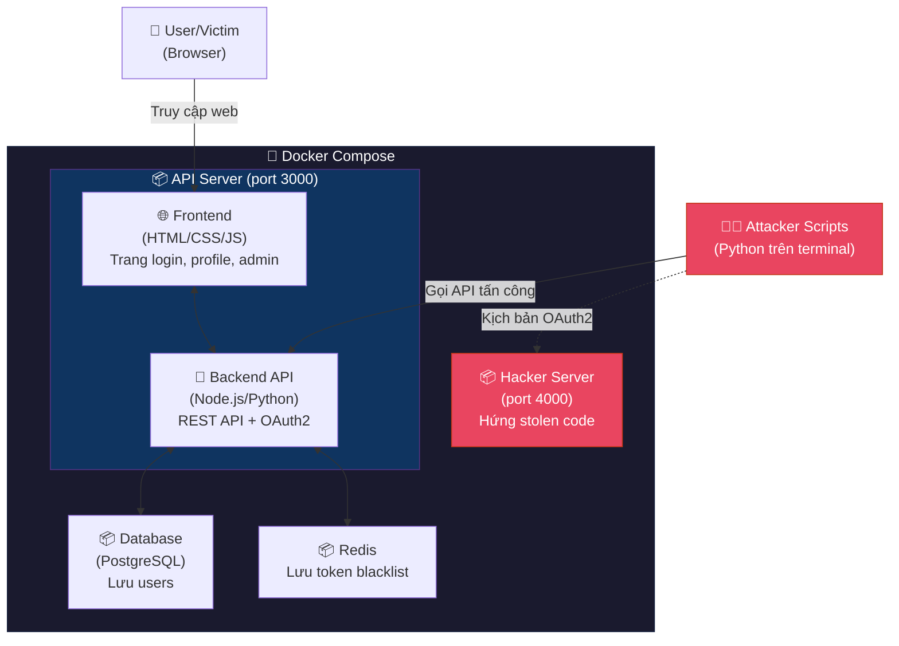

# 🧭 Giải Thích Toàn Bộ Dự Án — Cho Người Mới

---

## ❓ Dự án này làm cái gì?

Đơn giản thôi: **Xây 1 hệ thống web giả lập**, rồi **tự hack nó**, rồi **show cách chống hack**.

```
Bước 1: Xây 1 cái website có API (giống thật)
Bước 2: Viết script tấn công vào API đó → hack thành công
Bước 3: Bật bảo mật → chạy lại script → bị chặn
Bước 4: Giảng viên thấy Before/After → ấn tượng
```

---

## ❓ Dự án có bao nhiêu "thứ" cần làm?

Có **4 thứ** chính:

```
┌─────────────────────────────────────────────────────────┐
│                    DỰ ÁN CỦA NHÓM                      │
│                                                         │
│   1️⃣  API Server        ← Website chính (có API)       │
│   2️⃣  Attacker Scripts  ← Script Python hack vào API   │
│   3️⃣  Hacker Server     ← Server giả của hacker        │
│   4️⃣  Docker            ← Đóng gói tất cả lại         │
│                                                         │
└─────────────────────────────────────────────────────────┘
```

Giờ giải thích từng cái:

---

## 1️⃣ API Server — "Cái web bị hack"

### Nó là gì?
Một web server có **REST API**, giống như backend của 1 app thực tế (ví dụ: backend của Shopee, Grab...). Nó có:
- Đăng ký tài khoản
- Đăng nhập → nhận JWT token
- Xem profile
- Trang admin (chỉ admin mới vào được)
- OAuth2 login (đăng nhập bằng Google/GitHub giả lập)

### Nó có những trang/API gì?

```
📁 API Server (ví dụ: http://localhost:3000)
│
├── 🌐 Giao diện Web (Frontend)
│   ├── /                    → Trang chủ
│   ├── /login               → Trang đăng nhập
│   ├── /register            → Trang đăng ký
│   ├── /profile             → Trang profile (cần login)
│   └── /admin               → Trang admin (cần quyền admin)
│
├── 🔌 REST API (Backend)
│   ├── POST /api/register   → Đăng ký user mới
│   ├── POST /api/login      → Đăng nhập → trả JWT token
│   ├── GET  /api/profile    → Xem profile (cần token)
│   ├── GET  /api/admin/users→ Xem tất cả users (cần token admin)
│   └── GET  /api/public-key → Lấy public key (cho JWT RS256)
│
├── 🔐 OAuth2 Endpoints
│   ├── GET  /oauth/authorize → Bắt đầu OAuth flow
│   ├── POST /oauth/token     → Đổi code → access token
│   └── GET  /oauth/callback  → Nhận authorization code
│
└── ⚙️ Config
    └── .env                  → SECURITY_MODE=vulnerable hoặc secure
```

### Nó hoạt động thế nào?



> **Tóm lại**: Nó là 1 website bình thường, có đăng nhập, có API, có phân quyền. Đây là "con mồi" để nhóm hack.

---

## 2️⃣ Attacker Scripts — "Công cụ hack"

### Nó là gì?
Những file **Python** mà nhóm viết để **tấn công vào API Server**. Mỗi file là 1 kiểu tấn công.

### Có những script nào?

```
📁 attacker-scripts/
│
├── 🔑 JWT Attacks
│   ├── attack_alg_confusion.py    → Đổi RS256 → HS256, forge token admin
│   ├── attack_alg_none.py         → Tạo token "alg: none", bỏ signature
│   └── attack_bruteforce.py       → Brute-force secret key
│
└── 🔐 OAuth2 Attacks
    ├── attack_redirect_uri.py     → Đổi redirect_uri sang hacker server
    └── attack_csrf.py             → CSRF tấn công OAuth flow
```

### Mỗi script làm gì?

```
Ví dụ: attack_alg_confusion.py

Chạy:  python attack_alg_confusion.py

Nó sẽ:
  1. Gọi GET /api/public-key        → lấy public key
  2. Tạo token giả (alg: HS256)     → sign bằng public key
  3. Gọi GET /api/admin/users       → gửi token giả

Kết quả (VULNERABLE mode):
  ✅ 200 OK — Lấy được data admin!

Kết quả (SECURE mode):
  ❌ 401 — Algorithm 'HS256' is not allowed
```

> **Tóm lại**: Đây là các file `.py` chạy trên terminal. Không có giao diện. Chỉ là script gọi API.

---

## 3️⃣ Hacker Server — "Server giả của hacker"

### Nó là gì?
Một server **rất nhỏ**, đóng vai "server của hacker" để **nhận authorization code bị đánh cắp** trong kịch bản OAuth2.

### Tại sao cần?
Trong kịch bản OAuth2 Redirect URI Attack:
- Hacker đổi `redirect_uri` sang server của mình
- Auth Server redirect user tới server hacker
- **Cần 1 server để "hứng" cái redirect đó**

```
📁 hacker-server/
│
└── server.py     ← Chỉ 1 file, ~20 dòng code
```

```python
# hacker-server/server.py — CỰC ĐƠN GIẢN
from flask import Flask, request

app = Flask(__name__)

@app.route('/callback')
def catch_code():
    code = request.args.get('code')
    print(f"🎣 Caught stolen auth code: {code}")
    return "Got it!"

app.run(port=4000)
```

### Khi nào dùng?



> **Tóm lại**: Server cực nhỏ, chỉ dùng cho 1 kịch bản OAuth2. Vai trò = hứng authorization code bị đánh cắp.

---

## 4️⃣ Docker — "Đóng gói tất cả"

### Docker là gì? (Giải thích đơn giản)

Tưởng tượng Docker như **1 cái hộp** chứa sẵn mọi thứ cần chạy. Thay vì:
- Cài Node.js
- Cài Python
- Cài Redis
- Cài Database
- Config mọi thứ...

→ Chỉ cần **1 lệnh** `docker-compose up` là chạy hết.

### Tại sao cần Docker trong dự án này?

```
KHÔNG có Docker:
  "Thầy ơi, máy em cài Node 18 nhưng máy thầy Node 16, chạy không được..."
  "Máy em Windows, máy bạn Mac, config khác nhau..."

CÓ Docker:
  "Thầy chỉ cần chạy: docker-compose up"
  → Mọi thứ tự cài, tự chạy, máy nào cũng giống nhau ✅
```

### Docker chứa gì?

```
docker-compose.yml
│
├── 📦 Container 1: api-server (port 3000)
│   → Chạy API Server (Node.js)
│   → Chứa cả frontend + backend + OAuth2
│
├── 📦 Container 2: hacker-server (port 4000)
│   → Chạy Hacker Server (Python Flask)
│   → Dùng cho kịch bản OAuth2
│
├── 📦 Container 3: redis (port 6379)
│   → Lưu token blacklist
│   → Dùng cho phòng thủ JWT
│
└── 📦 Container 4: database (port 5432)
    → PostgreSQL/SQLite
    → Lưu users, tokens
```

### Lệnh Docker cần biết:

```bash
# Khởi động TẤT CẢ (vulnerable mode)
SECURITY_MODE=vulnerable docker-compose up

# Tắt tất cả
docker-compose down

# Khởi động lại (secure mode)
SECURITY_MODE=secure docker-compose up
```

> [!NOTE]
> **Nhóm dùng Cách 2 (env variable)** nên khi demo:
> - Lần 1: chạy `SECURITY_MODE=vulnerable` → hack thành công
> - Tắt, đổi biến, chạy lại `SECURITY_MODE=secure` → bị chặn

---

## 🗺️ Tổng Quan: Mọi Thứ Kết Nối Với Nhau Thế Nào?



---

## 📋 Tóm Tắt Cực Ngắn

| # | Thứ cần làm | Là gì | Ai code |
|---|-------------|-------|---------|
| 1️⃣ | **API Server** | Website có API, login, profile, admin, OAuth2. "Con mồi" bị hack | 👑 Lead |
| 2️⃣ | **Attacker Scripts** | File Python chạy trên terminal để hack API Server | 🔑 M2 (JWT) + 🔐 M3 (OAuth2) |
| 3️⃣ | **Hacker Server** | Server nhỏ xíu hứng code bị đánh cắp (chỉ cho OAuth2) | 🔐 M3 |
| 4️⃣ | **Docker** | Đóng gói tất cả vào 1 lệnh `docker-compose up` | 👑 Lead |

### Khi demo trước giảng viên:

```
Terminal 1:  docker-compose up  (SECURITY_MODE=vulnerable)
             → API Server chạy port 3000
             → Hacker Server chạy port 4000

Terminal 2:  python attack_alg_confusion.py
             → ✅ Hack thành công!

Terminal 1:  Ctrl+C (tắt)
             docker-compose up  (SECURITY_MODE=secure)

Terminal 2:  python attack_alg_confusion.py
             → ❌ Bị chặn!

Giảng viên:  "À ra thế, cùng 1 script mà kết quả khác" 👏
```
