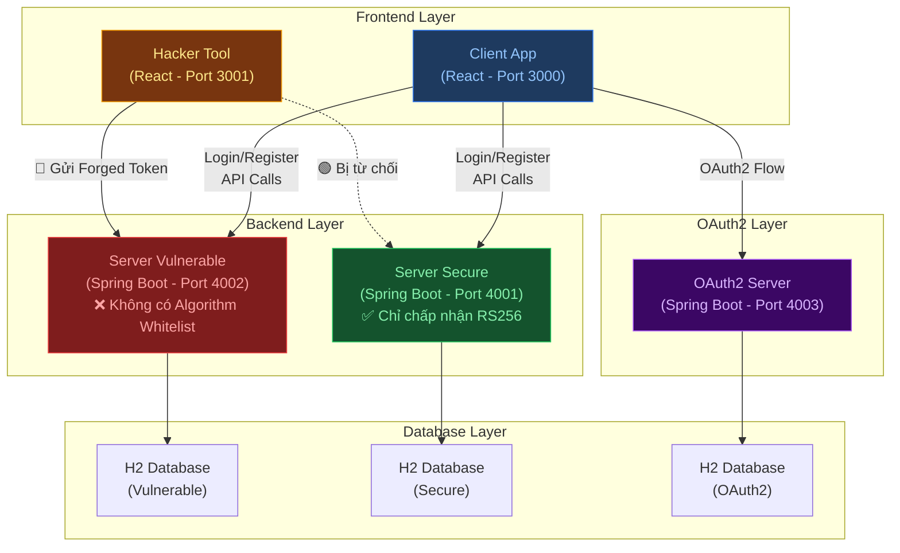
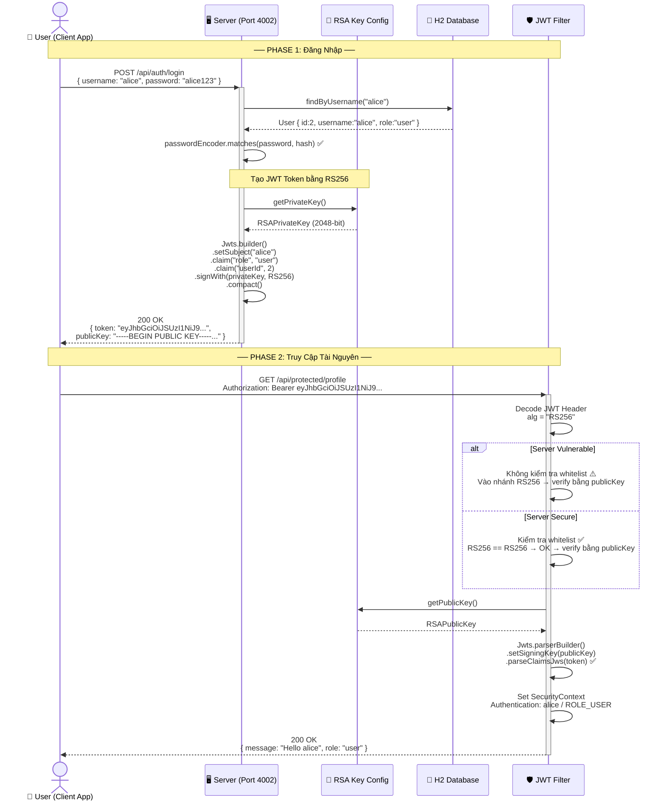
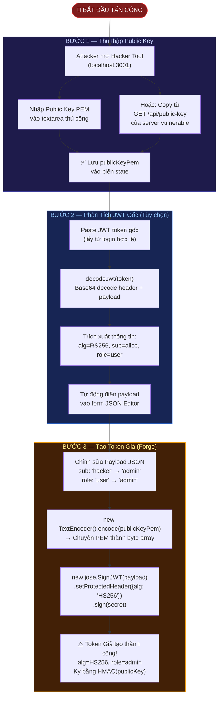
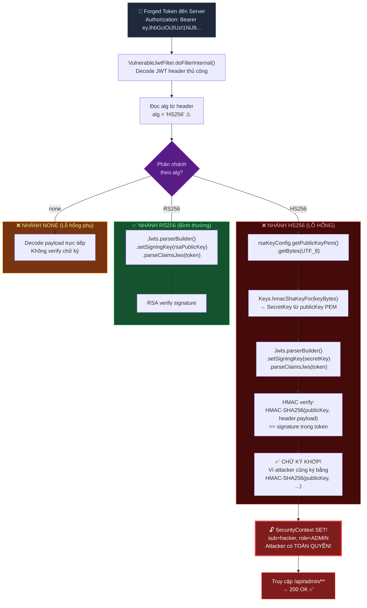
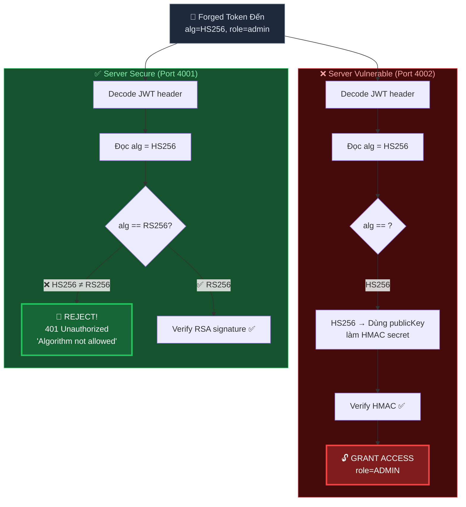
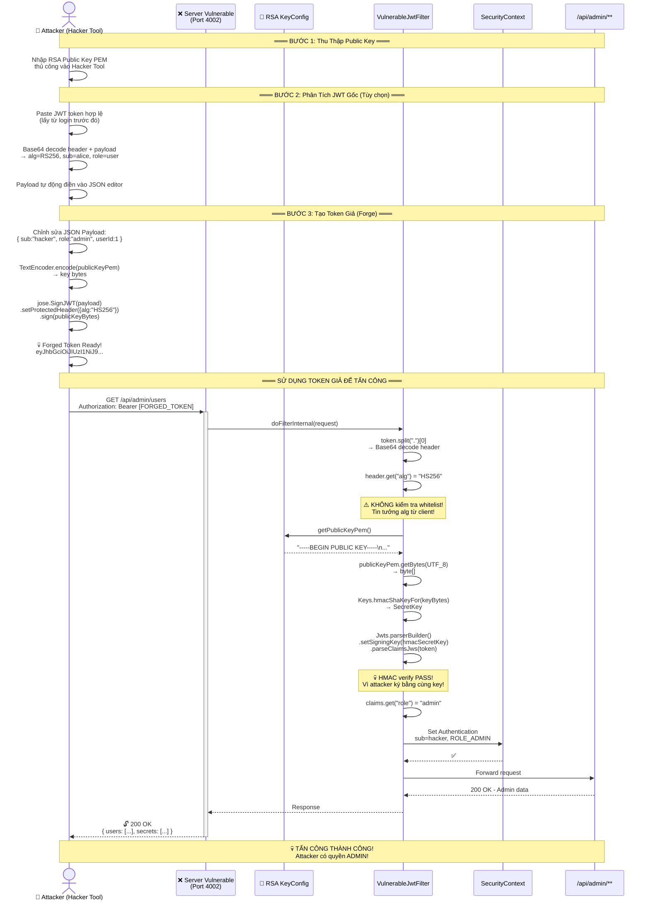
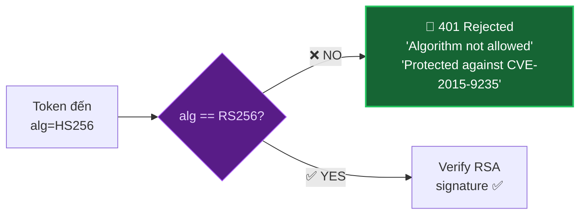

# Sơ Đồ Luồng Hoạt Động — Tấn Công JWT Algorithm Confusion (CVE-2015-9235)

---

## 1. Kiến Trúc Tổng Quan Hệ Thống



---

## 2. Luồng Đăng Nhập Hợp Lệ (Normal JWT Flow)

> [!NOTE]
> Đây là luồng hoạt động bình thường khi user đăng nhập. Server ký JWT bằng **RSA Private Key** với thuật toán **RS256**, và verify bằng **RSA Public Key**.



---

## 3. Luồng Tấn Công CVE-2015-9235 (Chi Tiết Từng Bước)

> [!CAUTION]
> Đây là luồng tấn công **Algorithm Confusion** khai thác lỗ hổng CVE-2015-9235. Attacker đổi thuật toán từ RS256 sang HS256 và dùng **Public Key** (công khai) làm **HMAC Secret** để ký token giả.

### 3.1 Tổng Quan Các Bước Tấn Công



### 3.2 Chi Tiết Kỹ Thuật: Quá Trình Server Xử Lý Token Giả



---

## 4. So Sánh: Server Vulnerable vs Server Secure

> [!IMPORTANT]
> Điểm khác biệt **duy nhất** giữa 2 server nằm ở **Algorithm Whitelist**. Server Secure kiểm tra `alg` **TRƯỚC KHI** verify, trong khi Server Vulnerable tin tưởng hoàn toàn vào giá trị `alg` từ JWT header của client.



---

## 5. Sequence Diagram Toàn Bộ Cuộc Tấn Công



---

## 6. Giải Thích Kỹ Thuật Sâu

### 6.1 Tại sao tấn công thành công?

| Yếu tố | Chi tiết |
|---------|---------|
| **Thuật toán RS256** | Asymmetric — ký bằng Private Key, verify bằng Public Key |
| **Thuật toán HS256** | Symmetric — ký VÀ verify bằng **cùng một** Secret Key |
| **Public Key** | Luôn **công khai** (ai cũng lấy được) |
| **Lỗ hổng** | Server dùng `publicKey` để verify → nếu `alg=HS256`, `publicKey` trở thành HMAC secret |
| **Kết quả** | Attacker biết `publicKey` → ký được token bất kỳ → chiếm quyền admin |

### 6.2 Chuỗi Logic Tấn Công

```
1. Server dùng RS256 → verify(token, publicKey)
2. Attacker đổi alg=HS256 trong JWT header
3. Server đọc alg=HS256 từ header → dùng publicKey làm HMAC secret
4. Attacker cũng dùng publicKey làm HMAC secret để ký token
5. HMAC(publicKey, data) ở server == HMAC(publicKey, data) ở attacker
6. → Chữ ký KHỚP → Server tin token hợp lệ → Cấp quyền ADMIN!
```

### 6.3 Cách Phòng Chống (Server Secure)



> [!TIP]
> **Giải pháp cốt lõi**: Kiểm tra `alg` từ JWT header **TRƯỚC** khi verify. Chỉ cho phép danh sách thuật toán đã đăng ký (whitelist). Trong [SecureJwtFilter.java](file:///d:/Document/Security/jwt-attack-demo/server-secure/src/main/java/com/attt/secure/filter/SecureJwtFilter.java#L74-L81):
> ```java
> if (!"RS256".equals(alg)) {
>     // 🚫 TỪ CHỐI ngay lập tức
>     writeError(response, 401, "Algorithm not allowed", ...);
>     return;
> }
> ```

---

## 7. Mapping Sơ Đồ → Mã Nguồn

| Bước trong sơ đồ | File mã nguồn | Dòng quan trọng |
|---|---|---|
| Tạo RSA Key Pair | [RsaKeyConfig.java](file:///d:/Document/Security/jwt-attack-demo/server-vulnerable/src/main/java/com/attt/vulnerable/config/RsaKeyConfig.java#L22-L31) | `KeyPairGenerator.getInstance("RSA")` |
| Login & Ký JWT RS256 | [AuthController.java](file:///d:/Document/Security/jwt-attack-demo/server-vulnerable/src/main/java/com/attt/vulnerable/controller/AuthController.java#L64-L71) | `signWith(privateKey, RS256)` |
| Expose Public Key | [AuthController.java](file:///d:/Document/Security/jwt-attack-demo/server-vulnerable/src/main/java/com/attt/vulnerable/controller/AuthController.java#L25-L36) | `GET /api/public-key` |
| **LỖ HỔNG: HS256 branch** | [VulnerableJwtFilter.java](file:///d:/Document/Security/jwt-attack-demo/server-vulnerable/src/main/java/com/attt/vulnerable/filter/VulnerableJwtFilter.java#L83-L98) | `Keys.hmacShaKeyFor(publicKeyPem.getBytes())` |
| **BẢO VỆ: Algorithm whitelist** | [SecureJwtFilter.java](file:///d:/Document/Security/jwt-attack-demo/server-secure/src/main/java/com/attt/secure/filter/SecureJwtFilter.java#L74-L81) | `if (!"RS256".equals(alg))` |
| Forge Token (Hacker Tool) | [JwtAttackPage.jsx](file:///d:/Document/Security/jwt-attack-demo/hacker-tool/src/pages/JwtAttackPage.jsx#L67-L100) | `jose.SignJWT(payload).sign(publicKeyBytes)` |
