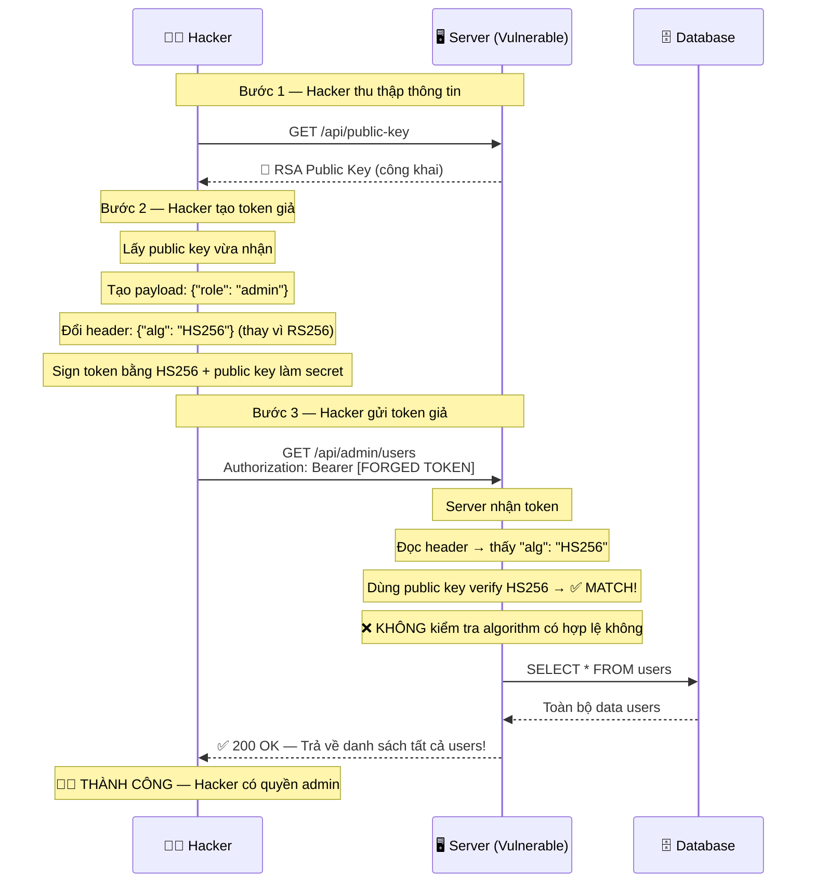
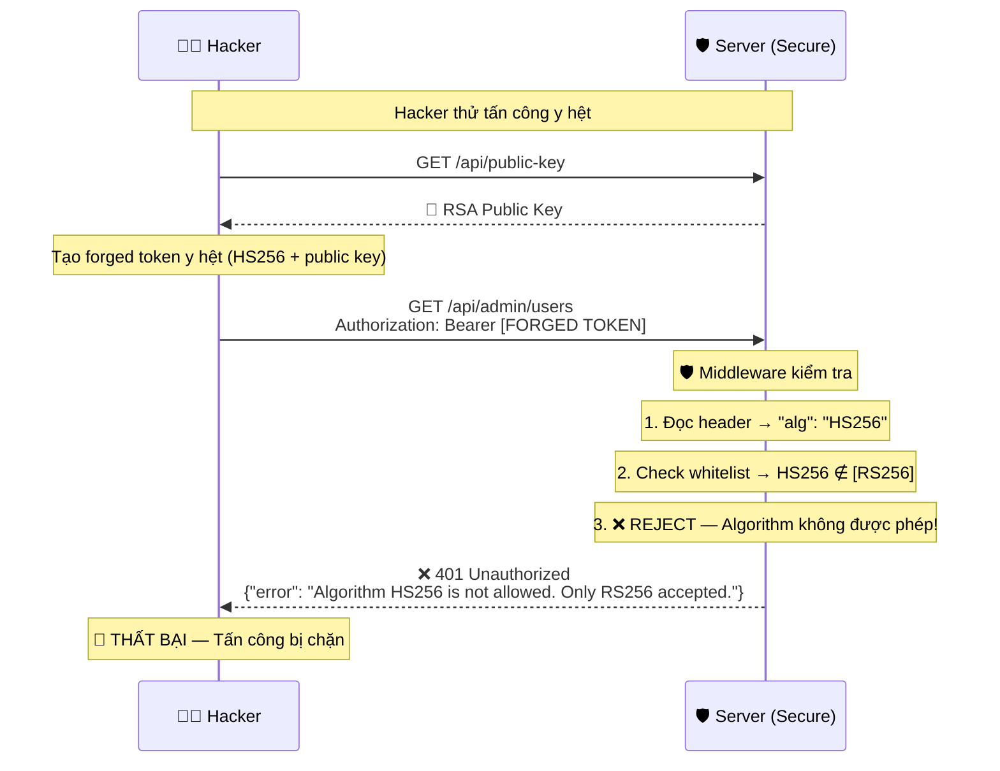
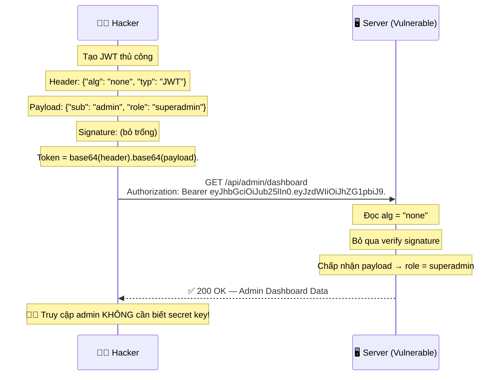
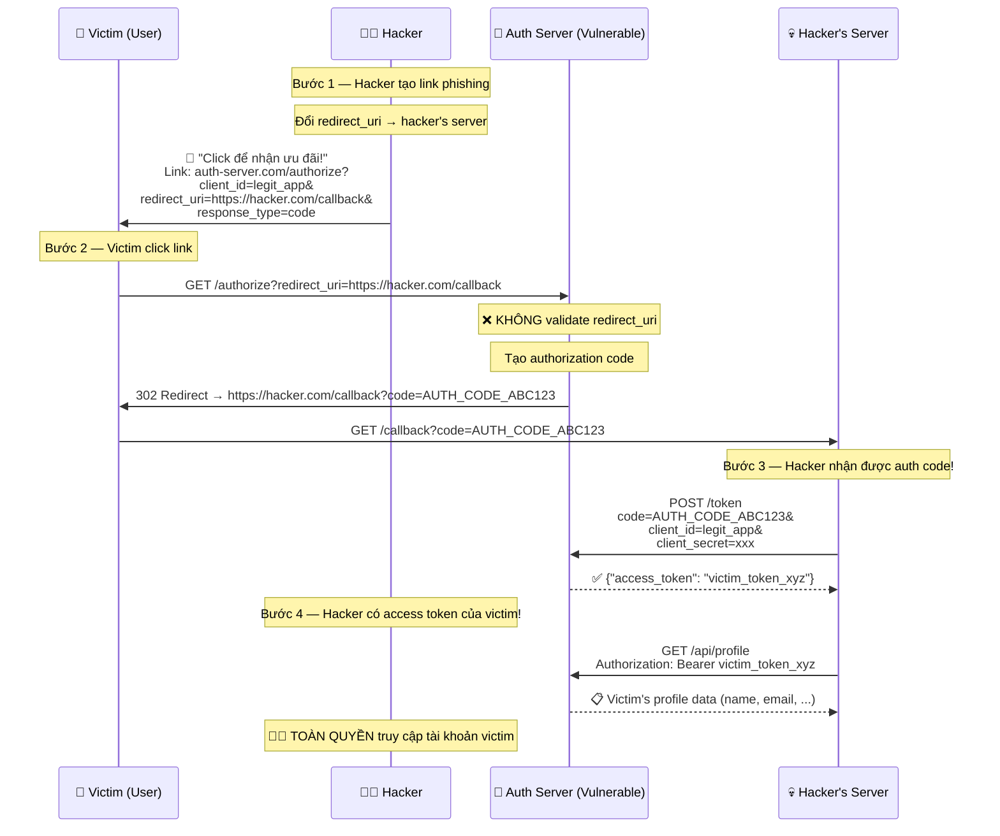
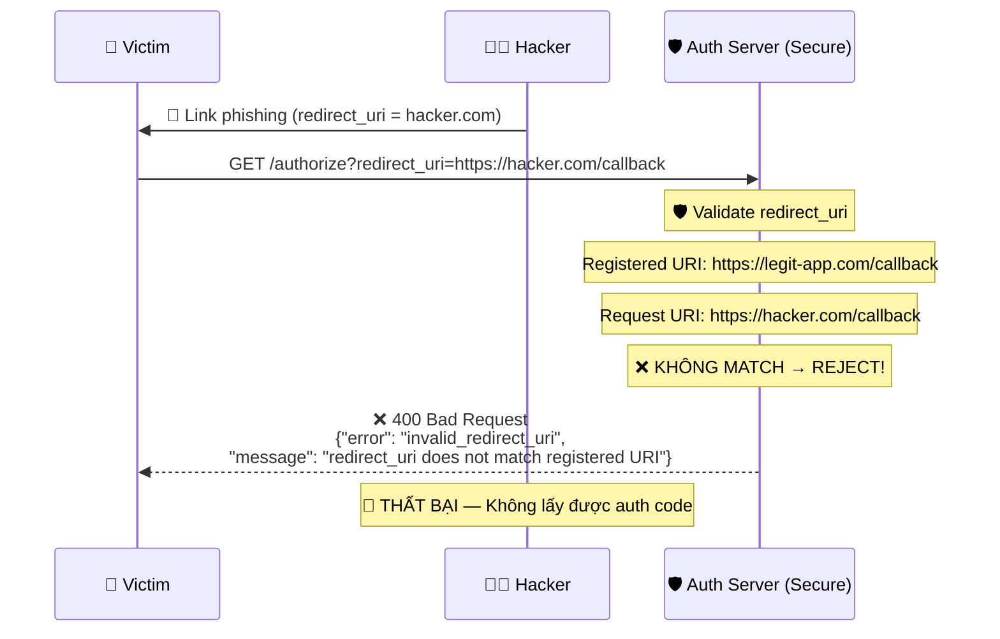
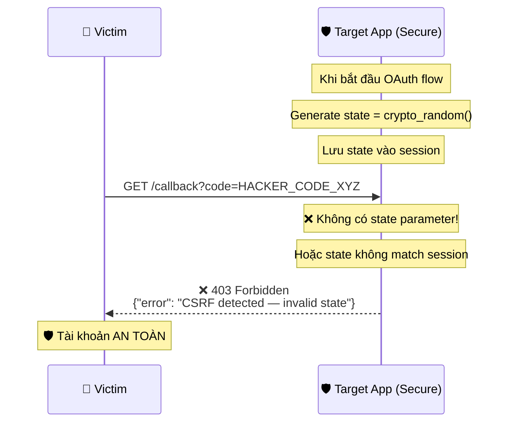
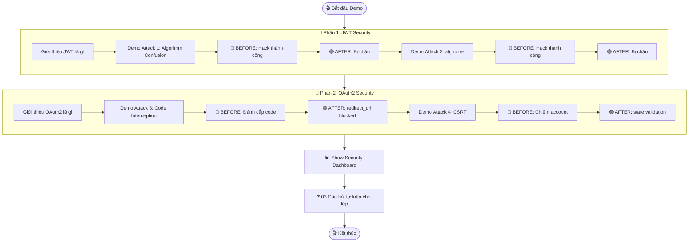

# 🎬 Kịch Bản Mô Phỏng — Tấn Công & Phòng Thủ API

> [!NOTE]
> Mỗi kịch bản gồm 2 phần: **BEFORE** (server yếu, bị hack) → **AFTER** (server đã bảo mật, chặn được).
> Khi demo, chạy BEFORE trước cho giảng viên thấy bị hack, rồi bật Secure mode chạy lại → bị chặn.

---

## 🔑 KỊCH BẢN 1: JWT — Algorithm Confusion Attack

### Bối cảnh

> Server dùng **RS256** (asymmetric) để sign JWT. Public key được công khai tại `/api/public-key`.
> Hacker lợi dụng việc server **không kiểm tra algorithm** → đổi sang HS256 và dùng public key làm secret để giả mạo token admin.

---

### 🔴 BEFORE — Server Vulnerable (Bị tấn công thành công)



**Quy trình thực hiện demo:**

```
Bước 1: Hacker chạy script lấy public key
        → Terminal hiện: "Fetched public key from server"

Bước 2: Script tự động tạo forged token
        → Terminal hiện: "Forged token: eyJhbGciOiJIUzI1NiJ9..."

Bước 3: Script gửi request với forged token
        → Terminal hiện: "✅ 200 OK — Got admin data!"
        → Hiển thị danh sách users (tên, email, role...)

👉 Kết luận: Server bị hack vì KHÔNG validate algorithm
```

---

### 🟢 AFTER — Server Secure (Chặn được tấn công)



**Quy trình thực hiện demo:**

```
Bước 1-2: Giống hệt phần BEFORE

Bước 3: Script gửi request với forged token
        → Terminal hiện: "❌ 401 Unauthorized"
        → Server log hiện: "⚠️ BLOCKED: Algorithm confusion attack detected from IP 192.168.1.x"

Bước 4: Show Dashboard
        → Dashboard hiện alert đỏ: "JWT Algorithm Attack Detected"
        → Log ghi lại: thời gian, IP, token bị reject

👉 Kết luận: Chỉ cần WHITELIST algorithm → chặn hoàn toàn
```

---

## 🔑 KỊCH BẢN 2: JWT — `alg: none` Attack

### Bối cảnh

> Hacker tạo token với `"alg": "none"` và bỏ phần signature. Server cấu hình sai → chấp nhận token không có chữ ký.

---

### 🔴 BEFORE — Bị tấn công



### 🟢 AFTER — Chặn được

```
Hacker gửi token "alg: none"
→ Server: ❌ 401 — "Algorithm 'none' is not permitted"
→ Dashboard log: "alg:none attack attempt blocked"
```

---

## 🔐 KỊCH BẢN 3: OAuth2 — Authorization Code Interception

### Bối cảnh

> Hệ thống dùng OAuth2 Authorization Code Flow. Server **không validate `redirect_uri`** chặt chẽ → Hacker đổi redirect_uri sang server của mình để đánh cắp authorization code.

---

### 🔴 BEFORE — Server Vulnerable



**Quy trình thực hiện demo:**

```
Bước 1: Mở browser → show URL phishing mà hacker tạo
        → Chỉ ra redirect_uri đã bị đổi sang hacker.com

Bước 2: Click link (giả lập victim)
        → Auth Server hiện trang "Cho phép ứng dụng truy cập?"
        → User click "Đồng ý"

Bước 3: Browser redirect tới hacker's server
        → Terminal hacker hiện: "🎣 Caught auth code: AUTH_CODE_ABC123"

Bước 4: Hacker script tự động đổi code → access token
        → Terminal hiện: "✅ Got victim's access token!"
        → Hiển thị thông tin victim

👉 Kết luận: redirect_uri không được validate → bị đánh cắp code
```

---

### 🟢 AFTER — Server Secure



**Quy trình thực hiện demo:**

```
Bước 1-2: Giống BEFORE, click link phishing

Bước 3: Auth Server CHẶN ngay
        → Browser hiện: "Error: Invalid redirect_uri"
        → Dashboard log: "⚠️ Suspicious redirect_uri blocked: hacker.com"

👉 Kết luận: Exact-match redirect_uri → chặn hoàn toàn
```

---

## 🔐 KỊCH BẢN 4: OAuth2 — CSRF Attack (Thiếu State Parameter)

### Bối cảnh

> OAuth2 flow **không dùng `state` parameter** → Hacker có thể trick victim link tài khoản với OAuth account của hacker.

---

### 🔴 BEFORE — Bị tấn công

```mermaid
sequenceDiagram
    participant H as 🏴‍☠️ Hacker
    participant AS as 🔑 Auth Server
    participant V as 👤 Victim
    participant App as 🖥️ Target App (Vulnerable)

    Note over H: Bước 1 — Hacker tự khởi tạo OAuth flow
    H->>AS: GET /authorize?client_id=app&redirect_uri=app.com/callback
    AS-->>H: Redirect → app.com/callback?code=HACKER_CODE_XYZ

    Note over H: Bước 2 — Hacker KHÔNG dùng code này
    Note over H: Mà gửi link chứa code cho victim

    H->>V: 📧 "Xem hình cute!"<br/>Trang web chứa:<br/>&lt;img src="app.com/callback?code=HACKER_CODE_XYZ"&gt;

    Note over V: Bước 3 — Victim mở trang web
    Note over V: Browser tự động load img src

    V->>App: GET /callback?code=HACKER_CODE_XYZ

    Note over App: ❌ Không có state → không phân biệt
    Note over App: Đổi HACKER's code → access token
    Note over App: Link HACKER's OAuth account vào VICTIM's session

    App-->>V: ✅ "Đã liên kết tài khoản thành công!"

    Note over H: Bước 4 — Hacker login bằng OAuth
    Note over H: Vào được tài khoản Victim!
    H->>App: Login with OAuth (hacker's account)
    App-->>H: ✅ Welcome! (vào account Victim)

    Note over H: 🏴‍☠️ Chiếm được tài khoản victim
```

**Quy trình thực hiện demo:**

```
Bước 1: Show hacker tạo CSRF page (HTML có  tag ẩn)
Bước 2: Victim mở trang web đó (mở browser)
Bước 3: Show trong app → account victim đã bị link với OAuth hacker
Bước 4: Hacker login OAuth → vào được account victim

👉 Kết luận: Không có state parameter → bị CSRF
```

---

### 🟢 AFTER — Chặn được



---

## 🎯 Tổng Hợp Workflow Demo



---

## ⏱️ Phân Bổ Thời Gian Trình Bày (Ước lượng ~30 phút)

| Thời gian | Nội dung | Người trình bày |
|-----------|----------|-----------------|
| 3 phút | Giới thiệu đề tài, mục tiêu, kiến trúc hệ thống | 👑 Lead |
| 5 phút | Lý thuyết JWT + Demo Attack 1 (Alg Confusion) Before/After | 🔑 Member 2 |
| 4 phút | Demo Attack 2 (alg:none) Before/After | 🔑 Member 2 |
| 5 phút | Lý thuyết OAuth2 + Demo Attack 3 (Code Interception) Before/After | 🔐 Member 3 |
| 4 phút | Demo Attack 4 (CSRF) Before/After | 🔐 Member 3 |
| 3 phút | Show Security Dashboard tổng hợp | 👑 Lead |
| 3 phút | Kết luận + Biện pháp phòng chống | 👑 Lead |
| 3 phút | 03 câu hỏi tự luận + tương tác lớp | Cả nhóm |
