# Sơ Đồ Luồng Hoạt Động — Tấn Công OAuth2 Authorization Code Interception

---

## 1. Kiến Trúc Tổng Quan Hệ Thống

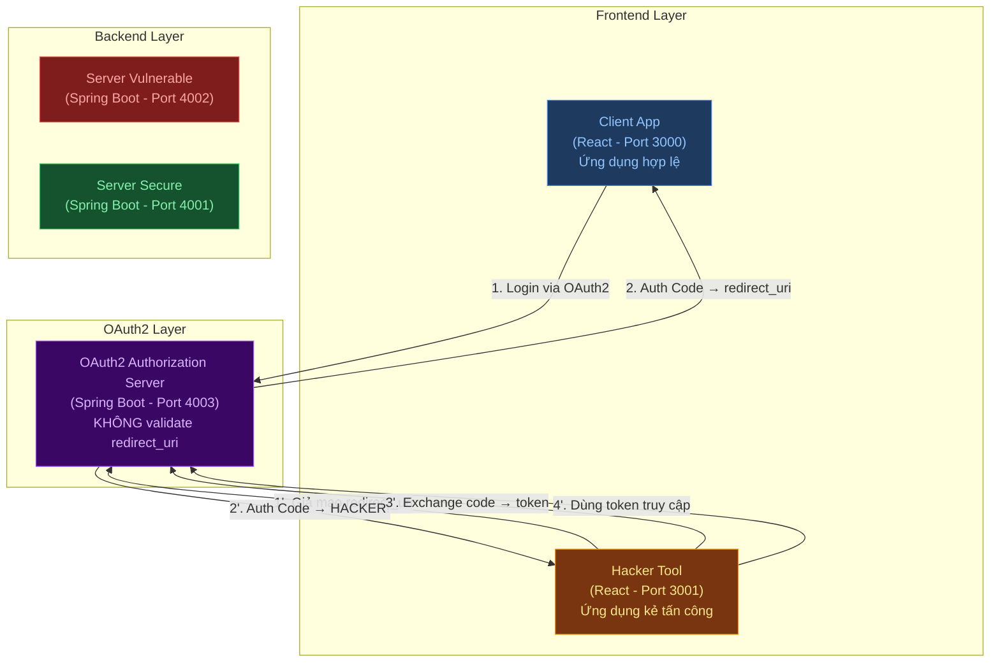

---

## 2. Luồng OAuth2 Authorization Code Flow Hợp Lệ

> [!NOTE]
> Đây là luồng bình thường theo chuẩn RFC 6749. Client hợp lệ đăng ký trước `redirect_uri` với OAuth Server, và server chỉ chấp nhận redirect về đúng URL đã đăng ký.

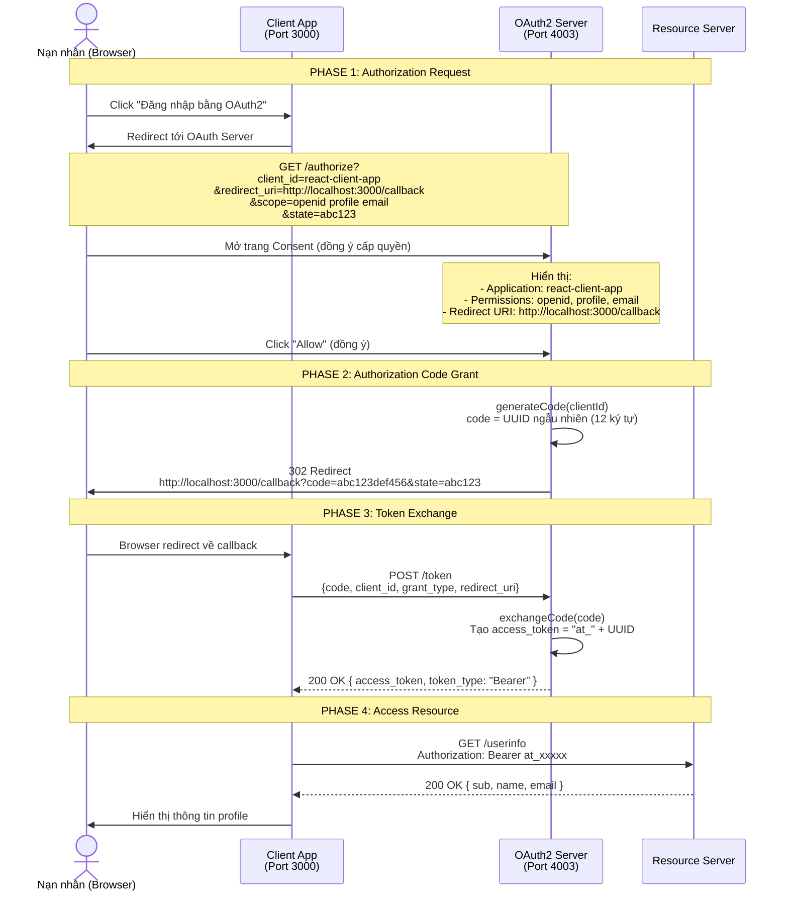

---

## 3. Bản Chất Lỗ Hổng — Thiếu Kiểm Tra redirect_uri

> [!CAUTION]
> Lỗ hổng xảy ra khi OAuth2 Authorization Server **KHÔNG validate** tham số `redirect_uri` trong request. Server chấp nhận **bất kỳ URL nào** — kể cả URL do attacker kiểm soát. Đây là vi phạm nghiêm trọng RFC 6749 Section 3.1.2.

### 3.1 Code Bị Lỗi Trong OAuth Server

```java
// Trong AuthorizeController.java — GET /authorize:
// Server KHÔNG có bất kỳ kiểm tra nào:
@GetMapping("/authorize")
public String authorize(
    @RequestParam String client_id,
    @RequestParam String redirect_uri,   // CHẤP NHẬN BẤT KỲ URL NÀO!
    @RequestParam String scope,
    @RequestParam String state,
    Model model
) {
    // THIẾU kiểm tra quan trọng:
    //   if (!ALLOWED_REDIRECT_URIS.contains(redirect_uri)) {
    //       return "error";  // Từ chối!
    //   }
    
    model.addAttribute("redirectUri", redirect_uri);  // Truyền thẳng vào form
    return "consent";
}
```

```java
// Trong AuthorizeController.java — POST /authorize:
// Sau khi user click "Allow", redirect về bất kỳ đâu:
@PostMapping("/authorize")
public RedirectView doAuthorize(
    @RequestParam String redirect_uri,   // URL CỦA ATTACKER!
    @RequestParam String state,
    @RequestParam String client_id
) {
    String code = authCodeService.generateCode(client_id);
    // Redirect auth code về URL của ATTACKER mà KHÔNG kiểm tra!
    String location = redirect_uri + "?code=" + code + "&state=" + state;
    return new RedirectView(location);  // GỬI CODE CHO HACKER!
}
```

### 3.2 Sơ Đồ Luồng Quyết Định Trong OAuth Server

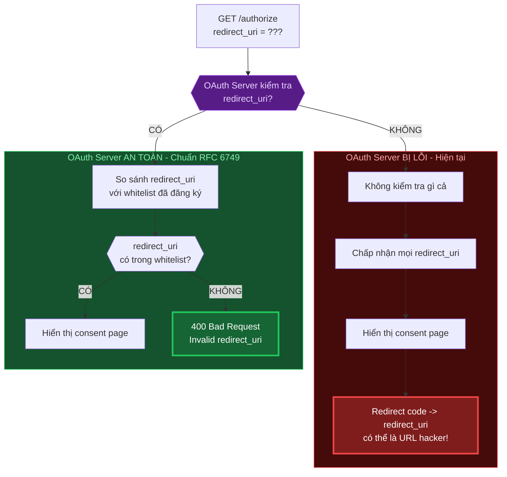

---

## 4. Luồng Tấn Công Chi Tiết Từng Bước

```mermaid
flowchart TD
    START(["BAT DAU TAN CONG"])

    subgraph STEP1["BUOC 1 — Chuẩn Bị và Social Engineering"]
        S1A["Attacker cấu hình Hacker Tool<br/>OAuth URL: http://localhost:4003<br/>Client ID: react-client-app"]
        S1B["Đặt redirect_uri = http://localhost:3001/callback<br/>URL callback của Hacker Tool"]
        S1C["Tạo state parameter ngẫu nhiên<br/>để bypass CSRF check nếu có"]
        S1D["Tạo link phishing chứa<br/>authorize URL với redirect_uri giả"]
    end

    subgraph STEP2["BUOC 2 — Intercept Authorization Code"]
        S2A["Nạn nhân click link hoặc được redirect<br/>Mở trang Consent trên OAuth Server"]
        S2B["Nạn nhân thấy trang Consent hợp lệ<br/>tên app, quyền hạn, redirect_uri"]
        S2C["Nạn nhân click Allow<br/>tin tưởng vì trang OAuth Server thật"]
        S2D["OAuth Server sinh auth code<br/>Redirect -> http://localhost:3001/callback?code=xxx"]
        S2E["Hacker Tool nhận code<br/>qua CallbackPage.jsx"]
        S2F["Callback page gửi postMessage<br/>về OAuth2AttackPage chính"]
    end

    subgraph STEP3["BUOC 3 — Exchange Code thanh Access Token"]
        S3A["Attacker gửi POST /token<br/>code + client_id + grant_type"]
        S3B["OAuth Server xác nhận code hợp lệ<br/>Xóa code - dùng 1 lần"]
        S3C["OAuth Server trả về<br/>access_token = at_xxxxx"]
        S3D["Attacker có Access Token!"]
    end

    subgraph STEP4["BUOC 4 — Khai Thác Resource"]
        S4A["Attacker gửi GET /userinfo<br/>Authorization: Bearer at_xxxxx"]
        S4B["OAuth Server trả về<br/>thông tin cá nhân nạn nhân"]
        S4C["Attacker chiếm đoạt danh tính<br/>name, email, sub"]
    end

    START --> S1A --> S1B --> S1C --> S1D
    S1D --> S2A --> S2B --> S2C --> S2D --> S2E --> S2F
    S2F --> S3A --> S3B --> S3C --> S3D
    S3D --> S4A --> S4B --> S4C

    style START fill:#7f1d1d,stroke:#ef4444,color:#fff
    style STEP1 fill:#1e1b4b,stroke:#6366f1,color:#c7d2fe
    style STEP2 fill:#422006,stroke:#f59e0b,color:#fde68a
    style STEP3 fill:#172554,stroke:#3b82f6,color:#93c5fd
    style STEP4 fill:#450a0a,stroke:#ef4444,color:#fca5a5
```

---

## 5. Sequence Diagram Toàn Bộ Cuộc Tấn Công

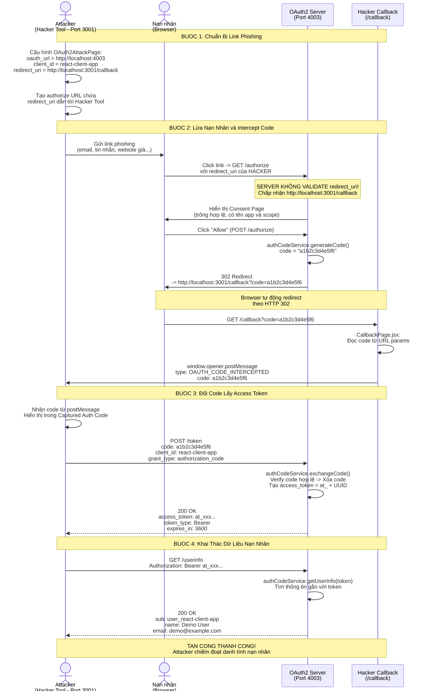

---

## 6. Chi Tiết Cơ Chế Callback Interception

> [!IMPORTANT]
> Hacker Tool sử dụng cơ chế `window.open()` + `postMessage()` để tự động chặn auth code mà không cần nạn nhân tương tác thêm.

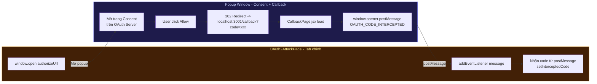

### Luồng dữ liệu qua CallbackPage:

```
1. OAuth Server redirect browser -> http://localhost:3001/callback?code=a1b2c3&state=xyz
2. React Router match route "/callback" -> render CallbackPage.jsx
3. CallbackPage đọc URL params: code = "a1b2c3", state = "xyz"
4. Kiểm tra window.opener (popup window reference)
5. Gửi postMessage tới parent window (OAuth2AttackPage)
6. OAuth2AttackPage nhận event -> cập nhật interceptedCode state
7. Attacker thấy code hiện trong UI -> tiến hành exchange
```

---

## 7. Tại Sao Tấn Công Thành Công?

> [!WARNING]
> Cuộc tấn công thành công do **3 yếu tố kết hợp**: Server không validate redirect_uri + Auth code dùng 1 lần nhưng không gắn với redirect_uri + Nạn nhân tin tưởng trang consent hợp lệ.

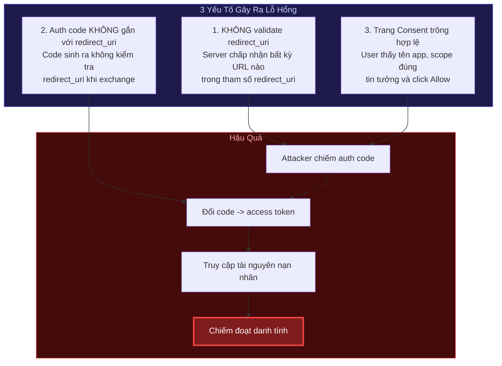

**Chi tiết kỹ thuật:**

```
Luồng hợp lệ:
  redirect_uri = http://localhost:3000/callback  (Client App)
  -> OAuth Server redirect code -> Client App
  -> Client App exchange code -> access token
  -> Client App dùng token truy cập resource

Luồng bị tấn công:
  redirect_uri = http://localhost:3001/callback  (Hacker Tool!)
  -> OAuth Server redirect code -> HACKER TOOL
  -> Hacker Tool exchange code -> access token
  -> Hacker Tool dùng token truy cập resource CỦA NẠN NHÂN!
```

---

## 8. Các Kịch Bản Tấn Công Thực Tế

### 8.1 Kịch bản trong Demo (Localhost)

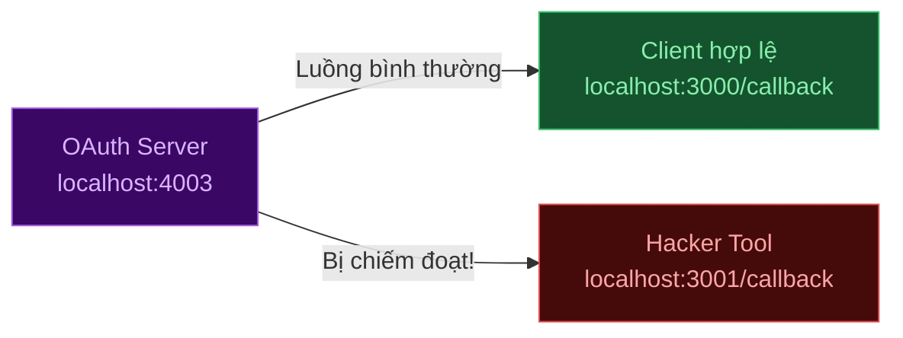

### 8.2 Các Kịch Bản Ngoài Thực Tế

| Kịch bản | Mô tả | redirect_uri giả |
|-----------|--------|-------------------|
| **Phishing Email** | Gửi email chứa link authorize với redirect_uri dẫn tới server hacker | `https://evil-hacker.com/steal` |
| **Open Redirect Chain** | Lợi dụng lỗi open redirect trên chính domain hợp lệ | `https://legit-app.com/redirect?url=https://evil.com` |
| **Subdomain Takeover** | Chiếm subdomain bỏ hoang của tổ chức | `https://old-service.legit-app.com/callback` |
| **Typosquatting** | Đăng ký domain giống domain thật | `https://leglt-app.com/callback` |
| **Referer Leakage** | Auth code lộ qua HTTP Referer header | Không cần thay đổi redirect_uri |

---

## 9. So Sánh: OAuth Server Bị Lỗi vs An Toàn

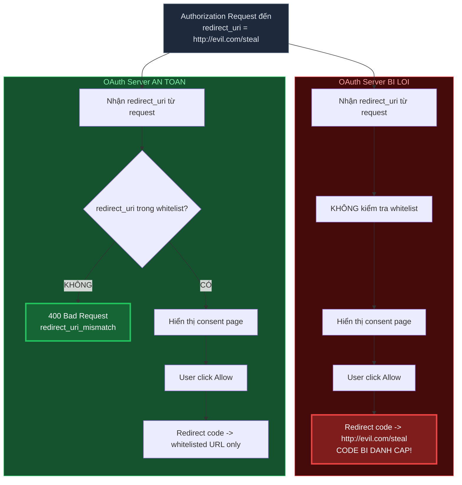

---

## 10. Cách Phòng Chống

> [!TIP]
> Phòng chống lỗ hổng OAuth2 redirect_uri interception cần áp dụng đồng thời nhiều biện pháp ở cả phía Authorization Server và Client.

### 10.1 Biện pháp chính: Validate redirect_uri Whitelist

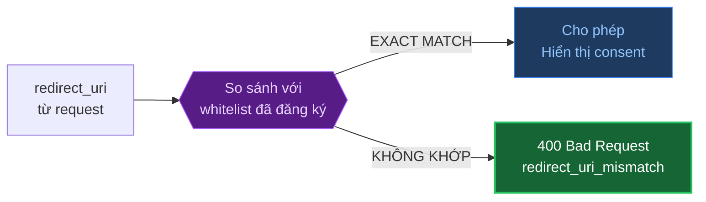

### 10.2 Code Phòng Chống

```java
// AuthorizeController.java — Phiên bản AN TOÀN:

// Whitelist các redirect_uri đã đăng ký
private static final Set<String> ALLOWED_REDIRECT_URIS = Set.of(
    "http://localhost:3000/callback",
    "https://my-app.com/oauth/callback"
);

@GetMapping("/authorize")
public String authorize(
    @RequestParam String client_id,
    @RequestParam String redirect_uri,
    @RequestParam String scope,
    @RequestParam String state,
    Model model
) {
    // KIỂM TRA REDIRECT_URI — Exact match!
    if (!ALLOWED_REDIRECT_URIS.contains(redirect_uri)) {
        throw new ResponseStatusException(
            HttpStatus.BAD_REQUEST,
            "Invalid redirect_uri: " + redirect_uri
        );
    }
    // ... tiếp tục xử lý
}
```

### 10.3 Checklist Bảo Mật OAuth2 Đầy Đủ

| Biện pháp | Mô tả | Mức độ |
|-----------|--------|--------|
| **Exact redirect_uri match** | So sánh chính xác, không dùng wildcard hay prefix match | Bắt buộc |
| **Đăng ký redirect_uri trước** | Client phải khai báo redirect_uri khi đăng ký ứng dụng | Bắt buộc |
| **State parameter** | Chống CSRF — so sánh state gửi đi và nhận về | Bắt buộc |
| **PKCE (RFC 7636)** | code_verifier + code_challenge chống interception | Khuyến nghị cao |
| **Auth code dùng 1 lần** | Xóa code ngay sau khi exchange thành công | Bắt buộc |
| **Auth code hết hạn nhanh** | Code chỉ valid trong 30s-60s | Khuyến nghị |
| **Bind code với redirect_uri** | Khi exchange, kiểm tra redirect_uri phải khớp lúc authorize | Bắt buộc |
| **HTTPS only** | Chặn man-in-the-middle đánh cắp code qua HTTP | Bắt buộc (production) |
| **Token binding** | Gắn token với session/device cụ thể | Nâng cao |

### 10.4 PKCE — Giải Pháp Mạnh Nhất

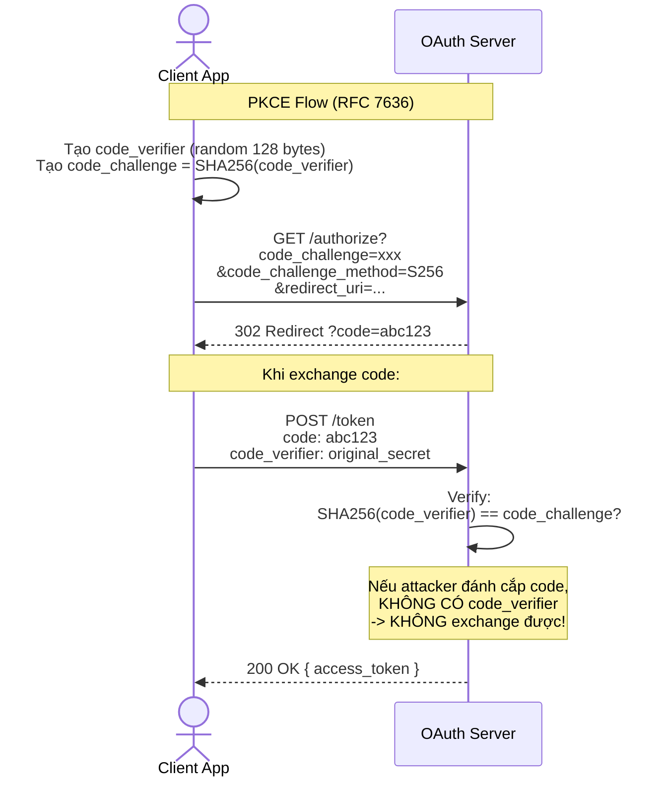

---

## 11. Mapping Sơ Đồ -> Mã Nguồn

| Bước trong sơ đồ | File mã nguồn | Mô tả |
|---|---|---|
| Cấu hình tấn công | [OAuth2AttackPage.jsx](file:///d:/Document/Security/jwt-attack-demo/hacker-tool/src/pages/OAuth2AttackPage.jsx#L3-L8) | State: oauthUrl, clientId, redirectUri |
| Tạo authorize URL | [OAuth2AttackPage.jsx](file:///d:/Document/Security/jwt-attack-demo/hacker-tool/src/pages/OAuth2AttackPage.jsx#L40-L52) | `startAuthorization()` — mở popup consent |
| **Lỗ hổng: Không validate redirect_uri** | [AuthorizeController.java](file:///d:/Document/Security/jwt-attack-demo/oauth-server/src/main/java/com/attt/oauth/controller/AuthorizeController.java#L28-L45) | `GET /authorize` — thiếu kiểm tra whitelist |
| **Redirect code về hacker** | [AuthorizeController.java](file:///d:/Document/Security/jwt-attack-demo/oauth-server/src/main/java/com/attt/oauth/controller/AuthorizeController.java#L51-L62) | `POST /authorize` — redirect không kiểm tra |
| Callback intercept code | [CallbackPage.jsx](file:///d:/Document/Security/jwt-attack-demo/hacker-tool/src/pages/CallbackPage.jsx#L10-L19) | Đọc code từ URL params, gửi postMessage |
| Nhận code qua postMessage | [OAuth2AttackPage.jsx](file:///d:/Document/Security/jwt-attack-demo/hacker-tool/src/pages/OAuth2AttackPage.jsx#L25-L38) | `handleMessage` event listener |
| Sinh auth code | [AuthCodeService.java](file:///d:/Document/Security/jwt-attack-demo/oauth-server/src/main/java/com/attt/oauth/service/AuthCodeService.java#L21-L26) | `generateCode()` — UUID random |
| Exchange code -> token | [TokenController.java](file:///d:/Document/Security/jwt-attack-demo/oauth-server/src/main/java/com/attt/oauth/controller/TokenController.java#L31-L64) | `POST /token` |
| Exchange logic | [AuthCodeService.java](file:///d:/Document/Security/jwt-attack-demo/oauth-server/src/main/java/com/attt/oauth/service/AuthCodeService.java#L29-L45) | `exchangeCode()` — verify code, tạo token |
| Khai thác userinfo | [TokenController.java](file:///d:/Document/Security/jwt-attack-demo/oauth-server/src/main/java/com/attt/oauth/controller/TokenController.java#L67-L76) | `GET /userinfo` |
| Trang consent (Thymeleaf) | [consent.html](file:///d:/Document/Security/jwt-attack-demo/oauth-server/src/main/resources/templates/consent.html) | Form hiển thị cho user |
| Security config (CORS) | [SecurityConfig.java](file:///d:/Document/Security/jwt-attack-demo/oauth-server/src/main/java/com/attt/oauth/config/SecurityConfig.java#L22-L32) | Cho phép CORS từ port 3000, 3001 |

---

## 12. So Sánh Với Tấn Công JWT Algorithm Confusion

| Tiêu chí | JWT Algorithm Confusion (CVE-2015-9235) | OAuth2 Redirect URI Interception |
|-----------|------------------------------------------|----------------------------------|
| **Mục tiêu** | Giả mạo JWT token | Chiếm đoạt authorization code |
| **Lỗ hổng ở đâu** | Thư viện JWT cũ (auto-detect alg) | OAuth Server (thiếu validate redirect_uri) |
| **Attacker cần gì** | Public Key (công khai) | Nạn nhân click link phishing |
| **Yếu tố con người** | Không cần (tự động hoàn toàn) | Cần lừa nạn nhân click Allow |
| **Kết quả** | Token giả với quyền admin | Access token của nạn nhân |
| **Phòng chống** | Algorithm whitelist | redirect_uri whitelist + PKCE |
| **CVE** | CVE-2015-9235 | Nhiều CVE, phổ biến nhất: CWE-601 |
