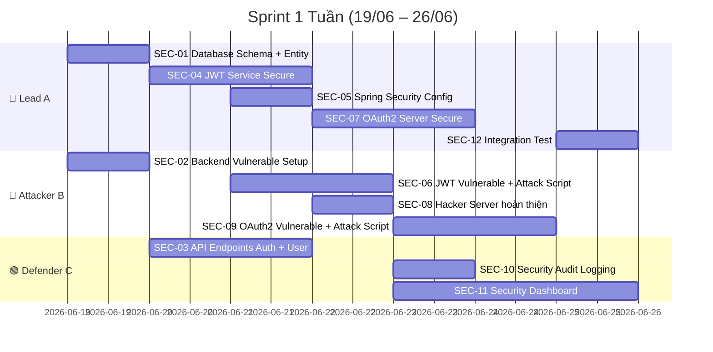

# 📋 Phân Công Nhiệm Vụ Jira — Sprint 1 Tuần

## Thông tin Sprint

| Thông tin | Giá trị |
|-----------|---------|
| **Sprint** | Sprint 1 — Core Demo |
| **Ngày bắt đầu** | Thứ Năm 19/06/2026 |
| **Deadline** | Thứ Năm 26/06/2026 (23:59) |
| **Sprint Goal** | Hoàn thành hệ thống chạy được 2 kịch bản mô phỏng Before/After: JWT Algorithm Confusion Attack + OAuth2 Authorization Code Interception |
| **Số lượng thành viên** | 3 người |
| **Docker Lab** | ✅ Đã setup xong |

### Vai trò thành viên

| Ký hiệu | Vai trò | Trách nhiệm chính |
|----------|---------|-------------------|
| 👑 **A** | Lead — Kiến trúc + Core Security | JWT Service, OAuth2 Server, Spring Security Config |
| 🔴 **B** | Attacker — Pentester | Backend Vulnerable, Attack Scripts Python, Hacker Server |
| 🟢 **C** | Defender — API + Frontend + DB | Database, Entity/Repository, API Endpoints, Dashboard |

---

## 🗂️ Tổng quan các Task



---

## 📌 CHI TIẾT TỪNG TASK

---

### SEC-01 — Thiết kế Database Schema + Entity Layer
> **Assignee**: 👑 A + 🟢 C cùng làm · **Priority**: 🔴 Highest · **Deadline**: 19/06 (Ngày 1)

**Mô tả**:
Thiết kế và tạo toàn bộ cấu trúc bảng MySQL cho hệ thống, bao gồm bảng lưu trữ người dùng, mã xác thực OAuth2, danh sách token bị thu hồi (blacklist), ứng dụng OAuth2 đăng ký, và log bảo mật. Đồng thời tạo các lớp Java Entity (JPA) ánh xạ tới các bảng này và các Repository interface để truy vấn dữ liệu.

Đây là task **nền tảng** — mọi task khác đều phụ thuộc vào task này hoàn thành trước.

**Nhiệm vụ chi tiết**:

| # | Việc cần làm | Người |
|---|-------------|-------|
| 1 | Tạo file `schema.sql` chứa lệnh `CREATE TABLE` cho 5 bảng: `users`, `oauth2_clients`, `authorization_codes`, `blacklisted_tokens`, `security_audit_log` | 🟢 C |
| 2 | Tạo file `data.sql` chứa dữ liệu mẫu ban đầu: 1 tài khoản admin (`admin@security.com`), 2 tài khoản user thường, 1 bản ghi OAuth2 client (`legit_app` với `redirect_uri = http://localhost:8080/oauth/callback`) | 🟢 C |
| 3 | Tạo các lớp Entity Java: `User.java`, `BlacklistedToken.java`, `SecurityAuditLog.java`, `OAuth2Client.java`, `AuthorizationCode.java` — mỗi entity dùng Lombok (`@Data`, `@Builder`) | 🟢 C |
| 4 | Tạo các Repository: `UserRepository` (có `findByEmail`), `BlacklistedTokenRepository` (có `existsByTokenId`), `OAuth2ClientRepository` (có `findByClientId`), `AuthorizationCodeRepository` (có `findByCode`) | 🟢 C |
| 5 | Cấu hình `application.yml` hai bản backend để Spring Boot JPA tự tạo bảng từ Entity (`ddl-auto: update`) và nạp `data.sql` | 👑 A |
| 6 | Khởi chạy `docker-compose up` → Spring Boot kết nối MySQL thành công, bảng được tạo, seed data được nạp | 👑 A + 🟢 C kiểm tra |

**Schema các bảng chính**:

```sql
-- Bảng users
users (id BIGINT PK AUTO_INCREMENT, username VARCHAR(50) UNIQUE, email VARCHAR(100) UNIQUE,
       password_hash VARCHAR(255), role VARCHAR(20) DEFAULT 'USER', created_at TIMESTAMP)

-- Bảng OAuth2 clients
oauth2_clients (client_id VARCHAR(100) PK, client_secret VARCHAR(255), client_name VARCHAR(100),
                redirect_uri VARCHAR(500), allowed_scopes VARCHAR(255))

-- Bảng authorization codes
authorization_codes (id BIGINT PK, code VARCHAR(255) UNIQUE, client_id VARCHAR(100),
                     user_id BIGINT, redirect_uri VARCHAR(500), is_used BOOLEAN DEFAULT FALSE,
                     expires_at TIMESTAMP, created_at TIMESTAMP)

-- Bảng JWT blacklist
blacklisted_tokens (id BIGINT PK, token_id VARCHAR(255) UNIQUE, expiry_time TIMESTAMP,
                    blacklisted_at TIMESTAMP DEFAULT CURRENT_TIMESTAMP)

-- Bảng log bảo mật
security_audit_log (id BIGINT PK, event_type VARCHAR(50), user_id BIGINT, ip_address VARCHAR(45),
                    endpoint VARCHAR(255), status_code INT, details TEXT, risk_level VARCHAR(20),
                    created_at TIMESTAMP)
```

**Nhiệm vụ đạt được (Definition of Done)**:
- [ ] Chạy `docker-compose up` → Spring Boot khởi động không lỗi, kết nối MySQL thành công
- [ ] Mở MySQL client (DBeaver/CLI) kết nối `localhost:3307` → Thấy 5 bảng đã tạo
- [ ] Bảng `users` chứa 3 bản ghi seed data (1 admin + 2 user)
- [ ] Bảng `oauth2_clients` chứa 1 bản ghi client `legit_app`
- [ ] Copy toàn bộ `schema.sql`, `data.sql`, Entity, Repository sang `backend-vulnerable/` (dùng chung)

**Files cần tạo**:
```
backend/src/main/resources/schema.sql
backend/src/main/resources/data.sql
backend/src/main/java/com/apisecurity/model/User.java
backend/src/main/java/com/apisecurity/model/BlacklistedToken.java
backend/src/main/java/com/apisecurity/model/SecurityAuditLog.java
backend/src/main/java/com/apisecurity/model/OAuth2Client.java
backend/src/main/java/com/apisecurity/model/AuthorizationCode.java
backend/src/main/java/com/apisecurity/repository/UserRepository.java
backend/src/main/java/com/apisecurity/repository/BlacklistedTokenRepository.java
backend/src/main/java/com/apisecurity/repository/OAuth2ClientRepository.java
backend/src/main/java/com/apisecurity/repository/AuthorizationCodeRepository.java
```

---

### SEC-02 — Setup Backend Vulnerable (Khung xương)
> **Assignee**: 🔴 B · **Priority**: 🔴 Highest · **Deadline**: 19/06 (Ngày 1)

**Mô tả**:
Sao chép toàn bộ cấu trúc mã nguồn từ `backend/` sang `backend-vulnerable/` để làm base code cho phiên bản lỗi bảo mật cố ý. Đảm bảo phiên bản vulnerable cũng kết nối được MySQL, dùng chung schema, entity và repository. Khác biệt duy nhất: các lớp Security sẽ được viết lại ở các task sau để cố ý bỏ qua kiểm tra bảo mật.

**Nhiệm vụ chi tiết**:

| # | Việc cần làm |
|---|-------------|
| 1 | Copy toàn bộ Entity, Repository, DTO từ `backend/` sang `backend-vulnerable/` (giữ cùng package `com.apisecurity`) |
| 2 | Đảm bảo `application.yml` của vulnerable có `SECURITY_MODE=vulnerable` |
| 3 | Khởi chạy `docker-compose -f docker-compose-vulnerable.yml up` → Spring Boot Vulnerable khởi động thành công, kết nối MySQL |
| 4 | Tạo sẵn cấu trúc package: `config/`, `security/jwt/`, `security/oauth2/`, `controller/` (để chuẩn bị cho SEC-06 và SEC-09) |

**Nhiệm vụ đạt được**:
- [ ] `docker-compose -f docker-compose-vulnerable.yml up` → Container `vulnerable-api-server` ở trạng thái `Running`
- [ ] Spring Boot log hiện: `Started VulnerableApplication` + `Connected to MySQL`
- [ ] Cấu trúc thư mục `backend-vulnerable/src/` sẵn sàng để thêm lớp JWT và OAuth2 ở bước sau

---

### SEC-03 — API Endpoints: Đăng ký, Đăng nhập, Profile, Admin
> **Assignee**: 🟢 C · **Priority**: 🔴 Highest · **Deadline**: 21/06 (Ngày 2–3)

**Mô tả**:
Xây dựng các API endpoint cốt lõi phục vụ cho cả 2 kịch bản demo. Đây là các endpoint mà hacker sẽ tấn công vào (đặc biệt là `GET /api/admin/users` và `GET /api/profile`). Tạo đầy đủ DTO (Data Transfer Object) cho Request/Response và Service layer xử lý nghiệp vụ.

**Nhiệm vụ chi tiết**:

| # | API Endpoint | Chức năng | Bảo mật |
|---|-------------|-----------|---------|
| 1 | `POST /api/auth/register` | Đăng ký tài khoản mới. Nhận `username`, `email`, `password`. Hash password bằng BCrypt. Role mặc định = `USER`. Trả về thông tin user (KHÔNG trả password) | Public |
| 2 | `POST /api/auth/login` | Đăng nhập. Nhận `email` + `password`. Xác thực bằng BCrypt.matches(). Nếu đúng → gọi `JwtTokenService` (task SEC-04) để sinh JWT. Trả về `access_token` | Public |
| 3 | `POST /api/auth/logout` | Đăng xuất. Lấy token từ header `Authorization: Bearer ...`, trích `jti` + `exp`, thêm vào bảng `blacklisted_tokens` | Authenticated |
| 4 | `GET /api/profile` | Xem thông tin cá nhân. Lấy `userId` từ JWT token hiện tại, query database trả về `username`, `email`, `role`, `created_at` | Authenticated |
| 5 | `GET /api/admin/users` | Xem danh sách TẤT CẢ users. Chỉ admin mới được phép gọi. Trả về list `UserResponse` | Role ADMIN |
| 6 | `GET /api/public-key` | Trả về RSA public key dạng PEM (phục vụ cho kịch bản tấn công Algorithm Confusion) | Public |

**DTO cần tạo**:

| DTO | Trường | Validation |
|-----|--------|-----------|
| `RegisterRequest` | `username`, `email`, `password` | `@NotBlank`, `@Email`, `@Size(min=6)` trên password |
| `LoginRequest` | `email`, `password` | `@NotBlank`, `@Email` |
| `UserResponse` | `id`, `username`, `email`, `role`, `createdAt` | Không chứa trường `password` hoặc `role` trong request (chống Mass Assignment) |
| `TokenResponse` | `accessToken`, `tokenType="Bearer"` | — |
| `ErrorResponse` | `status`, `error`, `message`, `timestamp` | — |

**Nhiệm vụ đạt được**:
- [ ] Gọi `POST /api/auth/register` với body `{"username":"test","email":"test@test.com","password":"123456"}` → Trả về 201 + thông tin user
- [ ] Gọi `POST /api/auth/login` với email/password đúng → Trả về `access_token` (JWT string)
- [ ] Gọi `GET /api/profile` với header `Authorization: Bearer <token>` → Trả về thông tin user
- [ ] Gọi `GET /api/admin/users` với token admin → Trả về danh sách tất cả users
- [ ] Gọi `GET /api/admin/users` với token user thường → Trả về 403 Forbidden
- [ ] Gọi `GET /api/public-key` → Trả về nội dung file `public.pem`
- [ ] `GlobalExceptionHandler` trả JSON error thống nhất, ẩn stack trace
- [ ] Copy `AuthController`, `UserController`, DTOs, `UserService` sang `backend-vulnerable/`

**Files cần tạo**:
```
backend/src/main/java/com/apisecurity/controller/AuthController.java
backend/src/main/java/com/apisecurity/controller/UserController.java
backend/src/main/java/com/apisecurity/dto/request/RegisterRequest.java
backend/src/main/java/com/apisecurity/dto/request/LoginRequest.java
backend/src/main/java/com/apisecurity/dto/response/UserResponse.java
backend/src/main/java/com/apisecurity/dto/response/TokenResponse.java
backend/src/main/java/com/apisecurity/dto/response/ErrorResponse.java
backend/src/main/java/com/apisecurity/service/UserService.java
backend/src/main/java/com/apisecurity/exception/GlobalExceptionHandler.java
```

---

### SEC-04 — JWT Token Service (Phiên bản Secure)
> **Assignee**: 👑 A · **Priority**: 🔴 Highest · **Deadline**: 21/06 (Ngày 2–3)

**Mô tả**:
Xây dựng dịch vụ JWT hoàn chỉnh cho phiên bản **Secure**. Dịch vụ này sử dụng thuật toán **RS256 (asymmetric)** — sign bằng private key, verify bằng public key. Khi verify token, hệ thống **CHỈ chấp nhận algorithm RS256** (whitelist), từ chối mọi algorithm khác (HS256, none, ...) nhằm chống lại tấn công Algorithm Confusion.

Tích hợp cơ chế **Blacklist token bằng MySQL** (bảng `blacklisted_tokens`): khi user logout, `jti` (JWT ID) được lưu vào bảng → các request sau dùng token cũ sẽ bị từ chối.

**Nhiệm vụ chi tiết**:

| # | Việc cần làm |
|---|-------------|
| 1 | Sinh cặp khóa RSA (2048-bit): `private.pem` + `public.pem`, lưu trong `src/main/resources/keys/` |
| 2 | `JwtTokenService.java`: Method `generateToken(User user)` → tạo JWT với header `alg: RS256`, payload chứa `sub` (userId), `email`, `role`, `jti` (UUID ngẫu nhiên), `iat`, `exp` (15 phút). Sign bằng private key |
| 3 | `JwtTokenService.java`: Method `validateToken(String token)` → Parse token, **BẮT BUỘC kiểm tra algorithm == RS256** trước khi verify signature bằng public key. Nếu algorithm khác → throw exception ngay lập tức |
| 4 | `JwtTokenService.java`: Method `isTokenBlacklisted(String jti)` → Query bảng `blacklisted_tokens` kiểm tra `jti` có tồn tại không |
| 5 | `JwtTokenService.java`: Method `blacklistToken(String jti, Date expiryTime)` → Insert bản ghi vào bảng `blacklisted_tokens` |
| 6 | `JwtAuthFilter.java`: Extends `OncePerRequestFilter`. Lấy token từ header `Authorization: Bearer ...` → Gọi `validateToken()` → Nếu hợp lệ VÀ không bị blacklist → set `SecurityContext`. Nếu lỗi → trả 401 JSON |
| 7 | `@Scheduled` method chạy mỗi giờ: `DELETE FROM blacklisted_tokens WHERE expiry_time < NOW()` |

**Luồng xử lý khi verify token (QUAN TRỌNG cho demo)**:
```
1. Lấy header từ JWT → đọc trường "alg"
2. Kiểm tra: alg == "RS256" ?
   → Nếu KHÔNG (HS256, none, ...) → REJECT ngay, trả 401 + log cảnh báo
   → Nếu ĐÚNG → tiếp tục verify signature bằng public key
3. Kiểm tra: jti có trong bảng blacklisted_tokens không?
   → Nếu CÓ → REJECT, trả 401 "Token has been revoked"
4. Kiểm tra: exp > hiện tại?
   → Nếu KHÔNG → REJECT, trả 401 "Token expired"
5. Tất cả OK → Set SecurityContext, cho phép request đi tiếp
```

**Nhiệm vụ đạt được**:
- [ ] Sinh JWT bằng RS256 thành công, decode trên https://jwt.io hiển thị đúng header/payload
- [ ] Gửi request với JWT hợp lệ (RS256) → `GET /api/profile` → 200 OK
- [ ] Gửi request với JWT giả (HS256 + public key) → `GET /api/profile` → **401 Unauthorized** + message `"Algorithm HS256 is not allowed"`
- [ ] Gửi request với JWT `alg: none` → **401 Unauthorized** + message `"Algorithm none is not allowed"`
- [ ] Sau khi gọi `POST /api/auth/logout` → dùng lại token cũ → **401 Unauthorized** + message `"Token has been revoked"`

**Files cần tạo**:
```
backend/src/main/resources/keys/private.pem
backend/src/main/resources/keys/public.pem
backend/src/main/java/com/apisecurity/security/jwt/JwtTokenService.java
backend/src/main/java/com/apisecurity/security/jwt/JwtAuthFilter.java
backend/src/main/java/com/apisecurity/security/jwt/JwtProperties.java
```

---

### SEC-05 — Spring Security Config (Secure)
> **Assignee**: 👑 A · **Priority**: 🟠 High · **Deadline**: 21/06 (Ngày 3)

**Mô tả**:
Cấu hình Spring Security Filter Chain cho phiên bản Secure. Xác định endpoint nào public, endpoint nào cần xác thực, endpoint nào cần quyền admin. Tích hợp `JwtAuthFilter` vào chuỗi filter. Cấu hình CORS cho phép Dashboard (port 3000) gọi API.

**Nhiệm vụ chi tiết**:

| # | Cấu hình |
|---|---------|
| 1 | Disable CSRF (vì dùng JWT stateless, không dùng cookie session) |
| 2 | Endpoint `POST /api/auth/**` và `GET /api/public-key` → `permitAll()` |
| 3 | Endpoint `GET /api/admin/**` → `hasRole("ADMIN")` |
| 4 | Tất cả endpoint còn lại → `authenticated()` |
| 5 | Thêm `JwtAuthFilter` vào trước `UsernamePasswordAuthenticationFilter` |
| 6 | CORS: Cho phép origin `http://localhost:3000` (Dashboard) |
| 7 | Endpoint OAuth2 `GET /oauth/**`, `POST /oauth/**` → `permitAll()` |

**Nhiệm vụ đạt được**:
- [ ] Gọi `POST /api/auth/register` không cần token → 201 OK
- [ ] Gọi `GET /api/profile` không có token → 401 Unauthorized
- [ ] Gọi `GET /api/admin/users` với token role USER → 403 Forbidden
- [ ] Gọi `GET /api/admin/users` với token role ADMIN → 200 OK
- [ ] Dashboard ở `localhost:3000` gọi API `localhost:8080` không bị lỗi CORS

**Files cần tạo**:
```
backend/src/main/java/com/apisecurity/config/SecurityConfig.java
backend/src/main/java/com/apisecurity/config/CorsConfig.java
```

---

### SEC-06 — JWT Vulnerable Version + Script tấn công Algorithm Confusion
> **Assignee**: 🔴 B · **Priority**: 🔴 Highest · **Deadline**: 23/06 (Ngày 3–4)

**Mô tả**:
Đây là task **QUAN TRỌNG NHẤT** cho kịch bản demo thứ nhất. Gồm 2 phần:

**Phần 1 — Backend Vulnerable JWT**: Tạo lớp `VulnerableJwtService.java` cố ý KHÔNG kiểm tra algorithm khi verify token. Server sẽ đọc trường `alg` trong header JWT và dùng bất kỳ algorithm nào mà token yêu cầu (kể cả HS256, none). Điều này cho phép hacker tạo token giả bằng HS256 + public key.

**Phần 2 — Attack Script Python**: Viết script `attack_algorithm_confusion.py` tự động thực hiện tấn công Algorithm Confusion từ đầu đến cuối: lấy public key → tạo forged token (HS256 + public key) → gọi `/api/admin/users` → hiển thị kết quả.

**Nhiệm vụ chi tiết — Phần 1 (Backend Vulnerable)**:

| # | Việc cần làm |
|---|-------------|
| 1 | `VulnerableJwtService.java`: Method `validateToken()` — KHÔNG kiểm tra algorithm, chấp nhận mọi `alg` (HS256, RS256, none) |
| 2 | `VulnerableJwtService.java`: Method `validateToken()` — Khi gặp `alg: HS256`, dùng public key làm secret để verify → token giả sẽ verify THÀNH CÔNG |
| 3 | `VulnerableJwtFilter.java`: Giống `JwtAuthFilter` nhưng gọi `VulnerableJwtService` |
| 4 | `VulnerableSecurityConfig.java`: Config Spring Security tương tự bản Secure nhưng dùng `VulnerableJwtFilter` |
| 5 | KHÔNG có blacklist token |

**Nhiệm vụ chi tiết — Phần 2 (Attack Script)**:

| # | Việc cần làm |
|---|-------------|
| 1 | Script nhận tham số `--target` (URL API, mặc định `http://localhost:8080`) |
| 2 | Bước 1: Gọi `GET /api/public-key` → Nhận RSA public key → In ra terminal |
| 3 | Bước 2: Tạo JWT payload `{"sub":"1","email":"admin@security.com","role":"ADMIN","jti":"fake-id","exp":9999999999}`, header `{"alg":"HS256"}`, sign bằng HS256 với public key làm secret → In forged token ra terminal |
| 4 | Bước 3: Gọi `GET /api/admin/users` với header `Authorization: Bearer <forged_token>` |
| 5 | Hiển thị kết quả: Nếu 200 → In `✅ ATTACK SUCCESS — Got admin data!` (màu đỏ) + hiển thị danh sách users. Nếu 401 → In `❌ ATTACK BLOCKED` (màu xanh) |

**Nhiệm vụ đạt được**:
- [ ] Chạy `docker-compose -f docker-compose-vulnerable.yml up` → API vulnerable hoạt động
- [ ] Chạy `python attack_algorithm_confusion.py --target http://localhost:8080` → Terminal in ra: `✅ ATTACK SUCCESS — Got admin data!` + hiển thị danh sách users
- [ ] Đổi target sang bản Secure → chạy lại script → Terminal in ra: `❌ ATTACK BLOCKED — 401 Unauthorized: Algorithm HS256 is not allowed`
- [ ] Script có docstring ghi rõ: `Attack: Algorithm Confusion (CVE-2015-9235)`, `OWASP: API2:2023 Broken Authentication`

**Files cần tạo**:
```
backend-vulnerable/src/main/java/com/apisecurity/security/jwt/VulnerableJwtService.java
backend-vulnerable/src/main/java/com/apisecurity/security/jwt/VulnerableJwtFilter.java
backend-vulnerable/src/main/java/com/apisecurity/config/VulnerableSecurityConfig.java
attacks/jwt/attack_algorithm_confusion.py
```

---

### SEC-07 — OAuth2 Authorization Server (Phiên bản Secure)
> **Assignee**: 👑 A · **Priority**: 🔴 Highest · **Deadline**: 24/06 (Ngày 4–5)

**Mô tả**:
Xây dựng OAuth2 Authorization Server đơn giản (tự implement bằng Controller, không dùng Spring Authorization Server) hỗ trợ **Authorization Code Flow**. Phiên bản Secure yêu cầu **validate `redirect_uri` chính xác (exact match)** so với bảng `oauth2_clients` trong database. Nếu `redirect_uri` trong request không khớp 100% với `redirect_uri` đã đăng ký → từ chối ngay lập tức.

**Nhiệm vụ chi tiết**:

| # | API Endpoint | Chức năng |
|---|-------------|-----------|
| 1 | `GET /oauth/authorize` | Nhận params: `client_id`, `redirect_uri`, `response_type=code`, `state`. Kiểm tra `client_id` tồn tại trong bảng `oauth2_clients`. **Kiểm tra `redirect_uri` khớp CHÍNH XÁC** với bảng. Nếu hợp lệ → Sinh `authorization_code` (UUID, hết hạn 5 phút) → Lưu vào bảng `authorization_codes` → Redirect `302` về `redirect_uri?code=<code>&state=<state>` |
| 2 | `POST /oauth/token` | Nhận body: `code`, `client_id`, `redirect_uri`. Kiểm tra `code` tồn tại và chưa dùng (`is_used = false`). Kiểm tra `redirect_uri` khớp với bản ghi. Đánh dấu `is_used = true`. Sinh access_token (JWT) và trả về |
| 3 | `GET /oauth/callback` | Trang callback mặc định. Nhận `code` + `state` từ query string. Hiển thị "Authorization successful, code received" (dùng cho demo flow bình thường) |

**Luồng validate `redirect_uri` (QUAN TRỌNG cho demo)**:
```
Request: GET /oauth/authorize?client_id=legit_app&redirect_uri=http://localhost:4000/callback

1. Query DB: SELECT redirect_uri FROM oauth2_clients WHERE client_id = 'legit_app'
   → Kết quả: "http://localhost:8080/oauth/callback"

2. So sánh EXACT MATCH:
   request: "http://localhost:4000/callback"
   database: "http://localhost:8080/oauth/callback"
   → KHÔNG KHỚP → REJECT!

3. Trả về 400 Bad Request:
   {"error": "invalid_redirect_uri", "message": "redirect_uri does not match registered URI"}
```

**Nhiệm vụ đạt được**:
- [ ] Gọi `GET /oauth/authorize?client_id=legit_app&redirect_uri=http://localhost:8080/oauth/callback&response_type=code&state=abc123` → 302 Redirect về `http://localhost:8080/oauth/callback?code=<UUID>&state=abc123`
- [ ] Gọi với `redirect_uri=http://localhost:4000/callback` (hacker server) → **400 Bad Request** + `"redirect_uri does not match registered URI"`
- [ ] Gọi `POST /oauth/token` với code hợp lệ → Trả về `access_token`
- [ ] Gọi `POST /oauth/token` với code đã dùng rồi → **400** `"Authorization code already used"`

**Files cần tạo**:
```
backend/src/main/java/com/apisecurity/security/oauth2/OAuth2Controller.java
```

---

### SEC-08 — Hoàn thiện Hacker Server
> **Assignee**: 🔴 B · **Priority**: 🟠 High · **Deadline**: 23/06 (Ngày 4)

**Mô tả**:
Hoàn thiện Flask Hacker Server (đã có khung ở `attacks/hacker-server/server.py`) để phục vụ cho kịch bản demo OAuth2 Authorization Code Interception. Server này đóng vai trò máy chủ của hacker, lắng nghe trên port 4000, chờ hứng `authorization_code` bị đánh cắp khi victim bị redirect.

**Nhiệm vụ chi tiết**:

| # | Việc cần làm |
|---|-------------|
| 1 | Route `GET /callback`: Nhận `code` + `state` từ query string. In ra terminal dạng `🎣 Caught stolen auth code: <code>`. Lưu code vào biến toàn cục |
| 2 | Route `GET /stolen-code`: Trả về code vừa bắt được dạng JSON (để attack script có thể tự động lấy) |
| 3 | In log có màu sắc (dùng ANSI escape codes) để khi demo, giảng viên nhìn thấy rõ ràng trên terminal |
| 4 | Rebuild Docker image: `docker-compose up --build hacker-server` → Test `curl http://localhost:4000/callback?code=test123` → Terminal in ra code |

**Nhiệm vụ đạt được**:
- [ ] Truy cập `http://localhost:4000` → Hiển thị `"💀 Hacker Server is running..."`
- [ ] Truy cập `http://localhost:4000/callback?code=ABC123&state=xyz` → Terminal hiện `🎣 Caught stolen auth code: ABC123`
- [ ] Truy cập `http://localhost:4000/stolen-code` → JSON `{"captured_code": "ABC123"}`

**File cần sửa**:
```
attacks/hacker-server/server.py
```

---

### SEC-09 — OAuth2 Vulnerable Version + Script tấn công Authorization Code Interception
> **Assignee**: 🔴 B · **Priority**: 🔴 Highest · **Deadline**: 25/06 (Ngày 5–6)

**Mô tả**:
Đây là task **QUAN TRỌNG NHẤT** cho kịch bản demo thứ hai. Gồm 2 phần:

**Phần 1 — Backend Vulnerable OAuth2**: Tạo `VulnerableOAuth2Controller.java` cố ý **KHÔNG validate `redirect_uri`** — chấp nhận bất kỳ URL nào mà request gửi lên, kể cả URL của hacker server (`http://localhost:4000/callback`).

**Phần 2 — Attack Script Python**: Viết script `attack_oauth2_redirect.py` tự động giả lập kịch bản tấn công: tạo link phishing với `redirect_uri` trỏ sang hacker server → gọi `/oauth/authorize` → authorization code bị redirect sang hacker server → script lấy code từ hacker server → đổi code lấy access_token → dùng token truy cập `/api/profile` của victim.

**Nhiệm vụ chi tiết — Phần 1 (Backend Vulnerable OAuth2)**:

| # | Việc cần làm |
|---|-------------|
| 1 | `VulnerableOAuth2Controller.java`: Endpoint `GET /oauth/authorize` — KHÔNG kiểm tra `redirect_uri`, chấp nhận mọi URL |
| 2 | Khi nhận request → Sinh authorization code → Redirect 302 về BẤT KỲ `redirect_uri` nào client gửi lên (kể cả `http://localhost:4000/callback`) |
| 3 | Endpoint `POST /oauth/token` — KHÔNG kiểm tra `redirect_uri` khớp với bản ghi gốc |

**Nhiệm vụ chi tiết — Phần 2 (Attack Script)**:

| # | Việc cần làm |
|---|-------------|
| 1 | Script nhận tham số `--target` (URL API), `--hacker-server` (URL hacker, mặc định `http://localhost:4000`) |
| 2 | Bước 1: In ra URL phishing mà hacker sẽ gửi cho victim: `http://localhost:8080/oauth/authorize?client_id=legit_app&redirect_uri=http://localhost:4000/callback&response_type=code&state=hacked` |
| 3 | Bước 2: Gọi `GET /oauth/authorize` với `redirect_uri=http://localhost:4000/callback` (mô phỏng victim click link). Theo dõi redirect 302 |
| 4 | Bước 3: Lấy authorization code từ hacker server (`GET http://localhost:4000/stolen-code`) |
| 5 | Bước 4: Gọi `POST /oauth/token` với code vừa đánh cắp → Nhận `access_token` |
| 6 | Bước 5: Gọi `GET /api/profile` với access_token → Hiển thị thông tin victim |
| 7 | In kết quả: `✅ ATTACK SUCCESS — Stole victim's access token!` hoặc `❌ ATTACK BLOCKED` |

**Nhiệm vụ đạt được**:
- [ ] Chạy bản Vulnerable + `python attack_oauth2_redirect.py` → Terminal in: `✅ ATTACK SUCCESS — Stole victim's access token!` + hiển thị thông tin victim
- [ ] Terminal hacker-server đồng thời in: `🎣 Caught stolen auth code: <code>`
- [ ] Đổi target sang bản Secure → chạy lại → `❌ ATTACK BLOCKED — 400: redirect_uri does not match`
- [ ] Script có docstring ghi rõ: `Attack: OAuth2 Authorization Code Interception`, `OWASP: API2:2023 Broken Authentication`

**Files cần tạo**:
```
backend-vulnerable/src/main/java/com/apisecurity/security/oauth2/VulnerableOAuth2Controller.java
attacks/oauth2/attack_oauth2_redirect.py
```

---

### SEC-10 — Security Audit Logging Service
> **Assignee**: 🟢 C · **Priority**: 🟠 High · **Deadline**: 24/06 (Ngày 5)

**Mô tả**:
Xây dựng dịch vụ ghi log bảo mật. Mọi sự kiện quan trọng (login thành công, login thất bại, JWT bị reject vì algorithm sai, redirect_uri bị chặn) đều phải ghi vào bảng `security_audit_log` trong MySQL. Tạo API endpoint cho Dashboard gọi lấy dữ liệu.

**Nhiệm vụ chi tiết**:

| # | Việc cần làm |
|---|-------------|
| 1 | `SecurityAuditService.java`: Method `logEvent(eventType, userId, ipAddress, endpoint, statusCode, details, riskLevel)` → Insert vào bảng `security_audit_log` |
| 2 | Tích hợp vào `JwtAuthFilter`: Khi token bị reject → gọi `logEvent("JWT_REJECTED", ..., "HIGH")` |
| 3 | Tích hợp vào `AuthController`: Login thành công → `logEvent("LOGIN_SUCCESS", ..., "LOW")`. Login thất bại → `logEvent("LOGIN_FAILED", ..., "MEDIUM")` |
| 4 | Tích hợp vào `OAuth2Controller`: redirect_uri bị chặn → `logEvent("OAUTH2_REDIRECT_BLOCKED", ..., "HIGH")` |
| 5 | `GET /api/admin/audit-logs`: Trả danh sách log (20 bản ghi mới nhất) |
| 6 | `GET /api/admin/audit-logs/stats`: Trả `{"totalRequests": N, "totalBlocked": M, "blockRate": "97.2%"}` |

**Nhiệm vụ đạt được**:
- [ ] Sau khi chạy attack script JWT → Bảng `security_audit_log` có bản ghi `event_type = "JWT_REJECTED"`, `risk_level = "HIGH"`
- [ ] Sau khi chạy attack script OAuth2 (bản Secure) → Bảng có bản ghi `event_type = "OAUTH2_REDIRECT_BLOCKED"`
- [ ] Gọi `GET /api/admin/audit-logs` → Trả về danh sách log dạng JSON
- [ ] Gọi `GET /api/admin/audit-logs/stats` → Trả về thống kê tổng hợp

**Files cần tạo**:
```
backend/src/main/java/com/apisecurity/service/SecurityAuditService.java
backend/src/main/java/com/apisecurity/controller/AuditLogController.java
```

---

### SEC-11 — Security Monitoring Dashboard (React)
> **Assignee**: 🟢 C · **Priority**: 🟠 High · **Deadline**: 26/06 (Ngày 5–7)

**Mô tả**:
Xây dựng giao diện Dashboard giám sát bảo mật bằng React (khung Vite đã có sẵn trong `dashboard/`). Dashboard phải hiển thị: thống kê tổng quan (tổng request, tổng attack bị chặn, tỷ lệ chặn), bảng log sự kiện bảo mật realtime (lấy từ API `GET /api/admin/audit-logs`), và trạng thái hệ thống. Giao diện phải theo phong cách **Dark Mode**, trông chuyên nghiệp giống SOC (Security Operations Center) dashboard.

**Nhiệm vụ chi tiết**:

| # | Component | Chức năng |
|---|----------|-----------|
| 1 | Layout chính `App.jsx` | Header có logo + trạng thái mode (Secure/Vulnerable), body chia 2 cột |
| 2 | Panel Metrics | Hiển thị: Total Hits, Blocked Attacks (%), trạng thái các dịch vụ (API Online, DB Connected) |
| 3 | Bảng Audit Log | Bảng hiển thị log từ API. Mỗi dòng có: thời gian, loại sự kiện, mức độ nghiêm trọng (LOW/MEDIUM/HIGH/CRITICAL), trạng thái (BLOCKED/SUCCESS) |
| 4 | Nút Refresh | Click để tải lại log từ API |
| 5 | Styling | Toàn bộ dùng Vanilla CSS (file `index.css`). Dark mode, font monospace cho log, màu sắc phân biệt severity |

**Nhiệm vụ đạt được**:
- [ ] Truy cập `http://localhost:3000` → Hiển thị Dashboard đẹp, Dark Mode
- [ ] Dashboard gọi API `GET /api/admin/audit-logs` → Hiển thị danh sách log thực từ database
- [ ] Dashboard gọi API `GET /api/admin/audit-logs/stats` → Hiển thị metrics (Total, Blocked, Rate)
- [ ] Khi chạy attack script → Refresh Dashboard → Log mới xuất hiện với severity HIGH/CRITICAL
- [ ] Không bị lỗi CORS khi gọi API từ `localhost:3000` → `localhost:8080`

**Files cần tạo/sửa**:
```
dashboard/src/App.jsx
dashboard/src/index.css
dashboard/src/components/AuditLogTable.jsx
dashboard/src/components/MetricsPanel.jsx
```

---

### SEC-12 — Integration Test + Fix Bug
> **Assignee**: 👑 A (chủ trì) + 🔴 B + 🟢 C · **Priority**: 🔴 Highest · **Deadline**: 26/06 (Ngày 7)

**Mô tả**:
Kiểm tra tích hợp toàn bộ hệ thống end-to-end. Chạy đầy đủ 2 kịch bản demo (JWT Algorithm Confusion + OAuth2 Code Interception) trên cả 2 môi trường (Vulnerable + Secure). Xác nhận kết quả Before/After đúng kịch bản. Fix mọi bug phát sinh.

**Quy trình kiểm tra**:

```
=== KỊCH BẢN 1: JWT Algorithm Confusion ===

[Bước 1] docker-compose -f docker-compose-vulnerable.yml up -d
[Bước 2] python attacks/jwt/attack_algorithm_confusion.py --target http://localhost:8080
         → Mong đợi: ✅ ATTACK SUCCESS — Got admin data!
[Bước 3] docker-compose -f docker-compose-vulnerable.yml down -v
[Bước 4] docker-compose up -d
[Bước 5] python attacks/jwt/attack_algorithm_confusion.py --target http://localhost:8080
         → Mong đợi: ❌ ATTACK BLOCKED — 401 Algorithm HS256 is not allowed
[Bước 6] Mở Dashboard (localhost:3000) → Thấy log "JWT_REJECTED" severity HIGH

=== KỊCH BẢN 2: OAuth2 Authorization Code Interception ===

[Bước 7] docker-compose -f docker-compose-vulnerable.yml up -d
[Bước 8] python attacks/oauth2/attack_oauth2_redirect.py --target http://localhost:8080
         → Mong đợi: ✅ ATTACK SUCCESS — Stole victim's access token!
         → Hacker Server terminal: 🎣 Caught stolen auth code
[Bước 9] docker-compose -f docker-compose-vulnerable.yml down -v
[Bước 10] docker-compose up -d
[Bước 11] python attacks/oauth2/attack_oauth2_redirect.py --target http://localhost:8080
          → Mong đợi: ❌ ATTACK BLOCKED — 400 redirect_uri does not match
[Bước 12] Dashboard → Thấy log "OAUTH2_REDIRECT_BLOCKED" severity HIGH
```

**Nhiệm vụ đạt được**:
- [ ] 12/12 bước kiểm tra trên đều PASS
- [ ] Dashboard hiển thị log chính xác sau mỗi lần tấn công
- [ ] Không còn lỗi runtime hoặc exception chưa xử lý
- [ ] Ghi chú lại các bug đã fix (nếu có) vào commit message

---

## 📊 Tổng hợp phân công theo thành viên

### 👑 Thành viên A — Lead

| Task | Mô tả ngắn | Deadline |
|------|-----------|----------|
| SEC-01 (phối hợp) | Cấu hình application.yml kết nối DB | 19/06 |
| **SEC-04** | JWT Token Service (RS256, Blacklist, Filter) | 21/06 |
| **SEC-05** | Spring Security Config | 21/06 |
| **SEC-07** | OAuth2 Authorization Server (validate redirect_uri) | 24/06 |
| SEC-12 (chủ trì) | Integration Test toàn bộ | 26/06 |

### 🔴 Thành viên B — Attacker

| Task | Mô tả ngắn | Deadline |
|------|-----------|----------|
| **SEC-02** | Setup Backend Vulnerable (copy structure) | 19/06 |
| **SEC-06** | JWT Vulnerable + Script `attack_algorithm_confusion.py` | 23/06 |
| **SEC-08** | Hoàn thiện Hacker Server Flask | 23/06 |
| **SEC-09** | OAuth2 Vulnerable + Script `attack_oauth2_redirect.py` | 25/06 |
| SEC-12 (phối hợp) | Test attack scripts trên cả 2 môi trường | 26/06 |

### 🟢 Thành viên C — Defender

| Task | Mô tả ngắn | Deadline |
|------|-----------|----------|
| **SEC-01** | Database Schema + Entity + Repository | 19/06 |
| **SEC-03** | API Endpoints (Register, Login, Profile, Admin, Public-key) | 21/06 |
| **SEC-10** | Security Audit Logging Service | 24/06 |
| **SEC-11** | Security Monitoring Dashboard (React) | 26/06 |
| SEC-12 (phối hợp) | Test Dashboard hiển thị log chính xác | 26/06 |

---

## 📅 Timeline tổng quan 1 tuần

```
Ngày 1 (19/06 — Thứ Năm):
  👑 A: Cấu hình DB + Review schema
  🔴 B: Copy structure → backend-vulnerable
  🟢 C: Schema + Entity + Repository + Seed data

Ngày 2–3 (20–21/06 — Thứ Sáu–Thứ Bảy):
  👑 A: JWT Service Secure + Spring Security Config
  🔴 B: (Chờ API endpoints từ C để bắt đầu viết Vulnerable JWT)
  🟢 C: API Endpoints (Auth + User + Public-key)

Ngày 3–4 (21–23/06 — Thứ Bảy–Thứ Hai):
  👑 A: Bắt đầu OAuth2 Server
  🔴 B: JWT Vulnerable + Script tấn công Algorithm Confusion
  🟢 C: Hỗ trợ B test API endpoints

Ngày 4–5 (23–24/06 — Thứ Hai–Thứ Ba):
  👑 A: Hoàn thiện OAuth2 Server Secure
  🔴 B: Hoàn thiện Hacker Server + Bắt đầu OAuth2 Vulnerable
  🟢 C: Audit Logging Service

Ngày 5–6 (24–25/06 — Thứ Ba–Thứ Tư):
  👑 A: Review code B + C, fix integration issues
  🔴 B: OAuth2 Vulnerable + Script tấn công OAuth2
  🟢 C: Dashboard React

Ngày 7 (26/06 — Thứ Năm):
  👑 A + 🔴 B + 🟢 C: INTEGRATION TEST — Chạy full 2 kịch bản Before/After
```
