# PROMPT ĐẦY ĐỦ — Hệ Thống Demo Bảo Mật API: JWT & OAuth2

> **Đề bài số 44:** Thực hành tấn công và bảo mật API bằng JWT (JSON Web Token) và OAuth2.
>
> **Hướng dẫn thầy:** _"Làm cả 2 và so sánh"_ — Demo web không có bảo mật, demo tấn công JWT/OAuth2 sai cách, và demo phiên bản an toàn. So sánh cả 3.

---

## PHẦN 0: KIẾN TRÚC DỰ ÁN — 3 PHIÊN BẢN

### Cấu Trúc 3 Phiên Bản (Yêu Cầu Thầy)

| Phiên bản | Mô tả | Mục tiêu demo |
|---|---|---|
| **v1 — Không Bảo Mật** | API không có auth gì cả | Chứng minh nguy hiểm khi không có JWT/OAuth2 |
| **v2 — JWT/OAuth2 Sai** | Có bảo mật nhưng implement sai | Chứng minh bảo mật sai vẫn bị hack |
| **v3 — JWT/OAuth2 Đúng** | Implement đúng chuẩn RFC | Chứng minh hiệu quả khi làm đúng |

### Tech Stack

| Thành phần | Công nghệ | Port |
|---|---|---|
| Client App (người dùng hợp lệ) | React (Vite) | 3000 |
| Hacker Tool (kẻ tấn công) | React (Vite) | 3001 |
| server-no-auth (v1 — Không bảo mật) | Spring Boot | 4000 |
| server-vulnerable (v2 — JWT/OAuth2 sai) | Spring Boot | 4002 |
| server-secure (v3 — JWT/OAuth2 đúng) | Spring Boot | 4001 |
| oauth-server (Authorization Server) | Spring Boot | 4003 |

### Cấu Trúc Thư Mục

```
jwt-oauth2-demo/
├── client-app/            # React Port 3000 — Client hợp lệ
│   └── src/pages/
│       ├── HomePage.jsx
│       ├── LoginPage.jsx
│       ├── ProfilePage.jsx
│       └── OAuth2CallbackPage.jsx
├── hacker-tool/           # React Port 3001 — Tool tấn công
│   └── src/pages/
│       ├── NoAuthAttackPage.jsx      ← Demo tấn công v1
│       ├── JwtAttackPage.jsx         ← Demo JWT attacks
│       ├── OAuth2AttackPage.jsx      ← Demo OAuth2 attacks
│       └── CallbackPage.jsx
├── server-no-auth/        # Spring Boot Port 4000 — KHÔNG bảo mật (v1)
│   └── src/main/java/com/attt/noauth/
│       ├── controller/UserController.java
│       └── controller/OrderController.java
├── server-vulnerable/     # Spring Boot Port 4002 — JWT/OAuth2 SAI (v2)
│   └── src/main/java/com/attt/vulnerable/
│       ├── controller/AuthController.java
│       ├── controller/UserController.java
│       └── security/JwtService.java
├── server-secure/         # Spring Boot Port 4001 — JWT/OAuth2 ĐÚNG (v3)
│   └── src/main/java/com/attt/secure/
│       ├── controller/AuthController.java
│       ├── controller/UserController.java
│       └── security/JwtService.java
└── oauth-server/          # Spring Boot Port 4003 — OAuth2 Auth Server
    └── src/main/java/com/attt/oauth/
        ├── controller/AuthorizeController.java
        ├── controller/TokenController.java
        └── service/AuthCodeService.java
```

### Sơ Đồ Kiến Trúc Tổng Thể — 3 Phiên Bản

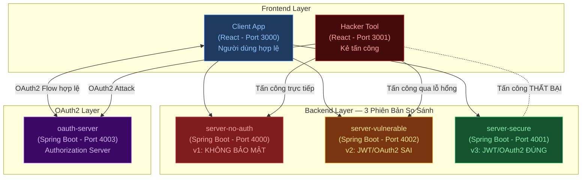

---

## PHẦN 1: WEB KHÔNG CÓ BẢO MẬT — server-no-auth (Port 4000)

> **Mục tiêu:** Cho thấy điều gì xảy ra khi API không có JWT, không có OAuth2, không có bất kỳ cơ chế xác thực nào.

### 1.1 Lỗ Hổng 1 — Unauthorized Access (Truy Cập Trái Phép)

#### Mô tả
API trả về dữ liệu nhạy cảm mà không yêu cầu đăng nhập hay token.

#### Code Bị Lỗi — server-no-auth

```java
// UserController.java — server-no-auth
@RestController
@RequestMapping("/api")
@CrossOrigin(origins = "*")  // Cho phép mọi origin!
public class UserController {

    @GetMapping("/users/{userId}/profile")
    public ResponseEntity<User> getProfile(@PathVariable Long userId) {
        // KHÔNG CÓ @PreAuthorize
        // KHÔNG CÓ token check
        // KHÔNG CÓ session check
        // BẤT KỲ AI CŨNG TRUY CẬP ĐƯỢC!
        return ResponseEntity.ok(userService.findById(userId));
    }

    @GetMapping("/admin/users")
    public ResponseEntity<List<User>> getAllUsers() {
        // KHÔNG KIỂM TRA role admin!
        // Bất kỳ ai cũng xem được toàn bộ user!
        return ResponseEntity.ok(userService.findAll());
    }

    @GetMapping("/users/{userId}/orders")
    public ResponseEntity<List<Order>> getOrders(@PathVariable Long userId) {
        // KHÔNG kiểm tra người gọi có phải chủ account không!
        return ResponseEntity.ok(orderService.findByUserId(userId));
    }
}
```

#### Demo Tấn Công — Không cần token, không cần đăng nhập

```bash
# Lấy profile của bất kỳ user nào:
curl http://localhost:4000/api/users/1/profile
curl http://localhost:4000/api/users/2/profile
curl http://localhost:4000/api/users/3/profile

# Xem toàn bộ danh sách user (quyền admin):
curl http://localhost:4000/api/admin/users

# Xem đơn hàng của người khác:
curl http://localhost:4000/api/users/1/orders
curl http://localhost:4000/api/users/2/orders
```

---

### 1.2 Lỗ Hổng 2 — IDOR (Insecure Direct Object Reference)

#### Mô tả
User A có thể xem, sửa, xóa dữ liệu của User B chỉ bằng cách thay đổi ID trong URL.

#### Code Bị Lỗi

```java
@GetMapping("/orders/{orderId}")
public ResponseEntity<Order> getOrder(@PathVariable Long orderId) {
    // KHÔNG kiểm tra order này có thuộc về người request không!
    return ResponseEntity.ok(orderService.findById(orderId));
}

@PutMapping("/orders/{orderId}")
public ResponseEntity<Order> updateOrder(@PathVariable Long orderId, @RequestBody Order order) {
    // KHÔNG kiểm tra quyền sở hữu → Sửa đơn hàng của người khác!
    return ResponseEntity.ok(orderService.update(orderId, order));
}
```

#### Sơ Đồ Tấn Công IDOR

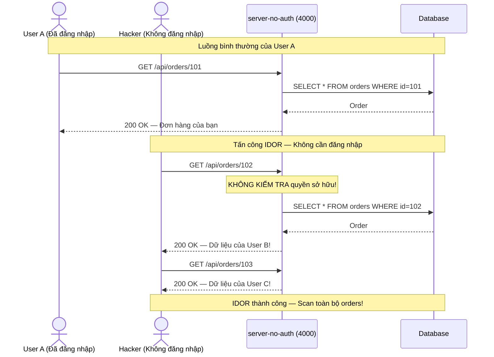

---

### 1.3 Hướng Dẫn Build — server-no-auth

```java
// SecurityConfig.java — server-no-auth
@Configuration
@EnableWebSecurity
public class SecurityConfig {

    @Bean
    public SecurityFilterChain filterChain(HttpSecurity http) throws Exception {
        http
            .csrf(csrf -> csrf.disable())
            .cors(cors -> cors.configurationSource(corsConfigurationSource()))
            .authorizeHttpRequests(auth -> auth
                .anyRequest().permitAll()  // KHÔNG BẢO VỆ GÌ CẢ!
            );
        return http.build();
    }
}
```

---

## PHẦN 2: JWT CÀI ĐẶT SAI → TẤN CÔNG → FIX

> **Kịch bản:** server-vulnerable (Port 4002) có JWT nhưng implement sai → bị tấn công.
> server-secure (Port 4001) fix lại đúng → an toàn. Chạy cùng lúc để so sánh trực tiếp.

---

### 2.1 Tấn Công 1 — Algorithm Confusion / alg:none Bypass

> **CVE-2015-9235** — Cho phép attacker tự tạo JWT giả mạo với quyền admin mà không cần secret key.

#### Nguyên Lý Kỹ Thuật

```
JWT hợp lệ được server cấp:
  Header:    {"alg":"HS256","typ":"JWT"}  → Base64 encode
  Payload:   {"userId":1,"role":"user","exp":...}  → Base64 encode
  Signature: HMAC-SHA256(header + "." + payload, SECRET_KEY)
  Token:     eyJhbGciOiJIUzI1NiJ9.eyJyb2xlIjoidXNlciJ9.VALID_SIG

JWT giả mạo do attacker tạo ra:
  Header:    {"alg":"none","typ":"JWT"}   → Base64 encode
  Payload:   {"userId":1,"role":"ADMIN"}  → Base64 encode  ← TỰ NÂNG QUYỀN!
  Signature: ""                           ← BỎ TRỐNG, không cần secret!
  Token:     eyJhbGciOiJub25lIn0.eyJyb2xlIjoiQURNSU4ifQ.

→ Thư viện JWT cũ: alg="none" → BỎ QUA VERIFY SIGNATURE → Chấp nhận token giả!
```

#### Code Bị Lỗi — server-vulnerable

```java
// JwtService.java — server-vulnerable
@Service
public class JwtService {

    @Value("${jwt.secret}")
    private String secret;  // = "weakSecret123" — cũng yếu nữa!

    // LỖI NGHIÊM TRỌNG: Không chỉ định algorithm whitelist!
    // Dùng jjwt phiên bản < 0.10.0 tự động chấp nhận "alg:none"
    public Claims validateToken(String token) {
        try {
            return Jwts.parser()         // ← Dùng parser() cũ, không dùng parserBuilder()!
                .setSigningKey(secret.getBytes())
                .parseClaimsJws(token)
                .getBody();
        } catch (JwtException e) {
            throw new RuntimeException("Invalid token");
        }
    }

    // pom.xml — PHIÊN BẢN CŨ BỊ LỖI:
    // <dependency>
    //     <groupId>io.jsonwebtoken</groupId>
    //     <artifactId>jjwt</artifactId>
    //     <version>0.9.1</version>   ← PHIÊN BẢN BỊ LỖI!
    // </dependency>
}
```

#### Sơ Đồ Tấn Công alg:none

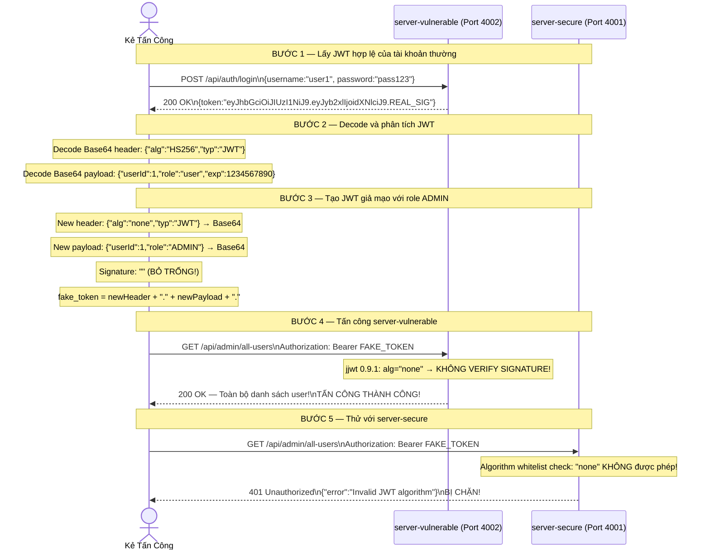

#### Code Fix — server-secure

```java
// JwtService.java — server-secure
@Service
public class JwtService {

    @Value("${jwt.secret}")
    private String secret;

    // FIX 1: Dùng parserBuilder() thay vì parser()
    // FIX 2: parseClaimsJws() tự động từ chối "alg:none"
    public Claims validateToken(String token) {
        try {
            // FIX: Kiểm tra thủ công trước khi parse
            // Decode header và kiểm tra algorithm
            String[] parts = token.split("\\.");
            if (parts.length != 3 || parts[2].isEmpty()) {
                throw new JwtException("Token must have 3 parts and non-empty signature");
            }

            String headerJson = new String(Base64.getUrlDecoder().decode(parts[0]));
            if (headerJson.toLowerCase().contains("\"none\"")) {
                throw new JwtException("Algorithm 'none' is not allowed!");
            }

            // FIX: Dùng jjwt 0.11.x+ với parserBuilder — tự động chặn "none"
            return Jwts.parserBuilder()
                .setSigningKey(Keys.hmacShaKeyFor(secret.getBytes(StandardCharsets.UTF_8)))
                .build()
                .parseClaimsJws(token)  // parseClaimsJws (JWS) chứ KHÔNG phải parseClaimsJwt (JWT)!
                .getBody();

        } catch (JwtException | IllegalArgumentException e) {
            log.error("JWT validation failed: {}", e.getMessage());
            throw new UnauthorizedException("Invalid JWT token");
        }
    }

    // pom.xml — PHIÊN BẢN MỚI AN TOÀN:
    // <dependency>
    //     <groupId>io.jsonwebtoken</groupId>
    //     <artifactId>jjwt-api</artifactId>
    //     <version>0.11.5</version>   ← PHIÊN BẢN AN TOÀN!
    // </dependency>
}
```

---

### 2.2 Tấn Công 2 — Weak Secret Key Brute Force

#### Nguyên Lý Kỹ Thuật

```
JWT ký bằng HS256:
  signature = HMAC-SHA256(base64url(header) + "." + base64url(payload), SECRET)

Nếu SECRET quá yếu (ví dụ: "secret", "123456", "password"):
  → Attacker có JWT → thử từng giá trị trong wordlist
  → Khi tính ra cùng signature → Tìm ra SECRET!
  → Ký JWT mới với payload tùy ý: {role:"admin"}

Công cụ thực tế:
  hashcat -a 0 -m 16500 captured.jwt rockyou.txt
  python jwt_tool.py TOKEN -C -d wordlist.txt
```

#### Code Bị Lỗi — server-vulnerable

```java
// application.properties — server-vulnerable
jwt.secret=secret123          # CÓ trong rockyou.txt!
jwt.secret=myapp              # QUÁ NGẮN! Brute force trong vài giây!
jwt.secret=password           # QUÁ PHỔ BIẾN!
jwt.expiration=86400000       # 24 giờ — token tồn tại quá lâu để crack!

// JwtService.java — server-vulnerable
@Value("${jwt.secret}")
private String secret = "secret123";  // HARDCODE TRỰC TIẾP!

private Key getSigningKey() {
    // LỖI: Dùng thẳng string, không đảm bảo đủ 256 bit!
    return Keys.hmacShaKeyFor(secret.getBytes());
}
```

#### Sơ Đồ Tấn Công Brute Force

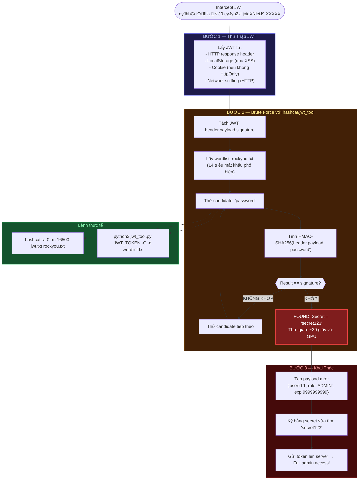

#### Code Fix — server-secure

```java
// application.properties — server-secure
# KHÔNG HARDCODE! Đọc từ environment variable:
jwt.secret=${JWT_SECRET}
# Giá trị thực: chuỗi 64 ký tự Base64 random (512 bit)
# Ví dụ: "dGhpcyBpcyBhIHZlcnkgbG9uZyBhbmQgc2VjdXJlIHNlY3JldCBrZXkgZm9yIEpXVA=="

jwt.expiration=900000     # Chỉ 15 phút! Giảm thời gian window tấn công

// JwtService.java — server-secure
// FIX: Dùng Keys.secretKeyFor() để tạo key đủ 256 bit
private SecretKey getSigningKey() {
    byte[] keyBytes = Decoders.BASE64.decode(secret);
    if (keyBytes.length < 32) {  // Kiểm tra tối thiểu 256 bit
        throw new IllegalStateException("JWT secret must be at least 256 bits!");
    }
    return Keys.hmacShaKeyFor(keyBytes);
}

// Khi deploy production:
// export JWT_SECRET=$(openssl rand -base64 64)
```

---

### 2.3 Tấn Công 3 — Missing Claims Validation (Token Expired / Issuer Confusion)

#### Nguyên Lý

```
JWT không kiểm tra đủ claims → Có thể tái sử dụng token đã hết hạn,
hoặc dùng token từ service khác để truy cập.

Các claim bắt buộc phải validate:
  exp (expiration)  → Token hết hạn?
  iss (issuer)      → Token do server nào cấp?
  aud (audience)    → Token dành cho service nào?
  iat (issued at)   → Token được tạo khi nào?
```

#### Code Bị Lỗi — server-vulnerable

```java
// JwtService.java — server-vulnerable
public Claims validateToken(String token) {
    return Jwts.parser()
        .setSigningKey(secret)
        .parseClaimsJws(token)
        .getBody();
    // LỖI: Không kiểm tra:
    // ❌ exp → Token hết hạn 1 năm trước vẫn được chấp nhận!
    // ❌ iss → Token do server khác cấp vẫn hợp lệ!
    // ❌ aud → Token cho service A dùng được ở service B!
}
```

#### Sơ Đồ Tấn Công Missing Validation

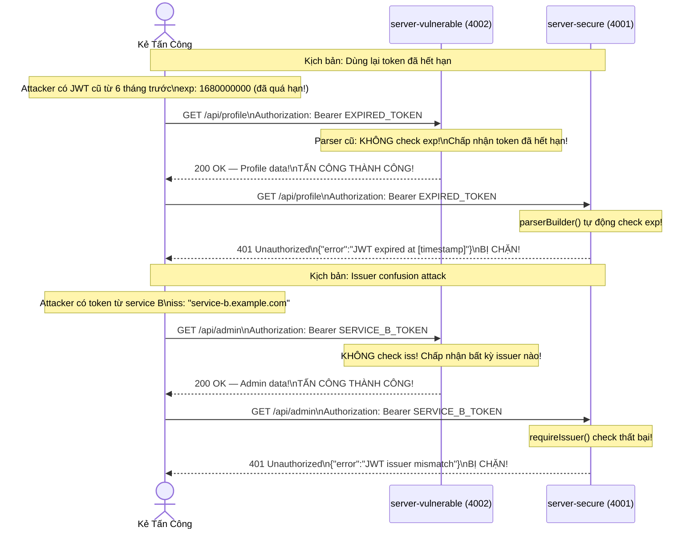

#### Code Fix — server-secure

```java
// JwtService.java — server-secure
public Claims validateToken(String token) {
    try {
        return Jwts.parserBuilder()
            .setSigningKey(getSigningKey())
            // FIX: Validate đầy đủ tất cả claims quan trọng
            .requireIssuer("http://localhost:4001")       // Chỉ nhận token từ server của mình
            .requireAudience("my-app-api")                // Chỉ nhận token cho service này
            .build()
            .parseClaimsJws(token)  // Tự động throw ExpiredJwtException nếu exp đã qua!
            .getBody();

    } catch (ExpiredJwtException e) {
        throw new UnauthorizedException("Token has expired. Please login again.");
    } catch (InvalidClaimException e) {
        throw new UnauthorizedException("Token claim validation failed: " + e.getMessage());
    } catch (JwtException e) {
        throw new UnauthorizedException("Invalid JWT token");
    }
}

// Khi tạo token, set đầy đủ claims:
public String generateToken(User user) {
    Date now = new Date();
    Date expiry = new Date(now.getTime() + expirationMs);

    return Jwts.builder()
        .setSubject(user.getId().toString())
        .setIssuer("http://localhost:4001")      // Bắt buộc!
        .setAudience("my-app-api")               // Bắt buộc!
        .setIssuedAt(now)                        // Bắt buộc!
        .setExpiration(expiry)                   // Bắt buộc! (15 phút)
        .claim("role", user.getRole())
        .signWith(getSigningKey(), SignatureAlgorithm.HS256)
        .compact();
}
```

---

### 2.4 Checklist Bảo Mật JWT

| Lỗ hổng | Code Sai (server-vulnerable) | Code Đúng (server-secure) | Mức độ |
|---|---|---|---|
| alg:none bypass | `Jwts.parser()` jjwt 0.9.1 | `Jwts.parserBuilder()` jjwt 0.11.5+ | **Nghiêm trọng** |
| Weak secret | `jwt.secret=secret123` | Secret 512-bit từ env var | **Nghiêm trọng** |
| Không check exp | `parser().parse()` không check exp | `parseClaimsJws()` tự động check | **Cao** |
| Không check iss | Không có `requireIssuer()` | `.requireIssuer("url")` | **Trung bình** |
| Không check aud | Không có `requireAudience()` | `.requireAudience("service")` | **Trung bình** |
| Token lifetime dài | `jwt.expiration=86400000` (24h) | `jwt.expiration=900000` (15 phút) | **Trung bình** |
| Secret hardcode | `private String secret = "abc"` | `@Value("${JWT_SECRET}")` từ env | **Cao** |

---

## PHẦN 3: OAUTH2 CÀI ĐẶT SAI → TẤN CÔNG → FIX

---

### 3.1 Kiến Trúc Tổng Quan OAuth2

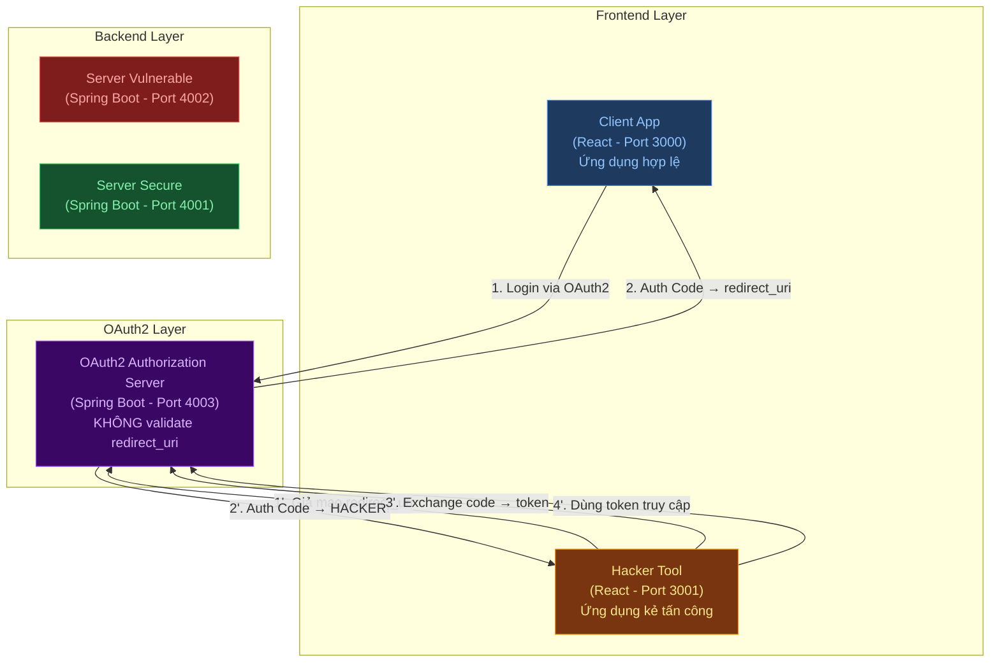

---

### 3.2 Luồng OAuth2 Authorization Code Flow Hợp Lệ

> [!NOTE]
> Đây là luồng bình thường theo chuẩn RFC 6749. Client hợp lệ đăng ký trước `redirect_uri` với OAuth Server, và server chỉ chấp nhận redirect về đúng URL đã đăng ký.

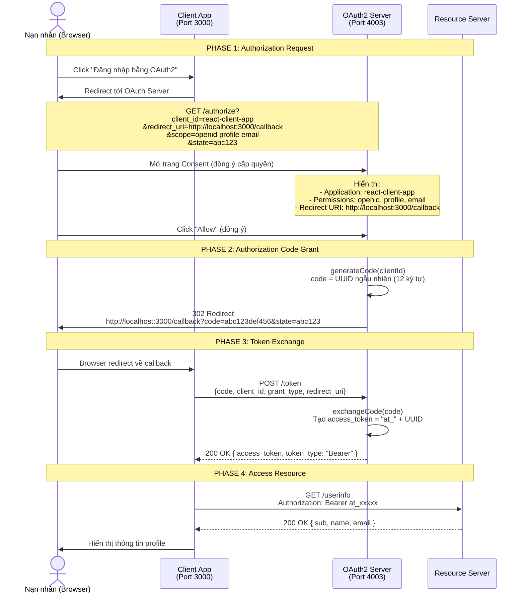

---

### 3.3 Bản Chất Lỗ Hổng — Thiếu Kiểm Tra redirect_uri

> [!CAUTION]
> Lỗ hổng xảy ra khi OAuth2 Authorization Server **KHÔNG validate** tham số `redirect_uri` trong request. Server chấp nhận **bất kỳ URL nào** — kể cả URL do attacker kiểm soát. Đây là vi phạm nghiêm trọng RFC 6749 Section 3.1.2.

#### Code Bị Lỗi Trong OAuth Server

```java
// Trong AuthorizeController.java — GET /authorize:
// Server KHÔNG có bất kỳ kiểm tra nào:
@GetMapping("/authorize")
public String authorize(
    @RequestParam String client_id,
    @RequestParam String redirect_uri,   // CHẤP NHẬN BẤT KỲ URL NÀO!
    @RequestParam String scope,
    @RequestParam String state,
    Model model
) {
    // THIẾU kiểm tra quan trọng:
    //   if (!ALLOWED_REDIRECT_URIS.contains(redirect_uri)) {
    //       return "error";  // Từ chối!
    //   }

    model.addAttribute("redirectUri", redirect_uri);  // Truyền thẳng vào form
    return "consent";
}
```

```java
// Trong AuthorizeController.java — POST /authorize:
// Sau khi user click "Allow", redirect về bất kỳ đâu:
@PostMapping("/authorize")
public RedirectView doAuthorize(
    @RequestParam String redirect_uri,   // URL CỦA ATTACKER!
    @RequestParam String state,
    @RequestParam String client_id
) {
    String code = authCodeService.generateCode(client_id);
    // Redirect auth code về URL của ATTACKER mà KHÔNG kiểm tra!
    String location = redirect_uri + "?code=" + code + "&state=" + state;
    return new RedirectView(location);  // GỬI CODE CHO HACKER!
}
```

#### Sơ Đồ Luồng Quyết Định Trong OAuth Server

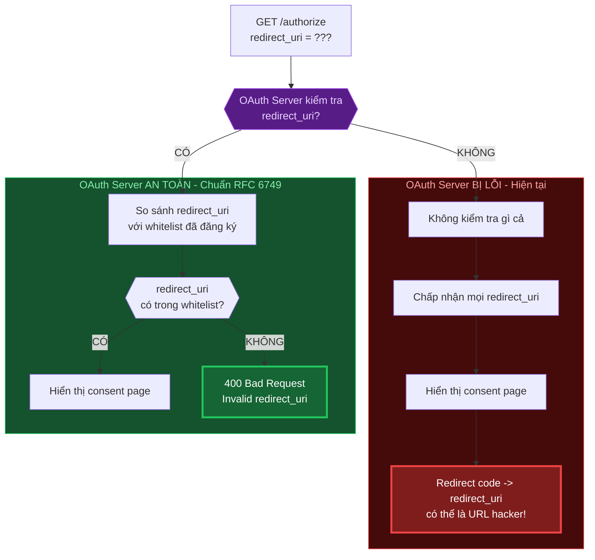

---

### 3.4 Luồng Tấn Công OAuth2 Chi Tiết Từng Bước

```mermaid
flowchart TD
    START(["BAT DAU TAN CONG"])

    subgraph STEP1["BUOC 1 — Chuẩn Bị và Social Engineering"]
        S1A["Attacker cấu hình Hacker Tool<br/>OAuth URL: http://localhost:4003<br/>Client ID: react-client-app"]
        S1B["Đặt redirect_uri = http://localhost:3001/callback<br/>URL callback của Hacker Tool"]
        S1C["Tạo state parameter ngẫu nhiên<br/>để bypass CSRF check nếu có"]
        S1D["Tạo link phishing chứa<br/>authorize URL với redirect_uri giả"]
    end

    subgraph STEP2["BUOC 2 — Intercept Authorization Code"]
        S2A["Nạn nhân click link hoặc được redirect<br/>Mở trang Consent trên OAuth Server"]
        S2B["Nạn nhân thấy trang Consent hợp lệ<br/>tên app, quyền hạn, redirect_uri"]
        S2C["Nạn nhân click Allow<br/>tin tưởng vì trang OAuth Server thật"]
        S2D["OAuth Server sinh auth code<br/>Redirect -> http://localhost:3001/callback?code=xxx"]
        S2E["Hacker Tool nhận code<br/>qua CallbackPage.jsx"]
        S2F["Callback page gửi postMessage<br/>về OAuth2AttackPage chính"]
    end

    subgraph STEP3["BUOC 3 — Exchange Code thanh Access Token"]
        S3A["Attacker gửi POST /token<br/>code + client_id + grant_type"]
        S3B["OAuth Server xác nhận code hợp lệ<br/>Xóa code - dùng 1 lần"]
        S3C["OAuth Server trả về<br/>access_token = at_xxxxx"]
        S3D["Attacker có Access Token!"]
    end

    subgraph STEP4["BUOC 4 — Khai Thác Resource"]
        S4A["Attacker gửi GET /userinfo<br/>Authorization: Bearer at_xxxxx"]
        S4B["OAuth Server trả về<br/>thông tin cá nhân nạn nhân"]
        S4C["Attacker chiếm đoạt danh tính<br/>name, email, sub"]
    end

    START --> S1A --> S1B --> S1C --> S1D
    S1D --> S2A --> S2B --> S2C --> S2D --> S2E --> S2F
    S2F --> S3A --> S3B --> S3C --> S3D
    S3D --> S4A --> S4B --> S4C

    style START fill:#7f1d1d,stroke:#ef4444,color:#fff
    style STEP1 fill:#1e1b4b,stroke:#6366f1,color:#c7d2fe
    style STEP2 fill:#422006,stroke:#f59e0b,color:#fde68a
    style STEP3 fill:#172554,stroke:#3b82f6,color:#93c5fd
    style STEP4 fill:#450a0a,stroke:#ef4444,color:#fca5a5
```

---

### 3.5 Sequence Diagram Toàn Bộ Cuộc Tấn Công OAuth2

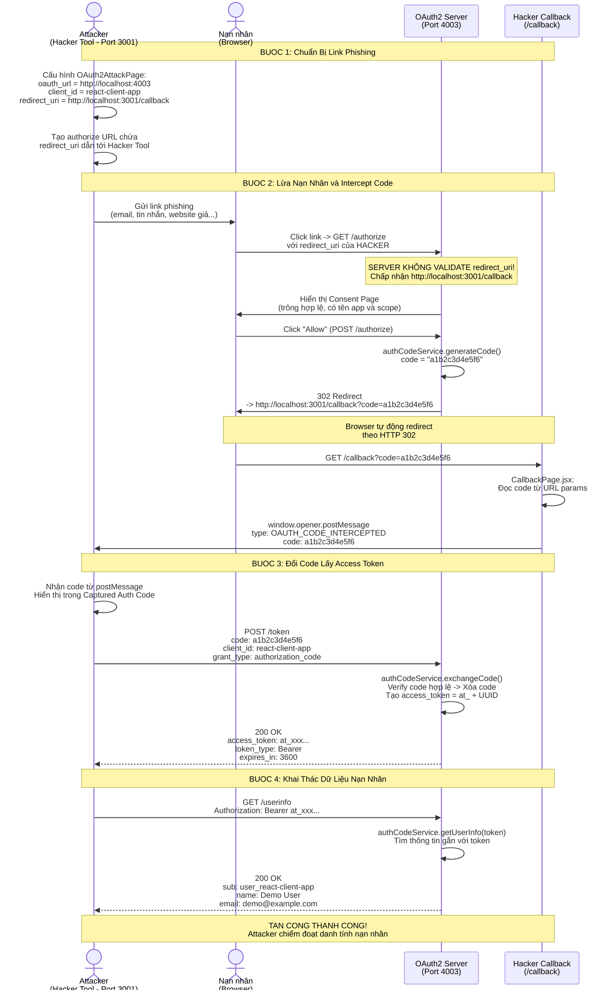

---

### 3.6 Chi Tiết Cơ Chế Callback Interception

> [!IMPORTANT]
> Hacker Tool sử dụng cơ chế `window.open()` + `postMessage()` để tự động chặn auth code mà không cần nạn nhân tương tác thêm.

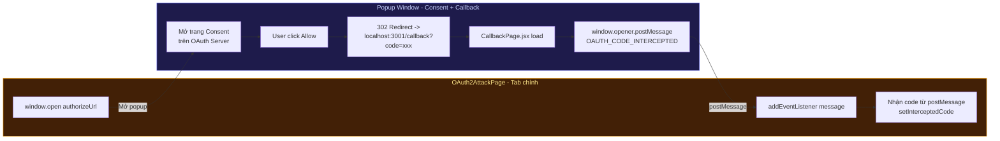

#### Luồng dữ liệu qua CallbackPage:

```
1. OAuth Server redirect browser -> http://localhost:3001/callback?code=a1b2c3&state=xyz
2. React Router match route "/callback" -> render CallbackPage.jsx
3. CallbackPage đọc URL params: code = "a1b2c3", state = "xyz"
4. Kiểm tra window.opener (popup window reference)
5. Gửi postMessage tới parent window (OAuth2AttackPage)
6. OAuth2AttackPage nhận event -> cập nhật interceptedCode state
7. Attacker thấy code hiện trong UI -> tiến hành exchange
```

---

### 3.7 Tại Sao OAuth2 Attack Thành Công?

> [!WARNING]
> Cuộc tấn công thành công do **3 yếu tố kết hợp**: Server không validate redirect_uri + Auth code dùng 1 lần nhưng không gắn với redirect_uri + Nạn nhân tin tưởng trang consent hợp lệ.

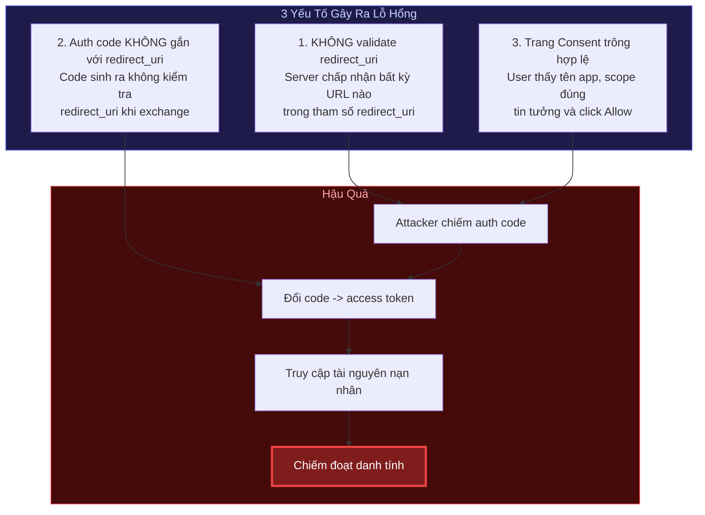

---

### 3.8 Cách Phòng Chống OAuth2

#### Fix 1: Validate redirect_uri Whitelist

```java
// AuthorizeController.java — PHIÊN BẢN AN TOÀN:

private static final Set<String> ALLOWED_REDIRECT_URIS = Set.of(
    "http://localhost:3000/callback",
    "https://my-app.com/oauth/callback"
);

@GetMapping("/authorize")
public String authorize(
    @RequestParam String client_id,
    @RequestParam String redirect_uri,
    @RequestParam String scope,
    @RequestParam String state,
    Model model
) {
    // KIỂM TRA REDIRECT_URI — Exact match!
    if (!ALLOWED_REDIRECT_URIS.contains(redirect_uri)) {
        throw new ResponseStatusException(
            HttpStatus.BAD_REQUEST,
            "Invalid redirect_uri: " + redirect_uri
        );
    }
    // ... tiếp tục xử lý
}
```

#### Fix 2: Thêm state Parameter (Chống CSRF)

```java
// AuthorizeController.java — Bind code với redirect_uri khi exchange
@PostMapping("/token")
public ResponseEntity<TokenResponse> exchangeToken(
    @RequestParam String code,
    @RequestParam String redirect_uri,
    @RequestParam String client_id,
    @RequestParam String grant_type
) {
    AuthCode authCode = authCodeService.findCode(code);

    // FIX: Kiểm tra redirect_uri phải khớp với lúc authorize!
    if (!authCode.getRedirectUri().equals(redirect_uri)) {
        throw new ResponseStatusException(HttpStatus.BAD_REQUEST, "redirect_uri mismatch");
    }

    // ... exchange code -> token
}
```

#### Fix 3: PKCE — Giải Pháp Mạnh Nhất

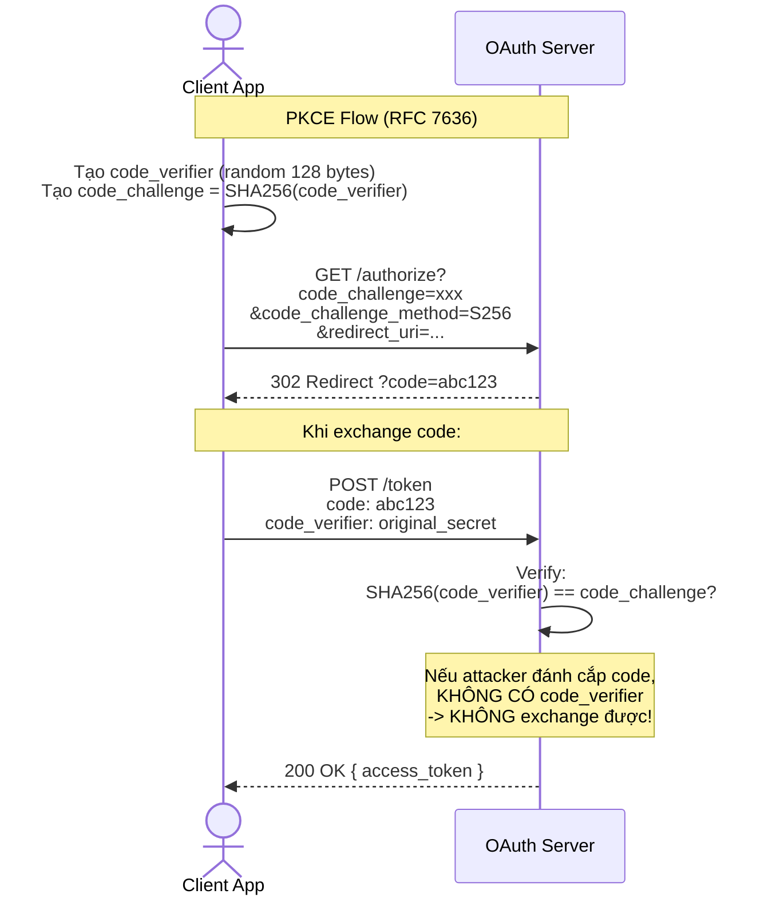

#### Checklist Bảo Mật OAuth2 Đầy Đủ

| Biện pháp | Mô tả | Mức độ |
|---|---|---|
| **Exact redirect_uri match** | So sánh chính xác, không dùng wildcard hay prefix match | Bắt buộc |
| **Đăng ký redirect_uri trước** | Client phải khai báo redirect_uri khi đăng ký ứng dụng | Bắt buộc |
| **State parameter** | Chống CSRF — so sánh state gửi đi và nhận về | Bắt buộc |
| **PKCE (RFC 7636)** | code_verifier + code_challenge chống interception | Khuyến nghị cao |
| **Auth code dùng 1 lần** | Xóa code ngay sau khi exchange thành công | Bắt buộc |
| **Auth code hết hạn nhanh** | Code chỉ valid trong 30s-60s | Khuyến nghị |
| **Bind code với redirect_uri** | Khi exchange, kiểm tra redirect_uri phải khớp lúc authorize | Bắt buộc |
| **HTTPS only** | Chặn man-in-the-middle đánh cắp code qua HTTP | Bắt buộc (production) |

---

### 3.9 Các Kịch Bản Tấn Công OAuth2 Thực Tế

| Kịch bản | Mô tả | redirect_uri giả |
|---|---|---|
| **Phishing Email** | Gửi email chứa link authorize với redirect_uri dẫn tới server hacker | `https://evil-hacker.com/steal` |
| **Open Redirect Chain** | Lợi dụng lỗi open redirect trên chính domain hợp lệ | `https://legit-app.com/redirect?url=https://evil.com` |
| **Subdomain Takeover** | Chiếm subdomain bỏ hoang của tổ chức | `https://old-service.legit-app.com/callback` |
| **Typosquatting** | Đăng ký domain giống domain thật | `https://leglt-app.com/callback` |
| **Referer Leakage** | Auth code lộ qua HTTP Referer header | Không cần thay đổi redirect_uri |

---

## PHẦN 4: SO SÁNH TỔNG THỂ 3 PHIÊN BẢN

### 4.1 Bảng So Sánh Chi Tiết

| Loại Tấn Công | v1: Không Bảo Mật | v2: JWT/OAuth2 Sai | v3: JWT/OAuth2 Đúng |
|---|:---:|:---:|:---:|
| **Truy cập không cần auth** | ✅ Thành công | ❌ Bị chặn | ❌ Bị chặn |
| **IDOR (leo thang ID)** | ✅ Thành công | ⚠️ Phụ thuộc impl. | ❌ Bị chặn |
| **JWT alg:none bypass** | N/A | ✅ Thành công | ❌ Bị chặn |
| **JWT weak secret brute force** | N/A | ✅ Thành công | ❌ Bị chặn |
| **JWT expired token reuse** | N/A | ✅ Thành công | ❌ Bị chặn |
| **JWT issuer confusion** | N/A | ✅ Thành công | ❌ Bị chặn |
| **OAuth2 redirect_uri hijack** | N/A | ✅ Thành công | ❌ Bị chặn |
| **OAuth2 CSRF (thiếu state)** | N/A | ✅ Thành công | ❌ Bị chặn |
| **OAuth2 code interception (no PKCE)** | N/A | ✅ Dễ khai thác | ❌ Bị chặn |

### 4.2 Sơ Đồ So Sánh 3 Phiên Bản

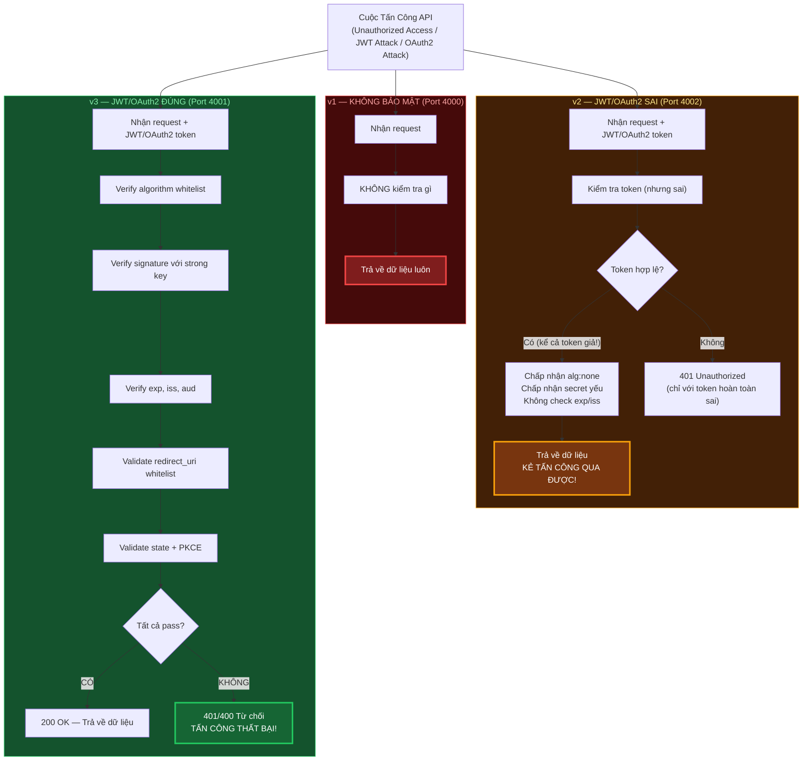

---

### 4.3 So Sánh JWT attack vs OAuth2 attack

| Tiêu chí | JWT Algorithm Confusion (CVE-2015-9235) | OAuth2 Redirect URI Interception |
|---|---|---|
| **Mục tiêu** | Giả mạo JWT token | Chiếm đoạt authorization code |
| **Lỗ hổng ở đâu** | Thư viện JWT cũ (auto-detect alg) | OAuth Server (thiếu validate redirect_uri) |
| **Attacker cần gì** | Public Key (công khai) | Nạn nhân click link phishing |
| **Yếu tố con người** | Không cần (tự động hoàn toàn) | Cần lừa nạn nhân click Allow |
| **Kết quả** | Token giả với quyền admin | Access token của nạn nhân |
| **Phòng chống** | Algorithm whitelist | redirect_uri whitelist + PKCE |
| **CVE** | CVE-2015-9235 | CWE-601 (Open Redirect) |

---

## PHẦN 5: MAPPING SƠ ĐỒ → MÃ NGUỒN

| Bước trong sơ đồ | File mã nguồn | Mô tả |
|---|---|---|
| **No-Auth server** | `server-no-auth/UserController.java` | Không có security filter |
| **JWT attack — alg:none** | `server-vulnerable/JwtService.java` | `Jwts.parser()` jjwt 0.9.1 |
| **JWT fix — algorithm whitelist** | `server-secure/JwtService.java` | `Jwts.parserBuilder()` jjwt 0.11.5 |
| **JWT attack — weak secret** | `server-vulnerable/application.properties` | `jwt.secret=secret123` |
| **JWT fix — strong key** | `server-secure/application.properties` | `jwt.secret=${JWT_SECRET}` env var |
| **JWT attack — missing claims** | `server-vulnerable/JwtService.java` | Không có `requireIssuer()`, `requireAudience()` |
| **JWT fix — full claims validation** | `server-secure/JwtService.java` | Đủ `requireIssuer()`, `requireAudience()`, auto check exp |
| **OAuth2 lỗ hổng redirect_uri** | `oauth-server/AuthorizeController.java` | `GET /authorize` — thiếu kiểm tra whitelist |
| **OAuth2 redirect code về hacker** | `oauth-server/AuthorizeController.java` | `POST /authorize` — redirect không kiểm tra |
| **OAuth2 intercept code** | `hacker-tool/CallbackPage.jsx` | Đọc code từ URL params, gửi postMessage |
| **OAuth2 nhận code** | `hacker-tool/OAuth2AttackPage.jsx` | `handleMessage` event listener |
| **OAuth2 exchange code** | `oauth-server/TokenController.java` | `POST /token` |
| **OAuth2 fix — whitelist** | `oauth-server/AuthorizeController.java` | `ALLOWED_REDIRECT_URIS.contains(redirect_uri)` |
| **OAuth2 fix — PKCE** | `oauth-server/TokenController.java` | `SHA256(code_verifier) == code_challenge` |
| **Hacker Tool — JWT attacks** | `hacker-tool/JwtAttackPage.jsx` | UI demo tấn công JWT |
| **Hacker Tool — No-auth attacks** | `hacker-tool/NoAuthAttackPage.jsx` | UI demo tấn công v1 |
| **Hacker Tool — OAuth2 attacks** | `hacker-tool/OAuth2AttackPage.jsx` | UI demo tấn công OAuth2 |
| **Security config** | `oauth-server/SecurityConfig.java` | CORS cho phép port 3000, 3001 |

---

## PHẦN 6: HƯỚNG DẪN TRIỂN KHAI VÀ CHẠY DEMO

### 6.1 Thứ Tự Khởi Động

```bash
# Terminal 1 — OAuth2 Authorization Server (cần chạy trước)
cd oauth-server && mvn spring-boot:run
# → http://localhost:4003

# Terminal 2 — Server No-Auth (v1)
cd server-no-auth && mvn spring-boot:run
# → http://localhost:4000

# Terminal 3 — Server Vulnerable (v2)
cd server-vulnerable && mvn spring-boot:run
# → http://localhost:4002

# Terminal 4 — Server Secure (v3)
export JWT_SECRET=$(openssl rand -base64 64)
cd server-secure && mvn spring-boot:run
# → http://localhost:4001

# Terminal 5 — Client App (người dùng hợp lệ)
cd client-app && npm install && npm run dev
# → http://localhost:3000

# Terminal 6 — Hacker Tool (kẻ tấn công)
cd hacker-tool && npm install && npm run dev
# → http://localhost:3001
```

### 6.2 Kịch Bản Demo Cụ Thể

#### Demo 1 — Web Không Có Bảo Mật (v1)
```
1. Mở http://localhost:3001 (Hacker Tool) → Tab "No-Auth Attack"
2. Nhập URL: http://localhost:4000/api/users/1/profile
3. Nhấn "Attack" → Xem dữ liệu user mà không cần đăng nhập
4. Thay userId = 2, 3, 4 → Xem dữ liệu người khác (IDOR)
5. Truy cập /api/admin/users → Xem toàn bộ user
```

#### Demo 2 — JWT alg:none Bypass
```
1. Mở http://localhost:3000 (Client App) → Đăng nhập vào server-vulnerable
2. Lấy JWT từ response (copy token)
3. Chuyển sang http://localhost:3001 → Tab "JWT Attack"
4. Paste JWT vào → Click "alg:none Attack"
5. Tool tự tạo fake_token với role="ADMIN"
6. Gửi fake_token đến server-vulnerable → Thành công (200 OK, admin data)
7. Gửi fake_token đến server-secure → Thất bại (401 Unauthorized)
8. So sánh kết quả trực tiếp!
```

#### Demo 3 — JWT Weak Secret
```
1. Lấy JWT từ server-vulnerable (secret = "secret123")
2. Chạy: hashcat -a 0 -m 16500 captured.jwt rockyou.txt
3. Đợi ~30 giây → hashcat tìm ra "secret123"
4. Tạo JWT mới với secret tìm được, payload {role:"ADMIN"}
5. Gửi lên server-vulnerable → Thành công
6. Thử với server-secure (secret từ env var, 512-bit) → Thất bại
```

#### Demo 4 — OAuth2 redirect_uri Interception
```
1. Mở http://localhost:3001 → Tab "OAuth2 Attack"
2. Cấu hình: oauth_url=http://localhost:4003, client_id=react-client-app
3. Đặt redirect_uri = http://localhost:3001/callback (URL của Hacker Tool)
4. Click "Start Attack" → Popup mở trang consent OAuth2
5. "Nạn nhân" (hoặc demo bằng chính mình) click Allow
6. Xem code xuất hiện trong "Intercepted Code" section
7. Click "Exchange Code" → Lấy access_token
8. Click "Get User Info" → Xem thông tin nạn nhân
```

### 6.3 Tổng Kết Flow Demo


---

> **Lưu ý triển khai:**
> - Tất cả demo chạy trên localhost để đảm bảo an toàn
> - Không deploy server-vulnerable lên production!
> - Dùng Docker Compose để khởi động tất cả service cùng lúc nếu cần
> - Có thể dùng Postman/Insomnia để demo tấn công thay vì viết script
